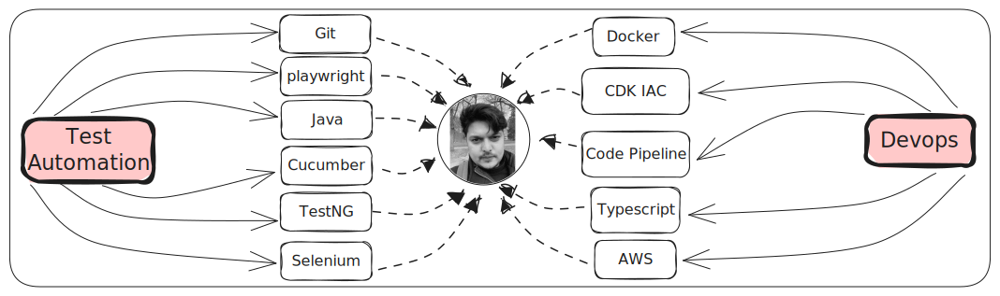

## Test Automation Lead Engineer

##### Helsinki,Finland

##### | [Download Resume](../../static/resume/SunnyRavindra_Resume.pdf) | [LinkedIn](https://www.linkedin.com/in/sunnybharne) | [Github](https://github.com/sunnyRavindra) | [Email](mailto:sunny.bharne.automation@gmail.com?subject=Test_Automation_Expert) | [Certifications](https://www.linkedin.com/in/sunnybharne/details/certifications/) |

-----

I'm Sunny, Test Automation and **Devops** Technical Lead, currently living in **Helsinki** , Finland.

Experienced (9years) Lead Test Automation Engineer with expertise in Test
Architecture, Framework Development, Test Automation and (AWS) Cloud DevOps
transformations.

-----

### Skills 

#### Test Automation
##### [Selenium](https://botcat.org/1Selenium), [TestNG](https://botcat.org/1TestNG), [RestAssured](https://botcat.org/2RestAssured), [Grid](https://botcat.org/2Grid), [Robot Framework](https://botcat.org/Robot-Framework), [Maven](https://botcat.org/2Maven), [Log4J](https://botcat.org/2Log4J), [Cucumber](https://botcat.org/2Log4J)

#### Programing Language
##### [Java](https://botcat.org/1Java), Python, [SQL](https://botcat.org/1Java) 

#### Test Management
##### [Jira](https://botcat.org/3Jira), [Xray](https://botcat.org/3Xray), [Zpheyr](https://botcat.org/2Zpheyr)

#### Devops
##### [Docker](https://botcat.org/3Docker), [Aws](https://botcat.org/3Aws), [Git](https://botcat.org/2Git), [CDK IAC Infrastructure as code](https://botcat.org/3CDK) 

-----

### Contact

#### Mail to Sunny.bharne.automation@gmail.com
#### Phone +358 415843299
