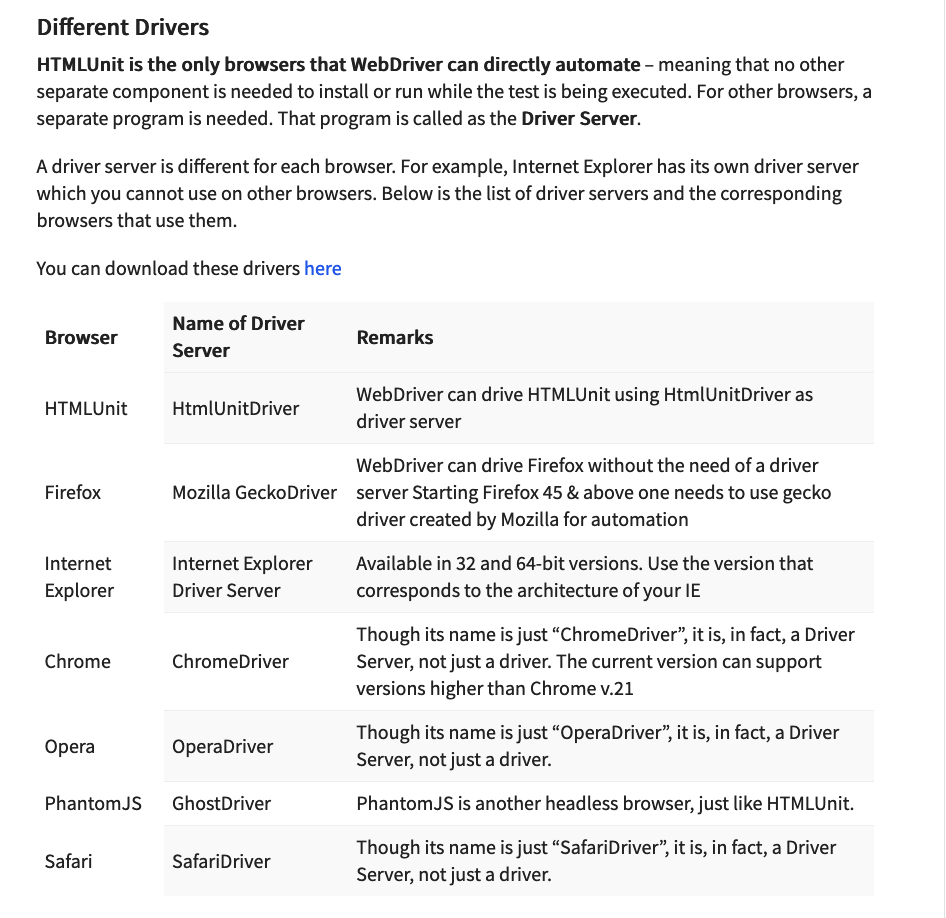
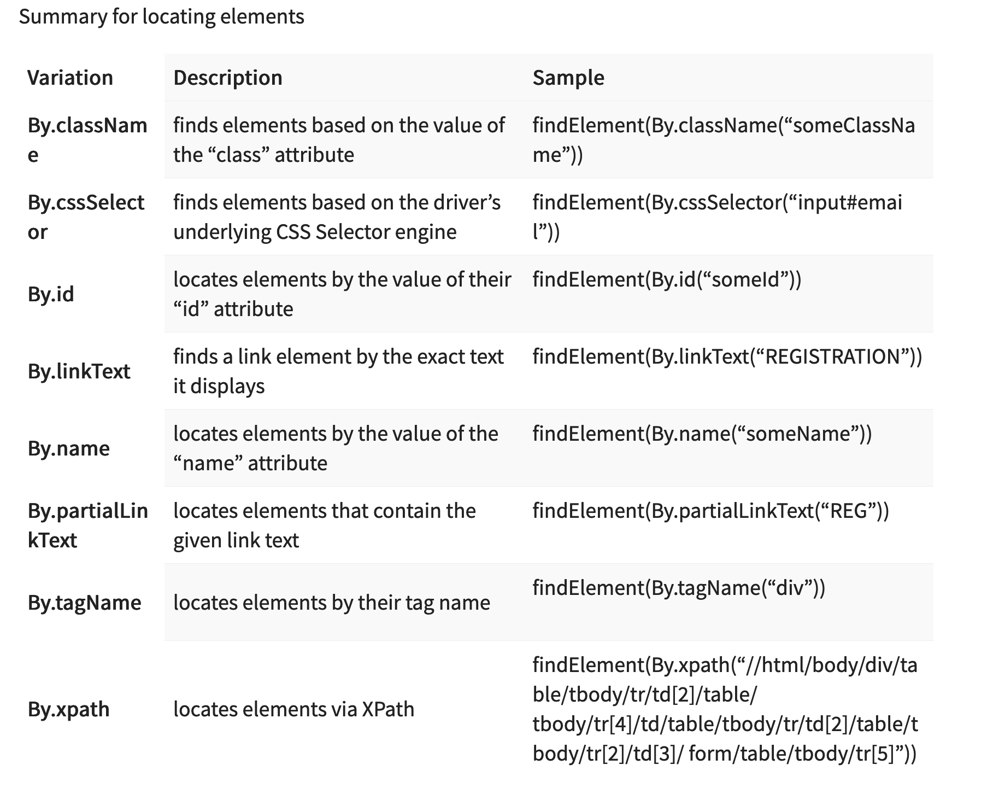
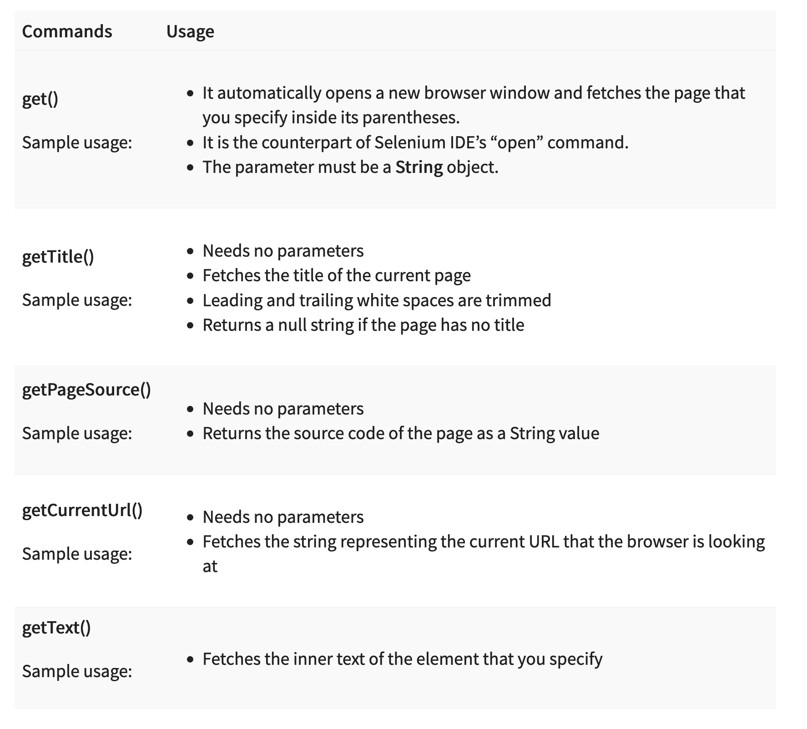
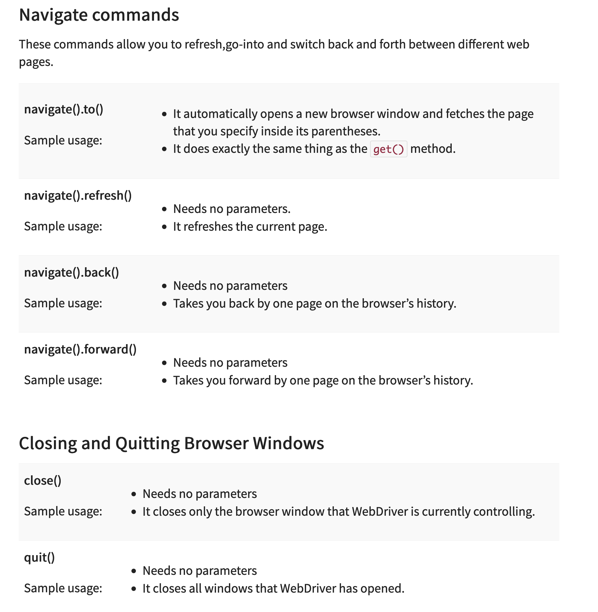
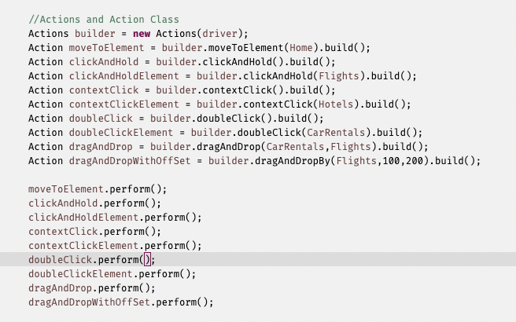

### Selenium Basics

- [Guru99](https://www.guru99.com/introduction-to-selenium.html)

- [Selenium HQ](https://www.selenium.dev/documentation/overview/components/)

<iframe src="https://www.interviewbit.com/blog/wp-content/uploads/2022/06/Working-of-Selenium-WebDriver-768x309.png" width="100%" height="220px" scrolling="no"></iframe>

### Architecture 

<iframe src="https://www.selenium.dev/documentation/overview/components/#the-parts-and-pieces" width="100%" height="2300px" scrolling="no"></iframe>


### The Same Origin Policy Issue

- [SOP](https://developer.mozilla.org/en-US/docs/Web/Security/Same-origin_policy)

Same Origin policy prohibits JavaScript code from accessing elements from a domain that is different from where it was launched. 
Example, the HTML code in www.google.com uses a JavaScript program “randomScript.js”. 
The same origin policy will only allow randomScript.js to access pages within google.com such as google.com/mail, google.com/login, or google.com/signup. However, 
it cannot access pages from different sites such as yahoo.com/search or guru99.com because they belong to different domains.

### Drivers



### Locators 




- WebDriver does not support the “contains” keyword when used in the By.cssSelector() method.

### Get Commands


### Navigate Commands



### CSS Selector

- `css=tag#id`
- `css=tag.class`
- `css=tag[attribute=value]`
- `css=tag.class[attribute=value]`
- `css=tag:contains("inner text")`
- [src$='/images/Toolsqa.jpg']
- `select#oldSelectMenu>option:nth-of-type(2)`
-  `input[id^='userN']`
-  `input[id$='ame']`
-  `input[id*='ame']`


### Xpath

- `Xpath=//tagname[@attribute='value']`
- `Xpath=//td[text()='UserID']`
- `/html/body/div[2]/div[1]/div/h4[1]/b/html[1]/body[1]/div[2]/div[1]/div[1]/h4[1]/b[1]`- Absolute Xpath.
- `Relative XPath: //div[@class='featured-box cloumnsize1']//h4[1]//b[1]` - Relative Xpath.
- `Xpath=//*[contains(@type,'sub')]`
- `Xpath=//*[contains(text(),'here')]`
- `Xpath=//*[@type='submit' or @name='btnReset']`
- `Xpath=//input[@type='submit' and @name='btnLogin']`
- `Xpath=//label[starts-with(@id,'message')]`
- `Xpath=//*[@type='text']//following::input`
- `Xpath=//*[text()='Enterprise Testing']//ancestor::div`
- `Xpath=//*[@id='java_technologies']//child::li`
- `Xpath=//*[@type='submit']//preceding::input`
- `xpath=//*[@type='submit']//following-sibling::input`
- `Xpath=//*[@id='rt-feature']//parent::div`
- `Xpath =//*[@type='password']//self::input`
- `Xpath=//*[@id='rt-feature']//descendant::a`
### Locating By DOM
`document.getElementById("id of the element")`
`document.getElementByIds("id of the elements")`
`document.getElementByName("Name of the element")`
`document.getElementByNames("Name of the elements")`
`document.getElementsByName(“name“)[index]`

### Alerts
```Java
- driver.switchTo().alert().dismiss();
- driver.switchTo().alert().accept();
- driver.switchTo().alert().getText();
- driver.switchTo().alert().sendKeys("Text");
```


### DropDowns 

### Window Handles


### ToolTip 

- Basic Attribute validation.


- Using Actions API


### Broken Links

### Test Practice site
- `http://demo.guru99.com/test/newtours/`
- `https://demoqa.com/`
- [practice](https://ultimateqa.com/dummy-automation-websites/)
### SelectorsHub 

- Used for identifying elements on web page in web development tools.
```Elements from test site
css->
a:contains(SIGN-ON)
```

### WebElements Conditions

```
WebElement.isEnabled()
WebElement.isDesplayed()
WebElement.isSelected()
```

### Expected Conditions

```
Wait.until(ExpectedConditions.alertIsPresent()
Wait.until(ExpectedConditions.elementToBeClickable()
Wait.until(ExpectedConditions.frameToBeAvailableAndSwitchToIt()
```
### Selenium Exceptions

**1. ElementNotVisibleException:** This type of Selenium exception occurs when an existing element in DOM has a feature set as hidden.

**2. ElementNotSelectableException:** This Selenium exception occurs when an element is presented in the [DOM](https://www.guru99.com/understanding-dom-fool-guide.html), but you can be able to select. Therefore, it is not possible to interact.

**3. NoSuchElementException:** This Exception occurs if an element could not be found.

**4. NoSuchFrameException:** This Exception occurs if the frame target to be switched to does not exist.

**5. NoAlertPresentException:** This Exception occurs when you switch to no presented alert.

**6. NoSuchWindowException:** This Exception occurs if the window target to be switch does not exist.

**7. StaleElementReferenceException:** This Selenium exception occurs happens when the web element is detached from the current DOM.

**8. SessionNotFoundException:** The WebDriver is acting after you quit the browser.

**9. TimeoutException:** Thrown when there is not enough time for a command to be completed. For Example, the element searched wasn’t found in the specified time.

**10. WebDriverException:** This Exception takes place when the WebDriver is acting right after you close the browser.

**11. ConnectionClosedException:** This type of Exception takes place when there is a disconnection in the driver.

**12. ElementClickInterceptedException:** The command may not be completed as the element receiving the events is concealing the element which was requested clicked.

**13. ElementNotInteractableException:** This Selenium exception is thrown when any element is presented in the DOM. However, it is impossible to interact with such an element.

**14. ErrorInResponseException:** This happens while interacting with the Firefox extension or the remote driver server.

**15. ErrorHandler.UnknownServerException:** Exception is used as a placeholder in case if the server returns an error without a stack trace.

**16. ImeActivationFailedException:** This expectation will occur when IME engine activation has failed.

**17. ImeNotAvailableException:** It takes place when IME support is unavailable.

**18. InsecureCertificateException:** Navigation made the user agent to hit a certificate warning. This can cause by an invalid or expired TLS certificate.

**19. InvalidArgumentException:** It occurs when an argument does not belong to the expected type.

**20. InvalidCookieDomainException:** This happens when you try to add a cookie under a different domain instead of current URL.

**21. InvalidCoordinatesException:** This type of Exception matches an interacting operation that is not valid.

**22. InvalidElementStateException:** It occurs when command can’t be finished when the element is invalid.

**23. InvalidSessionIdException:** This Exception took place when the given session ID is not included in the list of active sessions. It means the session does not exist or is inactive either.

**24. InvalidSwitchToTargetException:** This occurs when the frame or window target to be switched does not exist.

**25. JavascriptException:** This issue occurs while executing JavaScript given by the user.

**26. JsonException:** It occurs when you afford to get the session when the session is not created.

**27. NoSuchAttributeException:** This kind of Exception occurs when the attribute of an element could not be found.

**28. MoveTargetOutOfBoundsException:** It takes place if the target provided to the ActionChains move() methodology is not valid. For Example, out of the document.

**29. NoSuchContextException:** ContextAware does mobile device testing.

**30. NoSuchCookieException:** This Exception occurs when no cookie matching with the given pathname found for all the associated cookies of the currently browsing document.

**31. NotFoundException:** This Exception is a subclass of WebDriverException. This will occur when an element on the DOM does not exist.

**32. RemoteDriverServerException:** This Selenium exception is thrown when the server is not responding because of the problem that the capabilities described are not proper.

**33. ScreenshotException:** It is not possible to capture a screen.

**34. SessionNotCreatedException:** It happens when a new session could not be successfully created.

**35. UnableToSetCookieException:** This occurs if a driver is unable to set a cookie.

**36. UnexpectedTagNameException:** Happens if a support class did not get a web element as expected.

**37. UnhandledAlertException:** This expectation occurs when there is an alert, but WebDriver is not able to perform Alert operation.

**38. UnexpectedAlertPresentException:** It occurs when there is the appearance of an unexpected alert.

**39. UnknownMethodException:** This Exception happens when the requested command matches with a known URL but and not matching with a methodology for a specific URL.

**40. UnreachableBrowserException:** This Exception occurs only when the browser is not able to be opened or crashed because of some reason.

**41. UnsupportedCommandException:** This occurs when remote WebDriver doesn’t send valid commands as expected.
### Exceptions

- NoSuchElementException
- TimeoutException

### FindElements

```
WebElement loginLink = driver.findElement(By.linkText("Login"));
List<WebElement> listOfElements = driver.findElements(By.xpath("//div"));
driver.findElement(By.className("className"));
driver.findElement(By.cssSelector(".className"));
driver.findElement(By.id("elementId"));
driver.findElement(By.linkText("linkText"));
driver.findElement(By.name("elementName"));
driver.findElement(By.partialLinkText("partialText"));
driver.findElement(By.tagName("elementTagName"));
driver.findElement(By.xpath("xPath"));
```

### Timeouts

```
driver.manage().timeouts().implicitlyWait(Duration.ofSeconds(10));
driver.manage().timeouts().scriptTimeout(Duration.ofMinutes(2));
driver.manage().timeouts().pageLoadTimeout(Duration.ofSeconds(10));
```

### Wait 

```
new WebDriverWait(driver, Duration.ofSeconds(3))
  .until(ExpectedConditions.elementToBeClickable(By.cssSelector("#id")));

  Wait<WebDriver> wait = new FluentWait<WebDriver>(driver)
  .withTimeout(Duration.ofSeconds(30))
  .pollingEvery(Duration.ofSeconds(5))
  .ignoring(NoSuchElementException.class);
```

```java
Wait<WebDriver> wait = new FluentWait<WebDriver>(driver)
  .withTimeout(Duration.ofSeconds(30))
  .pollingEvery(Duration.ofSeconds(5))
  .ignoring(NoSuchElementException.class);
```

```java
		//Declare and initialise a fluent wait
		FluentWait wait = new FluentWait(driver);
		//Specify the timout of the wait
		wait.withTimeout(5000, TimeUnit.MILLISECONDS);
		//Sepcify polling time
		wait.pollingEvery(250, TimeUnit.MILLISECONDS);
		//Specify what exceptions to ignore
		wait.ignoring(NoSuchElementException.class)

		//This is how we specify the condition to wait on.
		//This is what we will explore more in this chapter
		wait.until(ExpectedConditions.alertIsPresent());
```
### Action Class



### Upload Files

```Java
        // enter the file path onto the file-selection input field
        uploadElement.sendKeys("C:\\newhtml.html");
```

### Download Files


`wget` is a command-line utility for downloading files from the web. It is available on most Unix-like operating systems and can be used to retrieve files using various protocols, including HTTP, HTTPS, and FTP. Here are some common use cases and examples:

### Basic Wget Usage:

1. **Download a File:**
   ```bash
   wget [URL]
   ```
   Replace `[URL]` with the actual URL of the file you want to download.

   Example:
   ```bash
   wget https://example.com/file.zip
   ```

2. **Save with a Different Name:**
   ```bash
   wget -O [output-file] [URL]
   ```
   Replace `[output-file]` with the desired name for the downloaded file.

   Example:
   ```bash
   wget -O myfile.zip https://example.com/file.zip
   ```

### Advanced Wget Usage:

3. **Resuming Downloads:**
   ```bash
   wget -c [URL]
   ```
   This option allows you to resume an interrupted download.

   Example:
   ```bash
   wget -c https://example.com/largefile.zip
   ```

4. **Limit Download Speed:**
   ```bash
   wget --limit-rate=[speed] [URL]
   ```
   Replace `[speed]` with the desired download speed limit.

   Example:
   ```bash
   wget --limit-rate=100k https://example.com/largefile.zip
   ```

5. **Download in the Background:**
   ```bash
   wget -b [URL]
   ```
   This runs `wget` in the background.

   Example:
   ```bash
   wget -b https://example.com/file.zip
   ```

6. **Download Entire Website:**
   ```bash
   wget --recursive --no-clobber --page-requisites --html-extension --convert-links --domains example.com --no-parent [URL]
   ```
   This command downloads a complete website.

   Example:
   ```bash
   wget --recursive --no-clobber --page-requisites --html-extension --convert-links --domains example.com --no-parent https://example.com
   ```

### Desired Capabilities 


<iframe src="https://w3c.github.io/webdriver/#capabilities" width="100%" height="2000px" scrolling="no"></iframe>

```java
FirefoxOptions browserOptions = new FirefoxOptions();
browserOptions.setPlatformName("Windows 10");
browserOptions.setBrowserVersion("92");
Map<String, Object> cloudOptions = new HashMap<>();
cloudOptions.put("build", myTestBuild);
cloudOptions.put("name", myTestName);
browserOptions.setCapability("cloud:options", cloudOptions);
WebDriver driver = new RemoteWebDriver(new URL(cloudUrl), browserOptions);
```

```Java
ChromeOptions options = new ChromeOptions()
options.addArgument("start-maximized");
ChromeDriver driver = new ChromeDriver(options);
```

```Java
// Create an object of desired capabilities class with Chrome driver
DesiredCapabilities SSLCertificate = DesiredCapabilities.chrome();
// Set the pre defined capability – ACCEPT_SSL_CERTS value to true
SSLCertificate.setCapability(CapabilityType.ACCEPT_SSL_CERTS, true);
// Open a new instance of chrome driver with the desired capability
WebDriver driver = new ChromeDriver(SSLCertificate);
```
Below are the list of available and most commonly used arguments for ChromeOptions class

- **start-maximized**: Opens Chrome in maximize mode
- **incognito:** Opens Chrome in incognito mode
- **headless:** Opens Chrome in headless mode
- **disable-extensions**: Disables existing extensions on Chrome browser
- **disable-popup-blocking**: Disables pop-ups displayed on Chrome browser
- **make-default-browser:** Makes Chrome default browser
- **version**: Prints chrome browser version
- **disable-infobars:** Prevents Chrome from displaying the notification ‘Chrome is being controlled by automated software
[Browser Options](https://w3c.github.io/webdriver/#capabilities)
### New Mutable Capabilities 

```
MutableCapabilities capabilities = new MutableCapabilities();
capabilities.setCapability("platformVersion", "Windows 10");
FirefoxOptions options = new FirefoxOptions();
options.setHeadless(true);
options = .merge(capabilities);

// The result of the `merge` call needs to be assigned to an object.
```

### ScreenShots 
```Java
public static void takeSnapShot(WebDriver webdriver,String fileWithPath) throws Exception{
//Convert web driver object to TakeScreenshot
TakesScreenshot scrShot =((TakesScreenshot)webdriver);
//Call getScreenshotAs method to create image file
File SrcFile=scrShot.getScreenshotAs(OutputType.FILE);
//Move image file to new destination
File DestFile=new File(fileWithPath);
//Copy file at destination
FileUtils.copyFile(SrcFile, DestFile);
}
```

### Desgin Patterns

- [Design Patterns ](https://www.browserstack.com/guide/design-patterns-in-automation-framework")
### Singleton Design Pattern

Singleton Design Pattern is one of the easiest and straightforward patterns to be implemented in an automation framework. This design is used when we need to use the same object of a class across the automation framework. It restricts the instantiation of a class to a single instance. 

Steps to follow to create singleton class:

1.   Declare the constructor of the class as **‘private’** so that no one can instantiate the class outside of it
2.   Declare a static reference variable of class
3.   Declare a static method with return type as an object of this singleton class which should check if the class is already instantiated once.

```Java
public class SingletonBaseClass {

private static WebDriver driver = null;
private static String browserName= "chrome";

public static void init() {
if (driver == null) {
if (browserName.equalsIgnoreCase("chrome")) {
WebDriverManager.chromedriver().setup();
driver = new ChromeDriver();
} else if (browserName.equalsIgnoreCase("firefox")) {
WebDriverManager.firefoxdriver().setup();
driver = new FirefoxDriver();
}
}
driver.manage().deleteAllCookies();
driver.manage().window().maximize();
} 
public static WebDriver getDriver() {
return driver;
} 
public static void quit() {
driver.quit();
driver=null;
}
}
```
### Page Object Model


- Base Class 
```Java
public class BaseClass {
static WebDriver driver;
static String browserName = "chrome";
static String url = "http://automationpractice.com/index.php";

public static WebDriver init() {
if (browserName.equalsIgnoreCase("chrome")) {
WebDriverManager.chromedriver().setup();
driver = new ChromeDriver();
} else if (browserName.equalsIgnoreCase("firefox")) {
WebDriverManager.firefoxdriver().setup();
driver = new FirefoxDriver();
}
driver.manage().deleteAllCookies();
driver.manage().window().maximize();
driver.get(url);
return driver;
} 
}
```

- HomePage

```Jave
public class HomePage{
WebDriver driver;

@FindBy(css = "a.login")
private WebElement signIn;

@FindBy(css = "input#search_query_top")
private WebElement search;

@FindBy(xpath = "//button[@name='submit_search']")c
private WebElement seacrhIcon;

@FindBy(css = "a.logout")
private WebElement signOut;

public LoginPage clickSignIn() {
signIn.click();
return new LoginPage(driver);
} 
public SearchPage search(String text) {
search.sendKeys(text);
seacrhIcon.click();
return new SearchPage(driver);
} 
public boolean logoutisDisplayed() {
return signOut.isDisplayed();
} 
public HomePage(WebDriver driver) {
PageFactory.initElements(driver, this);
}

}
```


```Java
import java.time.Duration;
import java.util.Properties;
import org.openqa.selenium.By;
import org.openqa.selenium.Keys;
import org.openqa.selenium.WebDriver;
import com.qa.hubspot.base.BasePage;
import com.qa.hubspot.util.Constants;
import com.qa.hubspot.util.ElementActions;

public class LoginPage extends BasePage {

WebDriver driver;
ElementActions elementActions;

//1. Create OR/Page objects -> using by locator

By userinputbox = By.xpath("//input[@id='react-select-2-input']");
By paaswordinputbox = By.xpath("//input[@id='react-select-3-input']");
By loginBtn = By.xpath("//button[@id='login-btn']");

//2. Define a constructor
public LoginPage(WebDriver driver)
{
this.driver = driver;
elementActions = new ElementActions(driver);
}

//3. Page Actions/Methods
public String getLoginPageTitle()
{
return elementActions.waitForPageTitle(Constants.LOGIN_PAGE_TITLE);
}

public HomePage doLogin(String username,String pwd) {

elementActions.doSendkeys(userinputbox, username);
driver.findElement(userinputbox).sendKeys(Keys.TAB);
elementActions.doSendkeys(paaswordinputbox, pwd);
driver.findElement(paaswordinputbox).sendKeys(Keys.TAB);
driver.manage().timeouts().implicitlyWait(Duration.ofSeconds(30));
elementActions.doClick(loginBtn);
return new HomePage(driver);
} 
}

HomePage -
import java.util.Properties;
import org.openqa.selenium.By;
import org.openqa.selenium.WebDriver;
import com.qa.hubspot.base.BasePage;
import com.qa.hubspot.util.Constants;
import com.qa.hubspot.util.ElementActions;

public class HomePage extends BasePage{

WebDriver driver;
Properties prop;
ElementActions elementActions;

//locators
By BSLogo = By.xpath("//a[@class='Navbar_logo__26S5Y']");
By accountName = By.xpath("//span[contains(text(),'demouser')]");

public HomePage(WebDriver driver)
{
this.driver = driver;
elementActions = new ElementActions(driver);
}

//Page Actions
public String getHomePageTitle()
{
return elementActions.waitForPageTitle(Constants.HOME_PAGE_TITLE);
}

public boolean isHomePageLogoVisible()
{
return elementActions.isElementDisplayed(BSLogo);
}
public boolean isAccountNameVisible()
{
return elementActions.isElementDisplayed(accountName);
}
public String getAccountNameText()
{
return elementActions.doGetText(accountName);
}
}
```

### Fluent Page Object Model
- provides method chaining

```Java
import org.openqa.selenium.By;
import org.openqa.selenium.Keys;
import org.openqa.selenium.WebDriver;

public class BSLoginPage {
WebDriver driver;
By usernm = By.xpath("//input[@id='react-select-2-input']");
By password = By.xpath("//input[@id='react-select-3-input']");
By loginBtn = By.xpath("//button[@id='login-btn']");

public BSLoginPage(WebDriver driver)
{
this.driver = driver;
}

public BSLoginPage enterUsername(String username)
{
driver.findElement(usernm).sendKeys(username);
driver.findElement(usernm).sendKeys(Keys.TAB);
return this;
}

public BSLoginPage enterPassword(String passwd)
{
driver.findElement(password).sendKeys(passwd);
driver.findElement(password).sendKeys(Keys.TAB);
return this;
} 
public HomePage clickLoginBtn()
{
driver.findElement(loginBtn).click();
return new HomePage(driver);
} 
}
```

### Factory Design Pattern

Factory Design Pattern is one of the most used creational patterns as it provides one of the best ways to create  an object. The term factory here means that there should be a class with a factory method which deals with all the creational stuff.

In this pattern, there is a superclass with multiple subclasses and based on the user input at test class level, it returns one of the subclasses. In other words, it is used to create an object from one of the possible classes that extends a common parent class/ implements an interface. The instantiation logic would be the responsibility of the class that is extending the parent class thereby it hides the complex code at test level. As a user, we just need to create an object of this class and use it in the test class to call the appropriate method holding the business logic.


```Java
public abstract class DriverManager {
protected WebDriver driver;
public WebDriver getDriver() {
return driver;
}
}
```

```Java
public class ChromeDriverManager extends DriverManager {

public ChromeDriverManager() {
WebDriverManager.chromedriver().setup();
driver = new ChromeDriver();
}
}
```

```Java
public class DriverManagerFactory {

public static DriverManager getManager(DriverType type) {
DriverManager driverManager = null;

switch (type) {
case CHROME:
driverManager = new ChromeDriverManager(); 
case FIREFOX:
driverManager = new FirefoxDriverManager(); 
case EDGE:
driverManager = new EdgeDriverManager(); 
default:
break;
}
return driverManager;
}
}
```

```Java
public enum DriverType {
CHROME,
FIREFOX,
EDGE,
SAFARI;
}
```

```Java
@BeforeTest
public void beforeTest() {
driverManager = DriverManagerFactory.getManager(DriverType.CHROME);
driver=driverManager.getDriver();
}
```
### Facade Design Pattern
Facade design pattern comes under structural design patterns. It provides a simple interface to deal with complex code. In this pattern we create a facade class which has methods that combine actions executed on different pages. This is an extension to the Page Object Model pattern.

Following example can help you under **Facade** in a layman sense.

When we visit any restaurant to order our favourite food, we are not aware of what cuisine the restaurant serves unless we see the menu card or ask the waiter about it. We are just interested in ordering the food by using a waiter/menu card as the interface(facade) and do not worry about how it is actually being prepared in the kitchen. 


### PageFactory

<iframe src="https://www.guru99.com/page-object-model-pom-page-factory-in-selenium-ultimate-guide.html#what-is-page-factory-in-selenium" width="100%" height="8220px" scrolling="no"></iframe>


### Parameterization


<iframe src="https://www.guru99.com/parameterization-using-xml-and-dataproviders-selenium.html#type-of-parameterization-in-testng" width="100%" height="21220px" scrolling="no"></iframe>


- [Stratagy Desgin Pattern](https://toolsqa.com/selenium-webdriver/strategy-design-pattern-automation-testing/)


### Apache POI


<iframe src="https://www.guru99.com/all-about-excel-in-selenium-poi-jxl.html#exporting-excel" width="100%" height="12220px" scrolling="no"></iframe>

### Robot Class

- [Robot Class](https://www.guru99.com/using-robot-api-selenium.html)

### Sikuli 

- [Sikuli Basics](https://www.guru99.com/sikuli-tutorial.html)
### Scrolling

```Java
JavascriptExecutor js = (JavascriptExecutor) driver;  
   js.executeScript(Script,Arguments);
   js.executeScript("window.scrollBy(0,1000)");
        
//This will scroll the page Horizontally till the element is found		
js.executeScript("arguments[0].scrollIntoView();", Element);
```

### Property File Object Repository

```Java 
Properties obj = new Properties();
FileInputStream objfile = new FileInputStream(System.getProperty("user.dir")+"\\application.properties");
obj.load(objfile);
String mobileTesting = obj.getProperty("MobileTesting");
```

