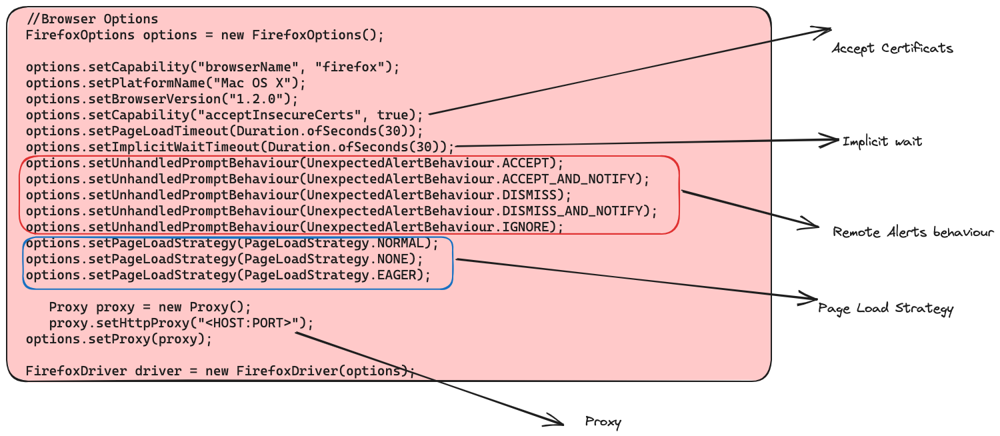

### Selenium Basics

- [Link1](https://www.toolsqa.com/selenium-webdriver/selenium-testing/)

- [Link2](https://www.guru99.com/introduction-to-selenium.html)

- [Link3](https://www.selenium.dev/documentation/overview/components/)

### The Same Origin Policy Issue

- [SOP](https://developer.mozilla.org/en-US/docs/Web/Security/Same-origin_policy)

  Same Origin policy prohibits JavaScript code from accessing elements from a domain that is different from where it was launched. 
Example, the HTML code in www.google.com uses a JavaScript program “randomScript.js”. 
The same origin policy will only allow randomScript.js to access pages within google.com such as google.com/mail, google.com/login, or google.com/signup. However, 
it cannot access pages from different sites such as yahoo.com/search or guru99.com because they belong to different domains.

### Desgin Patterns

- [Stratagy Desgin Pattern](https://toolsqa.com/selenium-webdriver/strategy-design-pattern-automation-testing/)

- [POM (Page Object Model)](https://toolsqa.com/selenium-webdriver/page-object-model/)

- [Apache POI](https://toolsqa.com/selenium-webdriver/excel-in-selenium/)

- [Data Driven Framework](https://toolsqa.com/selenium-webdriver/data-driven-framework/)

- [Log4j](https://www.toolsqa.com/selenium-webdriver/log4j-logging/)

- ITestListener Interface

- IReporter Interface

- TestNG reporter call - Reporter.log(string); 

-----
### [Selenium Basics](https://www.selenium.dev/documentation/)

### [Architecture](https://www.selenium.dev/documentation/overview/components/#the-parts-and-pieces)

### [Selenium Basic Commands](https://www.selenium.dev/documentation/webdriver/getting_started/first_script/#eight-basic-components) 

### [Executing using maven](https://www.selenium.dev/documentation/webdriver/getting_started/using_selenium/#executing) 

### [Driver Configurations](https://www.selenium.dev/documentation/webdriver/drivers/)

### [Grid Components](https://www.selenium.dev/documentation/grid/components/)

### [Starting Grid](https://www.selenium.dev/documentation/grid/getting_started/#standalone)

### [Grid Docker Image](https://hub.docker.com/r/selenium/hub)

Install docker
```bash
sudo yum update -y
sudo yum install -y docker
sudo service docker start
sudo usermod -aG docker ec2-user
docker network create Grid
docker run -d -p 4442-4444:4442-4444 --net Grid --name selenium-hub selenium/hub:latest
```


34.203.238.57 
Desired Capabilties
```java
FirefoxOptions browserOptions = new FirefoxOptions();
browserOptions.setPlatformName("Windows 10");
browserOptions.setBrowserVersion("92");
Map<String, Object> cloudOptions = new HashMap<>();
cloudOptions.put("build", myTestBuild);
cloudOptions.put("name", myTestName);
browserOptions.setCapability("cloud:options", cloudOptions);
WebDriver driver = new RemoteWebDriver(new URL(cloudUrl), browserOptions);
```

Find Elements 
```
driver.findElement(By.className("className"));
driver.findElement(By.cssSelector(".className"));
driver.findElement(By.id("elementId"));
driver.findElement(By.linkText("linkText"));
driver.findElement(By.name("elementName"));
driver.findElement(By.partialLinkText("partialText"));
driver.findElement(By.tagName("elementTagName"));
driver.findElement(By.xpath("xPath"));
```

Time outs
```
driver.manage().timeouts().implicitlyWait(Duration.ofSeconds(10));
driver.manage().timeouts().scriptTimeout(Duration.ofMinutes(2));
driver.manage().timeouts().pageLoadTimeout(Duration.ofSeconds(10));

```

Wait 

```

new WebDriverWait(driver, Duration.ofSeconds(3))
  .until(ExpectedConditions.elementToBeClickable(By.cssSelector("#id")));

  Wait<WebDriver> wait = new FluentWait<WebDriver>(driver)
  .withTimeout(Duration.ofSeconds(30))
  .pollingEvery(Duration.ofSeconds(5))
  .ignoring(NoSuchElementException.class);

```

New Mutable Capabilities 
```

MutableCapabilities capabilities = new MutableCapabilities();
capabilities.setCapability("platformVersion", "Windows 10");
FirefoxOptions options = new FirefoxOptions();
options.setHeadless(true);
options = options.merge(capabilities);

// The result of the `merge` call needs to be assigned to an object.

```

### Browser Options



[capabilities](https://w3c.github.io/webdriver/#capabilities)

### Code Reference
[Browser Initialise](https://github.com/sunnyRavindra/DataDrivenFramework/blob/main/src/test/java/com/amazon/testcase/InitializeBrowser.java)
