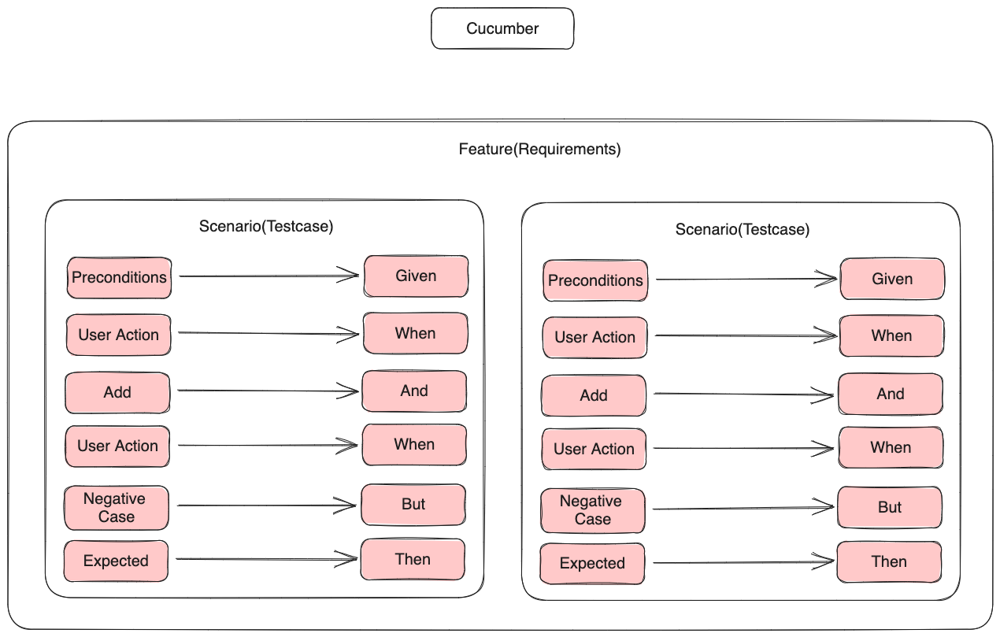

### Basics

Cucumber is the BDD Framework for running automated tests. Cucumber does not Automate your testcases.



### Create Cucumber Project
```shell
mvn archetype:generate                      \
   "-DarchetypeGroupId=io.cucumber"           \
   "-DarchetypeArtifactId=cucumber-archetype" \
   "-DarchetypeVersion=7.15.0"               \
   "-DgroupId=hellocucumber"                  \
   "-DartifactId=hellocucumber"               \
   "-Dpackage=hellocucumber"                  \
   "-Dversion=1.0.0-SNAPSHOT"                 \
   "-DinteractiveMode=false"
```
### Gherkin
a Business Readable, Domain Specific Language  that lets you describe software's behavior.

### Cucumber Terminology 
- Scenario
- Feature
- Feature file
- Scenario outline
- Step Definition

### Feature
```Cucumber

Background:
  Start Browser

Feature: Test Suite 
  Scenario: test case
    Given step with int 1
    When step with string "two"
    Then step three
    And step four
    Then step five
    But step six

### Step Defination
```Cucumber
	@Given("step with int {int}")
	public void step_with_int(Integer int1) {
		System.out.println("Step 1");
	}

	@When("step with string {string}")
	public void step_with_string(String string) {
		System.out.println("Step 2");
	}

	@Then("step three")
	public void step_three() {
		System.out.println("Step 3");
	}

	@Then("step four")
	public void step_four() {
		System.out.println("Step 4");
	}

	@Then("step five")
	public void step_five() {
		System.out.println("Step 5");
	}

	@Then("step six")
	public void step_six() {
		System.out.println("Step 6");
	}
```

### Runner File
```Java
import io.cucumber.testng.AbstractTestNGCucumberTests;
import io.cucumber.testng.CucumberOptions;

@CucumberOptions(
features = "src/test/java/features",
glue = "stepDefination",
monochrome = true,
tags = "@Smoke",
dryrun = true,
plugin = {"pretty", "html:target/cucumber.html","json:target/cucumber.json", "com.aventstack.extentreports.cucumber.adapter.ExtentCucumberAdapter:" }
)

public class smokeRunner extends AbstractTestNGCucumberTests {}
```

### Tags 

```Cucumber@
  @Smoke
  Scenario: test case
    Given step with int 1

  @Regression
  Scenario: test case
    Given step with int 1

  @Smoke @Regression
  Scenario: test case
    Given step with int 1

# Runner Params
tags = "@Smoke"
tags = "@Smoke and @Regression"
tags = "@Smoke or @Regression"
tags = "not @Smoke"
```


### Hooks

```java
public class hooks {

	@Before
	public void beforeAll() {
		System.out.println("------------------");
		System.out.println("Before all");
		System.out.println("------------------");
	}

	@After
	public void afterAll() {
		System.out.println("------------------");
		System.out.println("After all");
		System.out.println("------------------");
	}

	@Before("@Smoke")
	public void beforeAllSmoke() {
		System.out.println("------------------");
		System.out.println("Before all smoke");
		System.out.println("------------------");
	}

	@After("@Smoke")
	public void afterAllSmoke() {
		System.out.println("------------------");
		System.out.println("After all smoke");
		System.out.println("------------------");
	}

}
```

cucumber dependency injection (picocontainer)

step definition should be written using SRP (Single Responsibility Principle)

### ExtentReports Cucumber7 Adapter
```
https://ghchirp.site/3196/
```

### extent.properties
```
extent.reporter.spark.start=true
extent.reporter.spark.out=target/extentReport/report.html
```

### Spark-config.xml
```xml
<?xml version="1.0" encoding="UTF-8"?>
<extentreports>
	<configuration>
		<!-- report theme -->
		<!-- standard, dark -->
		<theme>dark</theme>

		<!-- document encoding -->
		<!-- defaults to UTF-8 -->
		<encoding>UTF-8</encoding>

		<!-- protocol for script and stylesheets -->
		<!-- defaults to https -->
		<protocol>https</protocol>

		<!-- title of the document -->
		<documentTitle>Basic Test</documentTitle>

		<!-- report name - displayed at top-nav -->
		<reportName>Report Name</reportName>

		<!-- view report without internet -->
		<offlineMode>false</offlineMode>

		<thumbnailForBase64>true</thumbnailForBase64>

		<!-- custom javascript -->
		<js></js>

		<!-- custom styles -->
		<css></css>
	</configuration>
</extentreports>
```

### Take ScreenShots on failure
```java
	@AfterStep
	public void takeScreenShots(Scenario scenario) throws IOException {
		if(scenario.isFailed()) {
			//Take Screenshot
			byte[] screenshotFile = ((TakesScreenshot)contextManager.driverManager.getDriver()).getScreenshotAs(OutputType.BYTES);
			//Attach to Extent report
			scenario.attach(screenshotFile, "image/png", "image");
		}
	}
```


### Dependency Injection

1. Add Cucumber picocontainer for the POM file from mvn repository.
2. Create a BrowserContext class for injection.

```Java
public class BrowserContext {

	public WebDriver driver;

	public BrowserContext() {
		driver = new ChromeDriver();
	}

}
```

3. Call the BrowserContext in stepdefinition file

```Java
public class login {
	 WebDriver driver;
	 
	 public login(BrowserContext browserContext){
		 this.driver = browserContext.driver;
	 }
}
```

4. You don't need to create an object of of the Browser Context class to when using picocontainer for dependency injection
5. Always write step definition with SRP(Single Responsibility principal)
6. Class's needs to be loosely coupled when righting step-definition.


### Factory Desgin Pattern

1. Create a class files with getters of all the pages in page Object class.

```Java
package pagesObject;

public class PageObjectManager {
	
	public LoginPage getLoginPage() {
		return new LoginPage();
	}

}
```
2. Add getter for PageObjectManger in BrowserContext class
```Java
	public PageObjectManager getPageObjectManager() {
		return new PageObjectManager();
	}
```
3. Call the PageObjectManager from stepdefinition

```Java
	LoginPage loginPage = browserContext.getPageObjectManager().getLoginPage(); 
```
### Dependency Injection

1. Add Cucumber picocontainer for the POM file from mvn repository.
2. Create a BrowserContext class for injection.

```Java
public class BrowserContext {

	public WebDriver driver;

	public BrowserContext() {
		driver = new ChromeDriver();
	}

}
```

3. Call the BrowserContext in stepdefinition file

```Java
public class login {
	 WebDriver driver;
	 
	 public login(BrowserContext browserContext){
		 this.driver = browserContext.driver;
	 }
}
```

4. You don't need to create an object of of the Browser Context class to when using picocontainer for dependency injection
5. Always write step definition with SRP(Single Responsibility principal)
6. Class's needs to be loosely coupled when righting step-definition.


### Factory Desgin Pattern

1. Create a class files with getters of all the pages in page Object class.

```Java
package pagesObject;

public class PageObjectManager {
	
	public LoginPage getLoginPage() {
		return new LoginPage();
	}

}
```
2. Add getter for PageObjectManger in BrowserContext class
```Java
	public PageObjectManager getPageObjectManager() {
		return new PageObjectManager();
	}
```
3. Call the PageObjectManager from stepdefinition

```Java
	LoginPage loginPage = browserContext.getPageObjectManager().getLoginPage(); 
```

### Parallel Test using Surefire

- [Parallel Tests](https://cucumber.io/docs/guides/parallel-execution/?lang=java#testng)

```xml
<!-- https://mvnrepository.com/artifact/org.apache.maven.plugins/maven-surefire-plugin -->
<dependency>
    <groupId>org.apache.maven.plugins</groupId>
    <artifactId>maven-surefire-plugin</artifactId>
    <version>3.2.3</version>
</dependency>

```


```Java
public class Regression extends AbstractTestNGCucumberTests {

@Override

@DataProvider(parallel = true)

public Object[][] scenarios() {

return super.scenarios();

}

}
```

To add the Surefire plugin to your `pom.xml` file, you can include the following configuration:

```xml
<build>
	<plugins>
		<!-- Surefire Plugin for running tests -->
		<plugin>
			<groupId>org.apache.maven.plugins</groupId>
			<artifactId>maven-surefire-plugin</artifactId>
			<version>3.0.0-M5</version> <!-- Use the latest version available -->

			<configuration>
				<!-- Set the test classes directory -->
				<testClassesDirectory>${project.build.directory}</testClassesDirectory>
				<includes>
					<include>**/*Test*.java</include>
					<include>**/*Test.java</include>
					<include>**/*Tests.java</include>
				</includes>
			</configuration>
		</plugin>
	</plugins>
</build>
```

This configuration will include the Surefire Plugin with the specified version (3.0.0-M5 in this example). It also configures the plugin to include test classes based on the standard naming conventions (`*Test*.java`, `*Test.java`, `*Tests.java`).

Make sure to replace the version with the latest version available at the time you're adding it. You can check the [Maven Repository](https://mvnrepository.com/artifact/org.apache.maven.plugins/maven-surefire-plugin) for the latest version.

### Parallel Tests using FireSure
```Java
<plugin>

<groupId>org.apache.maven.plugins</groupId>

<artifactId>maven-failsafe-plugin</artifactId>

<version>2.22.0</version>

<executions>

<execution>

<goals>

<goal>integration-test</goal>

<goal>verify</goal>

</goals>

<configuration>

<parallel>methods</parallel>

<useUnlimitedThreads>true</useUnlimitedThreads>

</configuration>

</execution>

</executions>

</plugin>
```