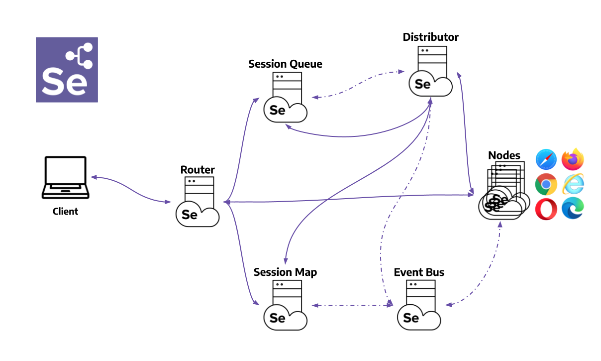
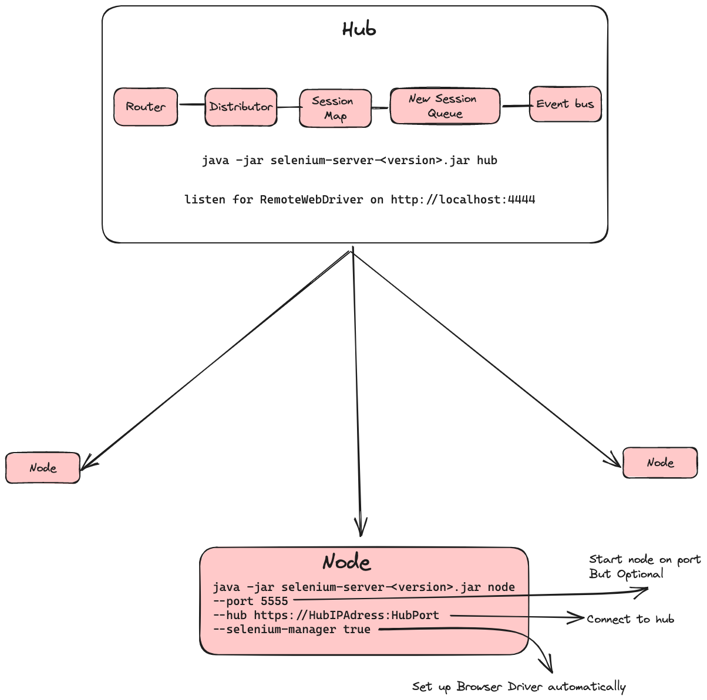

`Parallel Tests on Multiple Machines with Differen versions of Browser on different Platform`

#### Development Server on 4444
```
java -jar selenium-server-<version>.jar standalone
```
### Architecture




<iframe src="https://www.selenium.dev/documentation/grid/getting_started/#grid-roles" width="100%" height="7220px" scrolling="no"></iframe>

**Not applicable in case of Safari -- It can only spin up one instance**
### Hub Registration
```shell
java -jar selenium-server-<version>.jar hub
```
### Hub on a specific port 
```shell
java -jar selenium-server-<version>.jar hub --publish-events tcp://<hub-ip>:8886 --subscribe-events tcp://<hub-ip>:8887 --port 8888
```

### Node registration
```shell
java -jar selenium-server-<version>.jar node 
```
### Node registration on a specific port
```shell
java -jar selenium-server-<version>.jar node --port 5555
```
### Connect to a hub 
```shell
java -jar selenium-server-<version>.jar node --hub http://<hub-ip>:4444
```
### connect to a hub with specific port 
```shell
java -jar selenium-server-<version>.jar node --publish-events tcp://<hub-ip>:8886 --subscribe-events tcp://<hub-ip>:8887
```


### Reference
### [CLI Options](https://www.selenium.dev/documentation/grid/configuration/cli_options/)
### [Driver Configurations](https://www.selenium.dev/documentation/webdriver/drivers/)

### [Grid Components](https://www.selenium.dev/documentation/grid/components/)

### [Starting Grid](https://www.selenium.dev/documentation/grid/getting_started/#standalone)

### [Grid Docker Image](https://hub.docker.com/r/selenium/hub)

Install docker
```bash
sudo yum update -y
sudo yum install -y docker
sudo service docker start

sudo usermod -aG docker ec2-user
docker network create Grid

docker run -d -p 4442-4444:4442-4444 --net Grid --name selenium-hub selenium/hub:latest

docker run -d --net Grid -e SE_EVENT_BUS_HOST=selenium-hub \
    --shm-size="2g" \
    -e SE_EVENT_BUS_PUBLISH_PORT=4442 \
    -e SE_EVENT_BUS_SUBSCRIBE_PORT=4443 \
    selenium/node-firefox:latest
```

