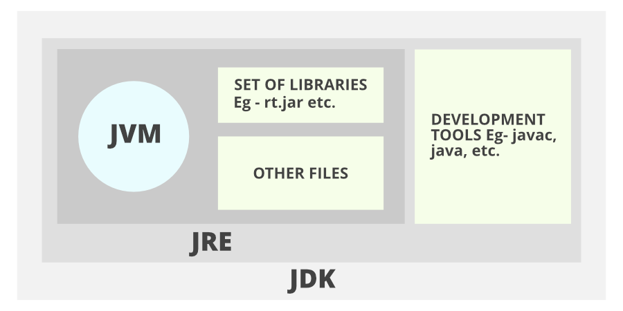
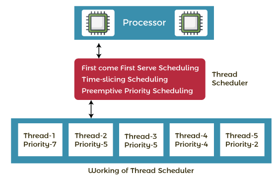

### Java used for developing
- Standalone Application(Windows based applications) using AWT and Swing.
- Web Applications using Servlet, JSP, Struts, Spring, Hibernate, JSF
- Java SE (Java Standard Edition) - OOPs, String, Regex, Exception, Inner classes, Multithreading, I/O Stream, Networking, AWT, Swing, Reflection, Collection, etc
- Java EE (Java Enterprise Edition) - Servlet, JSP, Web Services, EJB, JPA, etc.

### Garbage Collector 
programmers can’t delete the objects. To delete or recollect that memory JVM has a program called Garbage Collector. Garbage Collectors can recollect the objects that are not referenced.

### Secure
In java, we don’t have pointers, so we cannot access out-of-bound arrays i.e it shows ArrayIndexOutOfBound Exception if we try to do so. That’s why several security flaws like stack corruption or buffer overflow are impossible to exploit in Java. 

### JDK ,JRE, JVM


- **JDK**(Java Development Kit): JDK is intended for software developers and includes development tools such as the Java compiler, Javadoc, Jar, and a debugger.
- **JRE**(Java Runtime Environment): JRE contains the parts of the Java libraries required to run Java programs and is intended for end-users. JRE can be viewed as a subset of JDK.
- **JVM:** JVM (Java Virtual Machine) is an abstract machine. It is a specification that provides a runtime environment in which java bytecode can be executed. JVMs are available for many hardware and software platforms.

### Is a Relationship
```java
public class{

int name;
int age;
}
```
### Has a Relationship
```java
public class{

int name;
int age;

// variable of another class agregation
Address address;
}
```

### strictfp modifier
Java strictfp keyword ensures that you will get the same result on every platform if you perform operations in the floating-point variable. The precision may differ from platform to platform that is why java programming language have provided the strictfp keyword, so that you get same result on every platform. So, now you have better control over the floating-point arithmetic. 

### Java Document 
-  we must use the documentation comment /**... */ to post information for the class, method, constructor, fields etc.

```java
javadoc M.java 
```

### CompileTime Polimorphism
Methodoverridding 
Static methods cant be overridden

### String
- Immutable (Cant be changed)
- Thread Safe

### StringBuffer 
- Mutable (Can be changed)
- Good For Multitreading.
- Thread Safe
- Low performance
- If Multitreading is not required use StringBuilder

### StringBuilder
- Mutable
- Not Thread Safe
- Better performance

In Java, the terms "call by value" and "call by reference" refer to how arguments are passed to methods. However, it's important to note that Java strictly follows "call by value" semantics, and the concept of "call by reference" doesn't directly apply to Java.

### Call by Value:
   - In Java, when you pass a primitive data type (such as int, float, char, etc.) or an object reference as an argument to a method, you are passing the value of the variable. This means that a copy of the value is passed to the method, and any changes made to the parameter within the method do not affect the original variable outside the method.

   ```java
   public class CallByValueExample {
       public static void main(String[] args) {
           int x = 10;
           modifyValue(x);
           System.out.println("Original value: " + x);  // Output: Original value: 10
       }

       static void modifyValue(int num) {
           num = 20;
           System.out.println("Modified value: " + num);  // Output: Modified value: 20
       }
   }
   ```

   - In the example above, the method `modifyValue` receives a copy of the value of `x`, and changes made to `num` inside the method do not affect the original value of `x`.

### Call by Reference (Not Applicable in Java):
   - In languages that support "call by reference," when you pass an object to a method, you are passing a reference to the original object. This means that changes made to the object inside the method are reflected in the original object outside the method.

   - However, Java strictly adheres to "call by value" semantics even for object references. When you pass an object reference to a method, a copy of the reference is passed, not the actual object. Therefore, changes made to the object's state inside the method are reflected in the original object, but reassigning the reference to a new object within the method does not affect the original reference.

   ```java
   public class CallByReferenceExample {
       public static void main(String[] args) {
           StringBuilder sb = new StringBuilder("Hello");
           modifyReference(sb);
           System.out.println("Original reference: " + sb);  // Output: Original reference: Hello World
       }

       static void modifyReference(StringBuilder str) {
           str.append(" World");
           System.out.println("Modified reference: " + str);  // Output: Modified reference: Hello World
       }
   }
   ```

   - In this example, changes made to the `StringBuilder` object inside the method are reflected in the original object, but if you reassign `str` to a new `StringBuilder` object, it doesn't affect the original reference.

### Regex


    MatchResult interface
    Matcher class
    Pattern class
    PatternSyntaxException class


		boolean p= Pattern.compile(".s").matcher("ass").matches();
		
		boolean q = Pattern.matches(".S", "AS");

		boolean or = Pattern.matches("[abc]", "c"); //either a or b or c ones
		

### Validations
1	[abc]	a, b, or c (simple class)
2	[^abc]	Any character except a, b, or c (negation)
3	[a-zA-Z]	a through z or A through Z, inclusive (range)
4	[a-d[m-p]]	a through d, or m through p: [a-dm-p] (union)
5	[a-z&&[def]]	d, e, or f (intersection)
6	[a-z&&[^bc]]	a through z, except for b and c: [ad-z]
7	[a-z&&[^m-p]]	a through z, and not m through p: a-lq-z

The quantifiers specify the number of occurrences of a character.
Regex	Description
X?	X occurs once or not at all
X+	X occurs once or more times
X*	X occurs zero or more times
X{n}	X occurs n times only
X{n,}	X occurs n or more times
X{y,z}	X occurs at least y times but less than z times

```java
    import java.util.regex.*;  
    class RegexExample4{  
    public static void main(String args[]){  
    System.out.println("? quantifier ....");  
    System.out.println(Pattern.matches("[amn]?", "a"));//true (a or m or n comes one time)  
    System.out.println(Pattern.matches("[amn]?", "aaa"));//false (a comes more than one time)  
    System.out.println(Pattern.matches("[amn]?", "aammmnn"));//false (a m and n comes more than one time)  
    System.out.println(Pattern.matches("[amn]?", "aazzta"));//false (a comes more than one time)  
    System.out.println(Pattern.matches("[amn]?", "am"));//false (a or m or n must come one time)  
      
    System.out.println("+ quantifier ....");  
    System.out.println(Pattern.matches("[amn]+", "a"));//true (a or m or n once or more times)  
    System.out.println(Pattern.matches("[amn]+", "aaa"));//true (a comes more than one time)  
    System.out.println(Pattern.matches("[amn]+", "aammmnn"));//true (a or m or n comes more than once)  
    System.out.println(Pattern.matches("[amn]+", "aazzta"));//false (z and t are not matching pattern)  
      
    System.out.println("* quantifier ....");  
    System.out.println(Pattern.matches("[amn]*", "ammmna"));//true (a or m or n may come zero or more times)  
      
    }}  

```

Regex Metacharacters

The regular expression metacharacters work as shortcodes.
Regex	Description
.	Any character (may or may not match terminator)
\d	Any digits, short of [0-9]
\D	Any non-digit, short for [^0-9]
\s	Any whitespace character, short for [\t\n\x0B\f\r]
\S	Any non-whitespace character, short for [^\s]
\w	Any word character, short for [a-zA-Z_0-9]
\W	Any non-word character, short for [^\w]
\b	A word boundary
\B	A non word boundary

```java
    import java.util.regex.*;  
    class RegexExample5{  
    public static void main(String args[]){  
    System.out.println("metacharacters d....");\\d means digit  
      
    System.out.println(Pattern.matches("\\d", "abc"));//false (non-digit)  
    System.out.println(Pattern.matches("\\d", "1"));//true (digit and comes once)  
    System.out.println(Pattern.matches("\\d", "4443"));//false (digit but comes more than once)  
    System.out.println(Pattern.matches("\\d", "323abc"));//false (digit and char)  
      
    System.out.println("metacharacters D....");\\D means non-digit  
      
    System.out.println(Pattern.matches("\\D", "abc"));//false (non-digit but comes more than once)  
    System.out.println(Pattern.matches("\\D", "1"));//false (digit)  
    System.out.println(Pattern.matches("\\D", "4443"));//false (digit)  
    System.out.println(Pattern.matches("\\D", "323abc"));//false (digit and char)  
    System.out.println(Pattern.matches("\\D", "m"));//true (non-digit and comes once)  
      
    System.out.println("metacharacters D with quantifier....");  
    System.out.println(Pattern.matches("\\D*", "mak"));//true (non-digit and may come 0 or more times)  
      
    }}

```
### Exception Types


    Checked Exception
    Unchecked Exception
    Error


### IO

IO is done using Streams in Java
1) System.out: standard output stream

2) System.in: standard input stream

3) System.err: standard error stream

### Member Inner Classes
```java
    class Outer{  
     //code  
     class Inner{  
      //code  
     }  
    }

```

```java
    parantObj.new Inner();  
```

### MultiTasking

    Process-based Multitasking (Multiprocessing) - (Seperate memory is allocated hence slower)
    Thread-based Multitasking (Multithreading) -  (Same memory pool is pused hence faster performance)


### Stages in MultiTreading

    New
    Active(Runnable and Running)
    Blocked / Waiting (waiting for some external device to be availanble like printer)
    Timed Waiting (Thread.Sleep())
    Terminated:waiting

### MultiTreading can be achived using
1. Extending the Thread class and overiding the run methods
2. Implementing the Runnable interface and overriding the run menthod (here you need to create the thread object and pass class object in the thread constructor)

### Thread Scheduler 

### **Definition of Thread Scheduler in Java:**
   - Java's thread scheduler determines which thread to run or wait. It selects threads in the runnable state based on priority and time of arrival.

### **Thread Scheduling Factors:**
   - Threads are chosen based on priority (1 to 10). Higher priority threads have a better chance of being selected. If priorities are the same, the scheduler considers the time of arrival.

### **Priority in Thread Scheduling:**
   - Thread priority ranges from 1 to 10. Higher priority threads are favored by the scheduler, increasing their chances of execution.

### **Time of Arrival in Thread Scheduling:**
   - When threads with the same priority are in the runnable state, the thread scheduler uses their arrival time to decide which thread to process first. The first-arrived thread gets preference.

### **First Come First Serve Scheduling Algorithm:**
   - In this algorithm, threads are processed in the order of their arrival time. The thread that arrives first is executed first, followed by others in chronological order.

### **Time-slicing Scheduling:**
   - Utilizes time slices to prevent infinite blocking (starvation) in the First Come First Serve algorithm.
   - Threads are given specific time slices, allowing each thread to run for a defined period before yielding the CPU.

### **Preemptive-Priority Scheduling:**
   - Chooses threads based on priority; higher priority threads are selected.
   - Preemptive in nature, providing time slices to avoid starvation.
   - If the highest priority thread hasn't completed its task within the time slice, it relinquishes the CPU due to preemption.



### IMP points about threads 
1. You should not start same thread again or will through IllegalThreadStateException
2. If you run Run() method directly the seperate call stack wont be created. all the treads will run one after the other as it call stack is same. thread scheduler wont be able to pick up the threads for execution. they will execute one after the other.

```Java
		// Current Thread
		System.out.println("main Thread Name : " + Thread.currentThread().getName());

		// create Thread using Runnable Interface
		Runnable r1 = new RunnableClass();
		Thread t1 = new Thread(r1, "Thread 1");
		t1.start();

		// Create Thread using Thread class
		Thread t2 = new ThreadClass("Thread 2");
		t2.start();

		// Current Thread
		System.out.println("main Thread Name : " + Thread.currentThread().getName());

```
### priority
1. Priority is form 1 to 10


    public static int MIN_PRIORITY
    public static int NORM_PRIORITY
    public static int MAX_PRIORITY

Default priority of a thread is 5 (NORM_PRIORITY). The value of MIN_PRIORITY is 1 and the value of MAX_PRIORITY is 10.

### Deamon Thread

1. **Definition:**
   - A daemon thread is a background thread that runs intermittently in the background and provides services to user threads.
   - They are used for tasks such as garbage collection or monitoring.

2. **Setting Daemon Status:**
   - You can set a thread as a daemon by calling the `setDaemon(true)` method before starting the thread.

3. **Automatic Termination:**
   - Daemon threads are automatically terminated when all user threads (non-daemon threads) finish their execution. They do not prevent the program from exiting if there are no non-daemon threads running.

4. **Example:**
   - ```java
     Thread daemonThread = new Thread(() -> {
         // Daemon thread logic
     });
     daemonThread.setDaemon(true); // Set as daemon thread
     daemonThread.start(); // Start the thread
     ```

It's important to note that daemon threads should be used for tasks that can be safely abandoned if the program is exiting. Always refer to the latest Java documentation for any updates or changes in the usage of daemon threads.

### Thread pool
```java
  ExecutorService executor = Executors.newFixedThreadPool(5);
  executor.execute(ThreadClassObject)

```
newFixedThreadPool(int s): The method creates a thread pool of the fixed size s.

newCachedThreadPool(): The method creates a new thread pool that creates the new threads when needed but will still use the previously created thread whenever they are available to use.

newSingleThreadExecutor(): The method creates a new thread.

### Thread Group 
ThreadGroup tg1 = new ThreadGroup("Group A");   
Thread t1 = new Thread(tg1,new MyRunnable(),"one");     
Thread t2 = new Thread(tg1,new MyRunnable(),"two");     
Thread t3 = new Thread(tg1,new MyRunnable(),"three");

Now we can interrupt all threads by a single line of code only.

    Thread.currentThread().getThreadGroup().interrupt();

### Shutdown Hook

```java
Runtime r=Runtime.getRuntime();    
r.addShutdownHook(new MyThread());
```

### garbage collection
1) By nulling a reference:

    Employee e=new Employee();  
    e=null;  

2) By assigning a reference to another:

    Employee e1=new Employee();  
    Employee e2=new Employee();  
    e1=e2;//now the first object referred by e1 is available for garbage collection  

3) By anonymous object:

    new Employee();  

finalize() method

The finalize() method is invoked each time before the object is garbage collected. This method can be used to perform cleanup processing. This method is defined in Object class as:

    protected void finalize(){}  

Note: The Garbage collector of JVM collects only those objects that are created by new keyword. So if you have created any object without new, you can use finalize method to perform cleanup processing (destroying remaining objects).
gc() method

The gc() method is used to invoke the garbage collector to perform cleanup processing. The gc() is found in System and Runtime classes.

    public static void gc(){}  
System.gc()

Note: Garbage collection is performed by a daemon thread called Garbage Collector(GC). This thread calls the finalize() method before object is garbage collected.

### Java Runtime class

Java Runtime class is used to interact with java runtime environment. Java Runtime class provides methods to execute a process, invoke GC, get total and free memory etc. There is only one instance of java.lang.Runtime class is available for one java application.

The Runtime.getRuntime() method returns the singleton instance of Runtime class.

### Syncronization
Synchronization in Java is the capability to control the access of multiple threads to any shared resource.

Java Synchronization is better option where we want to allow only one thread to access the shared resource.


    Process Synchronization
    Thread Synchronization

### Thread Synchronization

There are two types of thread synchronization mutual exclusive and inter-thread communication.

    Mutual Exclusive
        Synchronized method.
        Synchronized block.
        Static synchronization.
    Cooperation (Inter-thread communication in java)


### Syncronization Lock
Synchronization is built around an internal entity known as the lock or monitor. Every object has a lock associated with it. By convention, a thread that needs consistent access to an object's fields has to acquire the object's lock before accessing them, and then release the lock when it's done with them.

### methods
public synchronized void methodNamr(){}
### Block
synchronized(ObjectReference){ }
### Static Syncronization
Yet to learn
### DeadLock
basic understanding
### Inter-thread Communication in java
    wait()
    notify()
    notifyAll()


### Exceptions

In Java, exceptions are categorized into two main types: checked exceptions and unchecked exceptions. The key difference between them lies in how the compiler enforces handling or declaration.

### Checked Exceptions

1. **Checked by Compiler:**
   - Checked exceptions are checked at compile-time by the Java compiler.
   - If a method can potentially throw a checked exception, the compiler enforces that the method must either handle the exception using a `try-catch` block or declare that it throws the exception using the `throws` clause in the method signature.

2. **Examples of Checked Exceptions:**
   - `IOException`
   - `SQLException`
   - `FileNotFoundException`

3. **Handling Checked Exceptions:**
   - Developers are required to handle checked exceptions explicitly, either by catching them using a `try-catch` block or by declaring that the method may throw the exception using the `throws` clause.

```java
public void readFile() throws IOException {
    // code that may throw IOException
}
```

### Unchecked Exceptions (Runtime Exceptions)

1. **Not Checked by Compiler:**
   - Unchecked exceptions, also known as runtime exceptions, are not checked at compile-time by the compiler.
   - Developers are not required to handle or declare unchecked exceptions explicitly.

2. **Examples of Unchecked Exceptions:**
   - `NullPointerException`
   - `ArrayIndexOutOfBoundsException`
   - `ArithmeticException`

3. **Handling Unchecked Exceptions:**
   - While developers are not obligated to handle unchecked exceptions, it is still considered good practice to catch them in appropriate situations to prevent unexpected program termination.

```java
public void divide(int a, int b) {
    if (b != 0) {
        int result = a / b;
        System.out.println("Result: " + result);
    } else {
        System.out.println("Cannot divide by zero!");
    }
}
```

### Summary

- **Checked Exceptions:**
  - Checked at compile-time.
  - Must be handled or declared using `throws`.
  - Typically represents external factors that a program cannot control (e.g., file I/O, network operations).
  - By default, Checked Exceptions are not forwarded in calling chain (propagated).

- **Unchecked Exceptions (Runtime Exceptions):**
  - Not checked at compile-time.
  - Handling is optional, but it's still recommended for robust code.
  - Often represents programming errors (e.g., null references, array index out of bounds).
  - By default Unchecked Exceptions are forwarded in calling chain (propagated).

In practice, checked exceptions are used for conditions that a well-behaved application should anticipate and recover from, while unchecked exceptions are often used for unexpected and unrecoverable errors in the program logic.


### User Defined Exceptions

```java
    // class represents user-defined exception  
    class UserDefinedException extends Exception  
    {  
        public UserDefinedException(String str)  
        {  
            // Calling constructor of parent Exception  
            super(str);  
        }  
    }  
    // Class that uses above MyException  
    public class TestThrow3  
    {  
        public static void main(String args[])  
        {  
            try  
            {  
                // throw an object of user defined exception  
                throw new UserDefinedException("This is user-defined exception");  
            }  
            catch (UserDefinedException ude)  
            {  
                System.out.println("Caught the exception");  
                // Print the message from MyException object  
                System.out.println(ude.getMessage());  
            }  
        }  
    }   

```

In Java, `throws` and `throw` are related to exception handling but serve different purposes.

### throws

1. **Used in Method Signature:**
   - `throws` is used in the method signature to declare that a method may throw one or more types of exceptions.
   - It is part of the method declaration and indicates that the method doesn't handle the specified exceptions itself but allows them to propagate to the calling code.

2. **Example:**
   ```java
   public void myMethod() throws IOException, SQLException {
       // method code that may throw IOException or SQLException
   }
   ```

3. **Propagation of Exceptions:**
   - When a method declares `throws` for certain exceptions, it informs the caller that these exceptions might occur, and the caller is responsible for handling or declaring them.

### throw

1. **Used to Explicitly Throw an Exception:**
   - `throw` is used within the body of a method to explicitly throw an exception.
   - It is used when a specific condition occurs, and the program needs to indicate that an exceptional situation has occurred.

2. **Example:**
   ```java
   public void validateAge(int age) {
       if (age < 0) {
           throw new IllegalArgumentException("Age cannot be negative");
       }
       // rest of the method code
   }
   ```

3. **Creating and Throwing Custom Exceptions:**
   - Developers can use `throw` to create and throw custom exceptions when the standard Java exceptions don't precisely fit the situation.

   ```java
   public void myMethod(int value) {
       if (value < 0) {
           throw new MyCustomException("Invalid value: " + value);
       }
       // rest of the method code
   }
   ```

### Summary

- **`throws`:**
  - Used in the method signature to declare that a method may throw one or more types of exceptions.
  - Indicates that the method does not handle these exceptions and expects the calling code to handle or declare them.

- **`throw`:**
  - Used within the body of a method to explicitly throw an exception.
  - Indicates that a specific exceptional situation has occurred, and the program needs to handle it.

In general, `throws` is part of the method declaration, indicating what exceptions might be thrown, while `throw` is used within the method body to actually throw an exception. They work together in the process of exception handling, allowing developers to manage exceptional situations in their code.

### Overriding

    If the superclass method does not declare an exception
        If the superclass method does not declare an exception, subclass overridden method cannot declare the checked exception but it can declare unchecked exception.
    If the superclass method declares an exception
        If the superclass method declares an exception, subclass overridden method can declare same, subclass exception or no exception but cannot declare parent exception.

