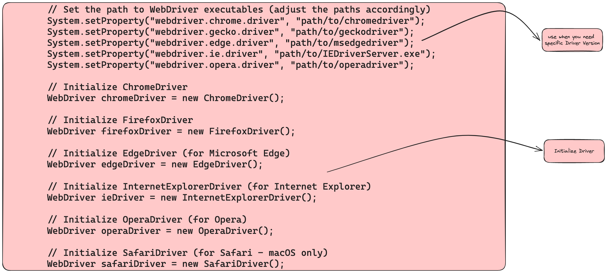

### Components


###  Architecture


### Example Code

### Code 
```Java
import org.openqa.selenium.WebDriver;
import org.openqa.selenium.chrome.ChromeDriver;
import org.openqa.selenium.firefox.FirefoxDriver;
import org.openqa.selenium.edge.EdgeDriver;
import org.openqa.selenium.ie.InternetExplorerDriver;
import org.openqa.selenium.opera.OperaDriver;
import org.openqa.selenium.safari.SafariDriver;

public class WebDriverExamples {
    public static void main(String[] args) {
        // Set the path to WebDriver executables (adjust the paths accordingly)
        System.setProperty("webdriver.chrome.driver", "path/to/chromedriver");
        System.setProperty("webdriver.gecko.driver", "path/to/geckodriver");
        System.setProperty("webdriver.edge.driver", "path/to/msedgedriver");
        System.setProperty("webdriver.ie.driver", "path/to/IEDriverServer.exe");
        System.setProperty("webdriver.opera.driver", "path/to/operadriver");
        
        // Initialize ChromeDriver
        WebDriver chromeDriver = new ChromeDriver();

        // Initialize FirefoxDriver
        WebDriver firefoxDriver = new FirefoxDriver();

        // Initialize EdgeDriver (for Microsoft Edge)
        WebDriver edgeDriver = new EdgeDriver();

        // Initialize InternetExplorerDriver (for Internet Explorer)
        WebDriver ieDriver = new InternetExplorerDriver();

        // Initialize OperaDriver (for Opera)
        WebDriver operaDriver = new OperaDriver();

        // Initialize SafariDriver (for Safari - macOS only)
        WebDriver safariDriver = new SafariDriver();
        
        // Close the browser windows when done
        chromeDriver.quit();
        firefoxDriver.quit();
        edgeDriver.quit();
        ieDriver.quit();
        operaDriver.quit();
        // Note: SafariDriver doesn't require quitting explicitly as Safari handles it automatically.
    }
}

```

### Reference
```
https://www.selenium.dev/documentation/
```


