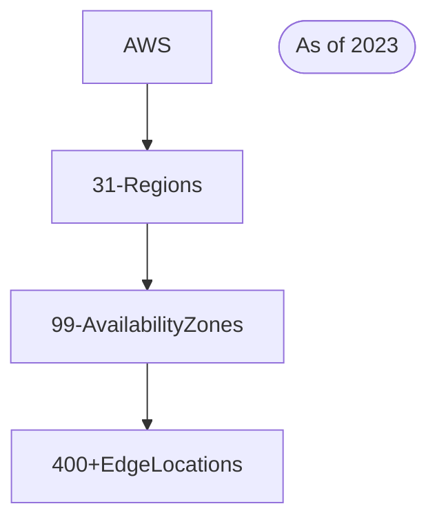

- [[AWS World Wide Infrastructure]]

```mermaid
flowchart TD
AWS --> 31-Regions --> 99-AvailabilityZones --> 400+EdgeLocations
id1([As of 2023])
```

- [[IAM]]
- [[AWS Local Zones]]
- [[Cloud Computing]]
- [[AWSD]]
- 