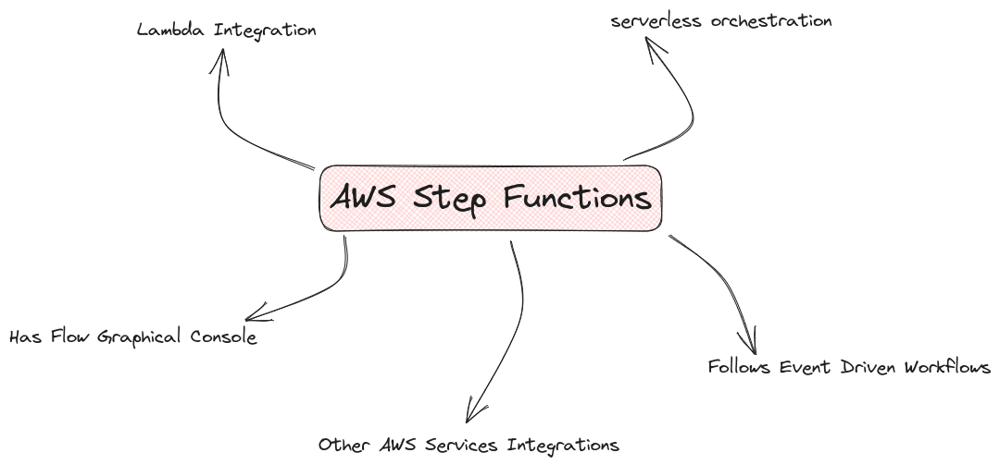
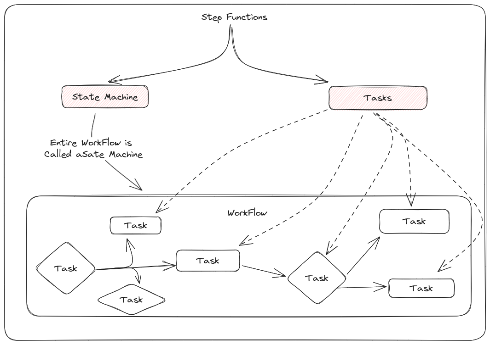

# Basics Of StepFunctions

1. Please have a look at the [AWS Reference](https://docs.aws.amazon.com/step-functions/index.html) .
2. Also You can also practice  linked [StepFunctions Workshop](https://catalog.workshops.aws/stepfunctions/en-US/introduction) . 

### Basics 

### State Machines and Tasks

