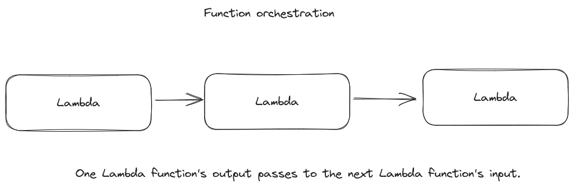
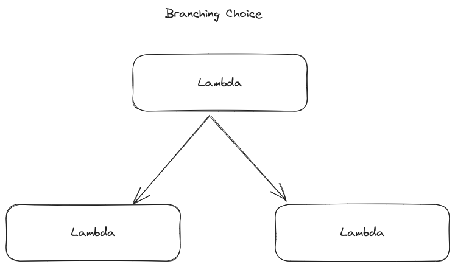

## Function Orchestration 

## Branching (Choice)

## Error handling (Retry/Catch)

### Retry

In this use case, a customer requests a username. The first time, your customer’s request is unsuccessful. Using a Retry statement, you can have Step Functions try your customer's request again. The second time, your customer’s request is successful.

### Catch

In a similar use case, a customer requests an unavailable username. Using a Catch statement, you have Step Functions suggest an available username. If your customer takes the available username, you can have Step Functions go to the next step in your workflow, which is to send a confirmation email. If your customer doesn’t take the available username, you have Step Functions go to a different step in your workflow, which is to start the sign-up process over.

##  Human in the loop

Using a banking app, one of your customers sends money to a friend. Your customer waits for a confirmation email. With a callback and a task token, you have Step Functions tell Lambda to send your customer’s money and report back when your customer’s friend receives it. After Lambda reports back that your customer’s friend received the money, you can have Step Functions go to the next step in your workflow, which is to send your customer a confirmation email.

## Parallel processing

A customer converts a video file into five different display resolutions, so viewers can watch the video on multiple devices. Using a Parallel state, Step Functions inputs the video file, so Lambda can process it into the five display resolutions at the same time.

## Dynamic parallelism
A customer orders three items, and you need to prepare each item for delivery. You check each item's availability, gather each item, and then package each item for delivery. Using a Map state, Step Functions has Lambda process each of your customer's items in parallel. Once all of your customer's items are packaged for delivery, Step Functions goes to the next step in your workflow, which is to send your customer a confirmation email with tracking information.
