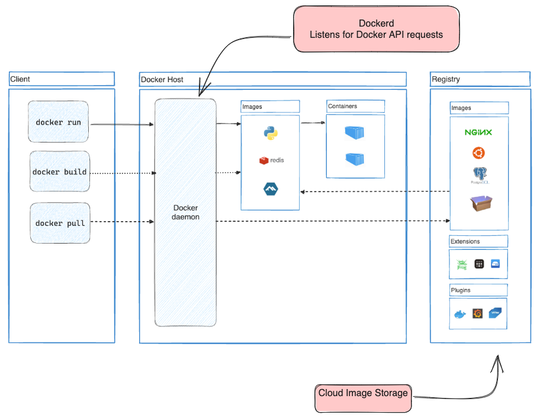

### Architecture


### Docker run

```console
$ docker run -i -t ubuntu /bin/bash
```

### Docker pull
```
docker pull ubuntu/latest
```

### Docker file 
```Dockerfile
FROM node:18-alpine
WORKDIR /app
COPY . .
RUN yarn install --production
CMD ["node", "src/index.js"]
EXPOSE 3000
```
### Build Image 
```console
$ cd /path/to/getting-started-app
$ docker build -t getting-started 
```
### List containers
```console
docker ps
docker ps -a //list container with all those were stopped
```
### Stop containers
```console
$ docker stop <the-container-id>
```

### Remove stoped containers
```console
$ docker rm <the-container-id>
```

### Push image to dockerhub
```console
docker tag getting-started YOUR-USER-NAME/getting-started
docker push YOUR-USER-NAME/getting-started
```

Continue from here 
https://docs.docker.com/get-started/05_persisting_data/

### Create Volume.
```
docker volume create mynewvolume
```

### Mount the created volume.
```
docker run -dp 3000:3000 --mount type=volume,src=mynewvolume,target=/etc/todos ubuntu 
```

### Bind Mount
```
docker run -it --rm -v ~/code/app:/app image:latest
```

```
 docker run -it --mount type=bind,src="$(pwd)",target=/src ubuntu bash
```

### Create network
 ```
docker network create todo-app
```


```d
services:
  app:
    image: node:18-alpine
    command: sh -c "yarn install && yarn run dev"
    ports:
      - 127.0.0.1:3000:3000
    working_dir: /app
    volumes:
      - ./:/app
    environment:
      MYSQL_HOST: mysql
      MYSQL_USER: root
      MYSQL_PASSWORD: secret
      MYSQL_DB: todos

  mysql:
    image: mysql:8.0
    volumes:
      - todo-mysql-data:/var/lib/mysql
    environment:
      MYSQL_ROOT_PASSWORD: secret
      MYSQL_DATABASE: todos

volumes:
  todo-mysql-data:
```

### References

- [Docker Overview](https://docs.docker.com/get-started/overview/)

- [Docker Quick Start Guide](https://docs.docker.com/get-started/overview/)

- [kernel namespaces and cgroups](https://medium.com/@saschagrunert/demystifying-containers-part-i-kernel-space-2c53d6979504)

