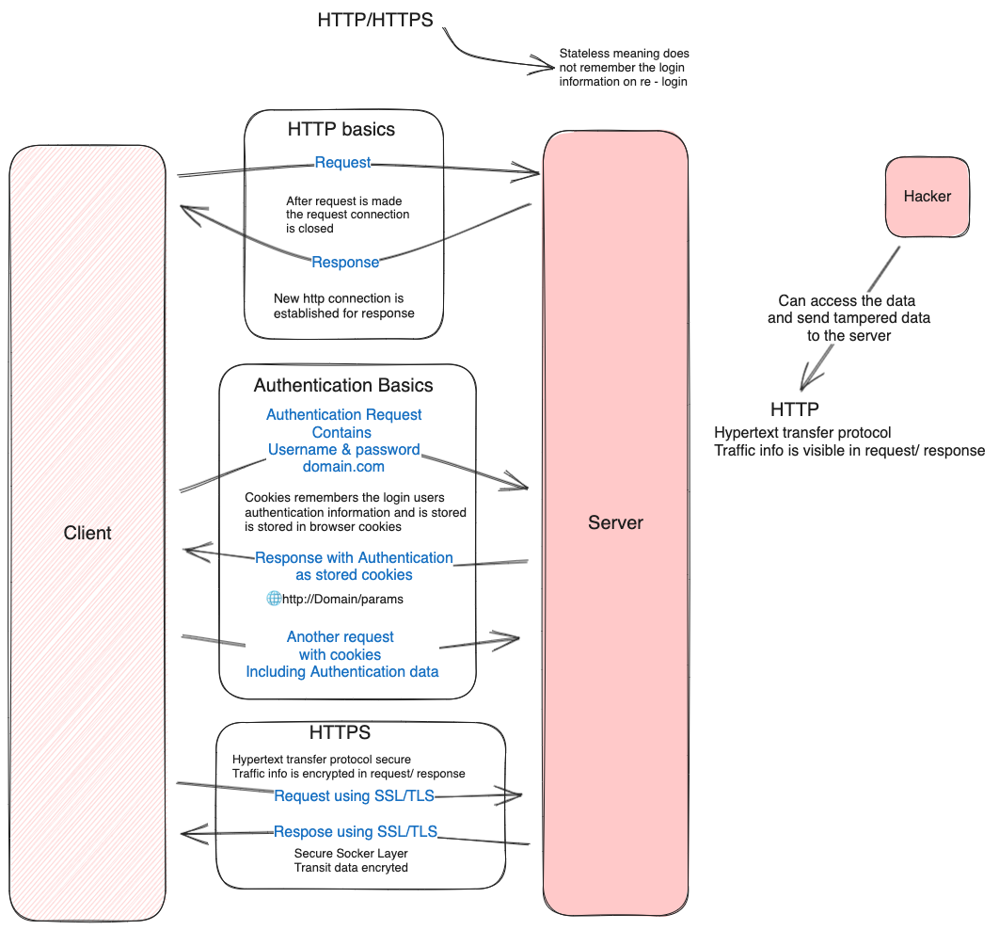

### Basics




## HTTP methods

### Get
1. can be cached.
2. Remains in browser history.
3. can be book marked.
4. Sensitive data should not be used.
5. Have length restrictions.
6. Should be used only to get data.
7. Parameters are part of URL.

```bash
https://domain.com/?key1=value1&key2=value2
```
### Post
1. Used to send data to server.
2. Parameters are part of the body.
3. can not be book marked.
4. Can not be book marked.
5. Does not store in browser history.

**GET** 	Asks to get the resource at the requested URL.
**POST** 	Asks the server to accept the body info attached. It is like GET request with extra info sent with the request.
**HEAD** 	Asks for only the header part of whatever a GET would return. Just like GET but with no body.
**TRACE** Asks for the loopback of the request message, for testing or troubleshooting.
**PUT**   Says to put the enclosed info (the body) at the requested URL.
**DELETE** 	Says to delete the resource at the requested URL.
**OPTIONS** 	Asks for a list of the HTTP methods to which the thing at the request URL can respond
**PATCH**: For partial updates.

1. 1xx (100 – 199): The response is informational
2. 2xx (200 – 299): Assures successful response
3. 3xx (300 – 399): You are required to take further action to fulfill the request
4. 4xx (400 – 499): There’s a bad syntax and the request cannot be completed
5. 5xx (500 – 599): The server entirely fails to complete the request
