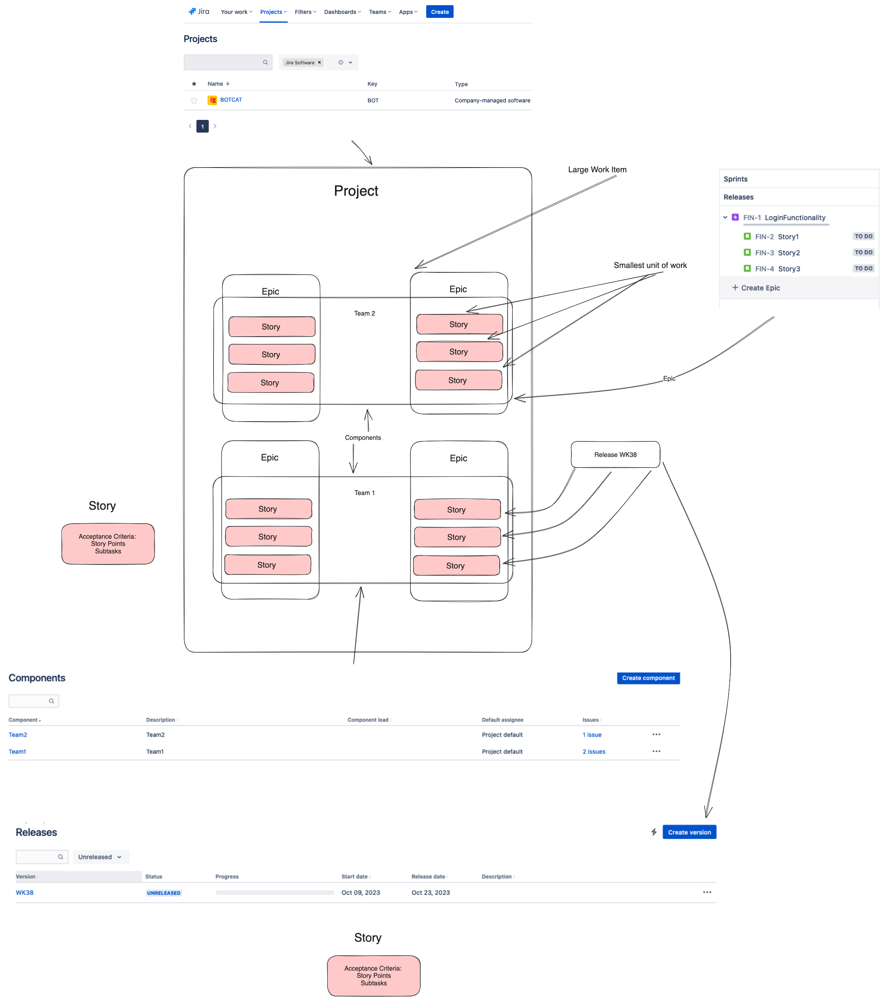
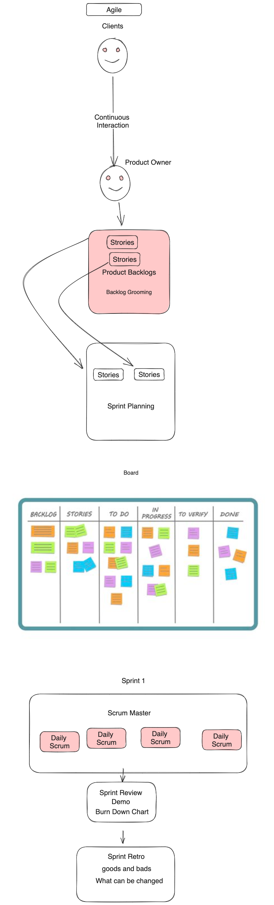

### Agile Projects

### Agile Workflow

### Agile Key points 
1. Interaction over tools. 
2. working software over documentation.
3. Customer collaboration over budget negotiation.
4. Responding to change as per plan changes.
5. Delivering software quickly in incremental model.
6. Business folks and Developer works closely.

### Sprint Artifacts
1. Product Backlog
2. Sprint Backlog
3. Burn down chart

### Sprint Ceremonies 
1. Sprint Planning
2. Daily Scrum Meeting
3. Sprint Review
4. Sprint Retro
### Kanban vs Scrum 
1. No Sprint backlog in Kanban
2. There is no process in Kanban 
3. Scrum has a fixed timeline