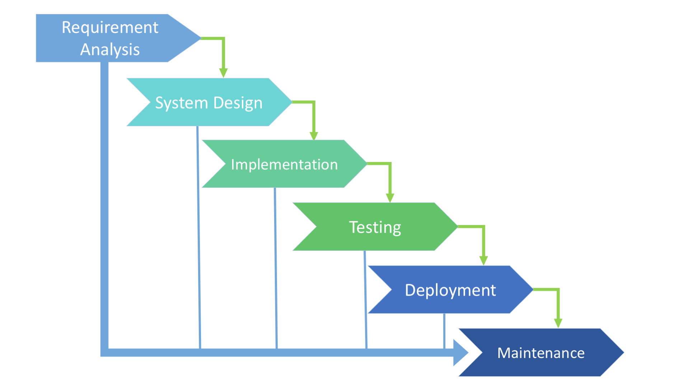

### Scrum Projects

### Kanban Projects

### Waterfall Model

1. Time to market is high
2. Final appliaction might not be what customer wanted. 
3. Changing the requirements midway is difficult.
4. Not suitable for project where requirements keeps on changing.
5. Better Documentation.

### Agile

1. Interaction over tools. 
2. working software over documentation.
3. Customer collaboation over budget negotiation.
4. Responding to change as per plan changes.
5. Delivering software quickly in incremental model.
6. Business folks and Developer works closely.

### Scrum / Sprint

1. Plan
2. Build
3. Test
4. Review

### Sprint Artifacts
1. Product Backlog
2. Sprint Backlog
3. Burn down chart

### Ceremonies 
1. Sprint Planning
2. Scrum Meeting
3. Sprint Review
4. Sprint Retro

### Kanban vs Scrum 
1. No Sprint backlog in Kanban
2. There is no process in Kanban 
3. Scrum has a fixed timeline

### Jira 
1. Jira Project 
2. Systems Dashboard (You can customize your dashboard as you like)
3. Everything in Jira is an Issue.
4. Epic - Major functionality
5. Stories - is defined as what user would want to be able to do after the end of Sprint
6. Task - are assigned to Developer

Epic -> Stories -> Tasks -> Bug

### Issue WorkFlow 
1. New 
2. Work

### Issue Estimates
1. by hours 
2. by story points

### Roles 
1. Global
2. Project Specific roles

### Createing custom issue type called scheme
### Createing custom fileds 
### Createing custom workflows
### Default Assignee can be set too
### Componenets can be created to device the responsibility to specific team (Its exactly like a configuration Item)

### Edge Test cases 

### Jira Introduction

1. Bug Tracking
2. Issue Tracking
3. Project Management
4. Requirements Management
5. HelpDesk
6. Generate Reports
7. Customized Issues 
8. Custome Notifications
9. Powerfull Search functionality
10. Extincible

