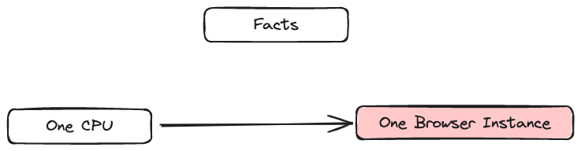

`Parallel Tests on Multiple Machines with Differen versions of Browser on different Platform`

#### Development Server on 4444
```
java -jar selenium-server-<version>.jar standalone
```
### Architecture

#### Hub Registration
```shell
java -jar selenium-server-<version>.jar hub
```
#### Hub on a specific port 
```shell
java -jar selenium-server-<version>.jar hub --publish-events tcp://<hub-ip>:8886 --subscribe-events tcp://<hub-ip>:8887 --port 8888
```

#### Node registration
```shell
java -jar selenium-server-<version>.jar node 
```
#### Node registration on a specific port
```shell
java -jar selenium-server-<version>.jar node --port 5555
```
#### Connect to a hub 
```shell
java -jar selenium-server-<version>.jar node --hub http://<hub-ip>:4444
```
#### connect to a hub with specific port 
```shell
java -jar selenium-server-<version>.jar node --publish-events tcp://<hub-ip>:8886 --subscribe-events tcp://<hub-ip>:8887
```




**Not applicable in case of Safari -- It can only spin up one instance**