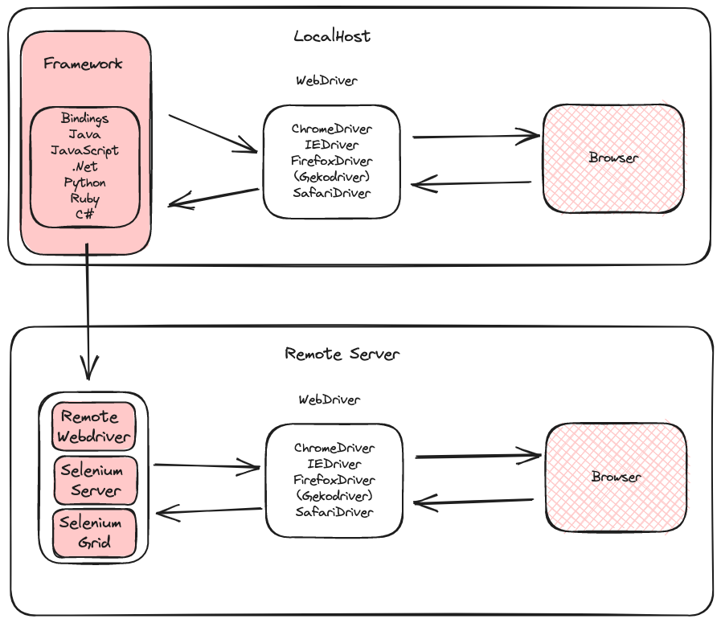

### Components

###  Architecture

### Initialise Browser

### Selenium Manager(_official driver manager_)
`Selenium bindings use this tool by default`

### Code Reference
[Browser Initialise](https://github.com/sunnyRavindra/DataDrivenFramework/blob/main/src/test/java/com/amazon/testcase/InitializeBrowser.java)
