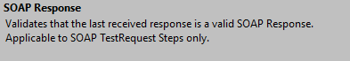
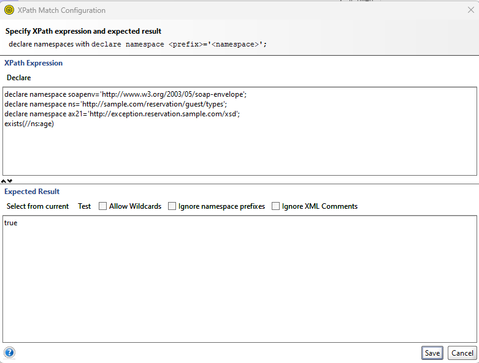
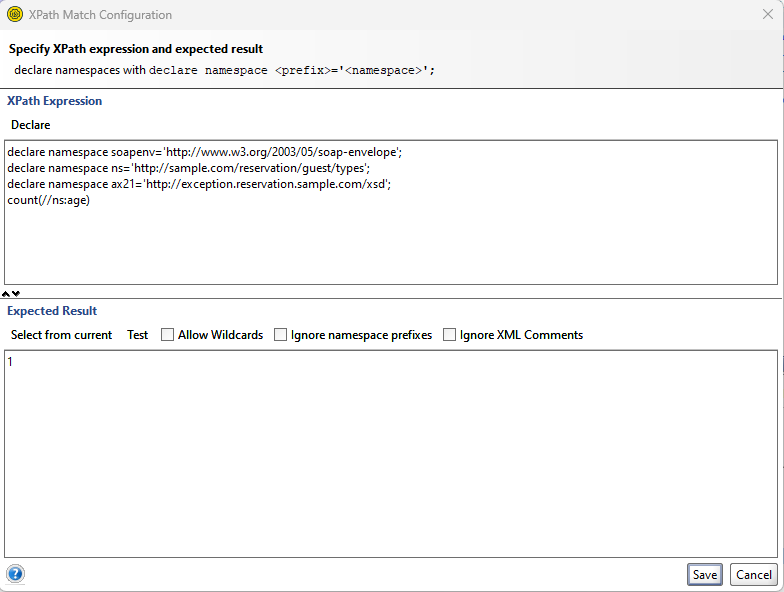
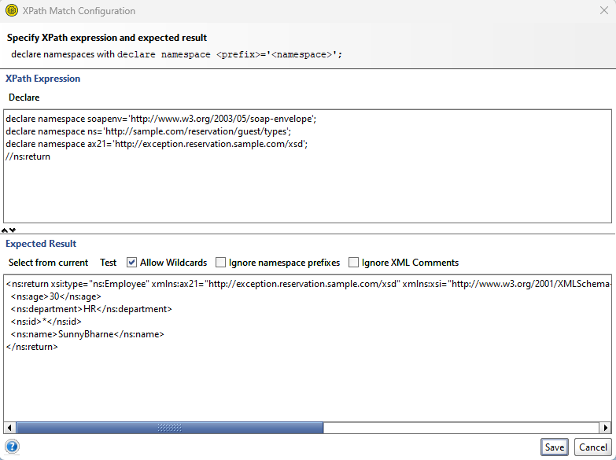
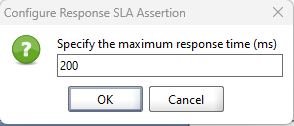
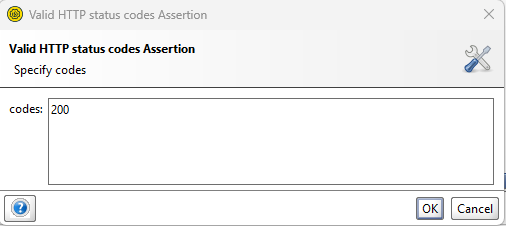
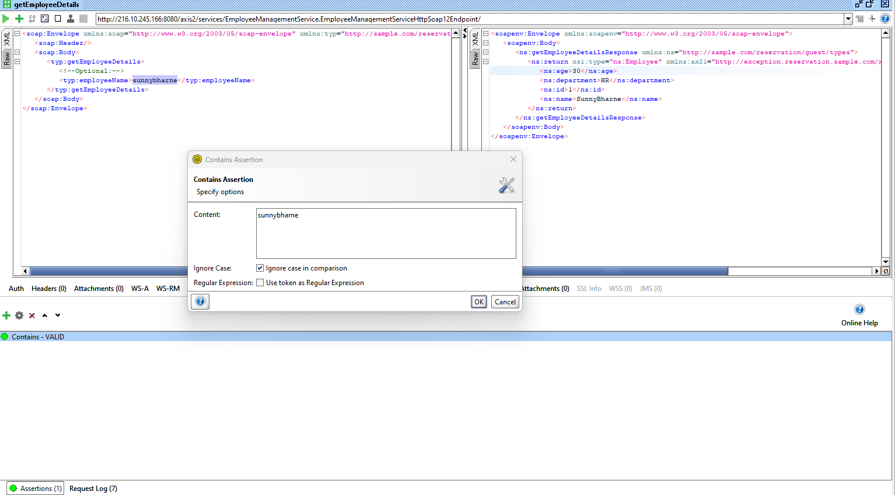
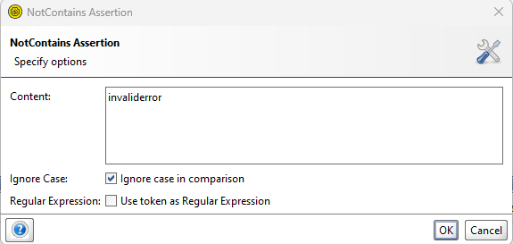

Assertions in SoapUI are used to validate the responses and behavior of web services during testing. They help ensure that the service meets the expected criteria.

### Types of Assertions

SoapUI supports various types of assertions, including:

### Response Assertion
Compares the response against expected values, status codes, or patterns.

2. **XPath Assertion**: Validates elements or attributes in XML responses using XPath expressions.
### Tag existence 

### Tag Counts

### Entire XML validation

### Allow Wildcards in Xpath

3. **Script Assertion**: Allows you to write custom scripts (e.g., Groovy scripts) to define complex validation logic.

4. **JSONPath Assertion**: Similar to XPath but for JSON responses, it uses JSONPath expressions for validation.
### SLA Assertion

### Status Code Assertion

### Contains Assertion

### Token validation
### Not Contains Assertion

8. **Length Assertion**: Verifies the length of the response content.

9. **SOAP Fault Assertion**: Ensures that a response contains a SOAP fault when expected.

### Using Assertions

To use assertions in SoapUI:

1. Create a test step in your test case (e.g., a REST or SOAP request).

2. Open the test step and navigate to the "Assertions" tab.

3. Add the desired assertion type based on what you want to validate.

4. Configure the assertion's settings, such as expected values or patterns.

5. Run the test case, and SoapUI will report whether the assertions pass or fail.

### Importance of Assertions

- Assertions help automate the validation process, making it easier to detect issues and changes in web service behavior.

- They play a critical role in regression testing, ensuring that new updates don't break existing functionality.

- By specifying expected outcomes, assertions provide clear pass/fail criteria for testing.

- They improve the reliability and accuracy of testing by reducing manual verification efforts.

- Assertions are an essential part of SoapUI's functionality, making it a powerful tool for testing and quality assurance.

Using assertions in SoapUI is crucial for robust testing of web services, enabling thorough verification of expected results and service behavior.
