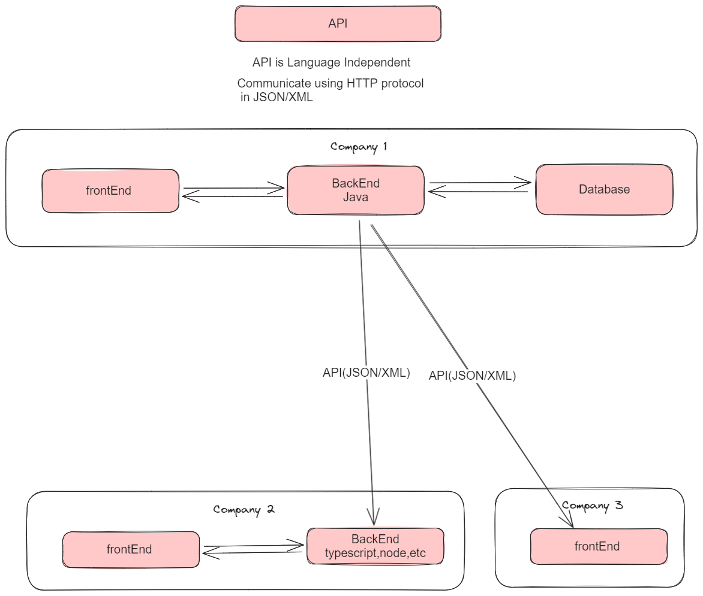
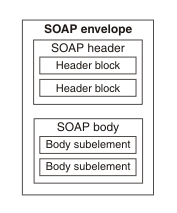

### API (Application Programming Interface) Basic Concepts

APIs, or Application Programming Interfaces, are essential components of software and system development, enabling applications to communicate and interact with each other. Here are some fundamental concepts related to APIs:

### What is an API?

- An API is a set of rules and protocols that allows different software applications to communicate and interact with each other.

- It defines the methods and data formats that applications can use to request and exchange information.

- APIs can be used to access functionality or data from services, libraries, or external systems.

### Types of APIs

1. **Web APIs**: Web APIs, often referred to as REST or SOAP APIs, are accessed over the internet using standard HTTP methods. They allow applications to communicate over the web.

2. **Library APIs**: Library APIs are sets of functions and procedures that developers can use to perform specific tasks or operations within a program.

3. **Operating System APIs**: These APIs provide access to the underlying functions and services of an operating system, such as file management, hardware control, and process management.

4. **Database APIs**: Database APIs enable applications to interact with databases, allowing data retrieval, modification, and management.

### Key Concepts

- **Endpoints**: Endpoints are specific URLs or URIs that represent different functionalities or resources provided by a web API. Each endpoint corresponds to a specific action.

- **HTTP Methods**: APIs use HTTP methods (e.g., GET, POST, PUT, DELETE) to perform operations on resources. For example, GET retrieves data, while POST creates new data.

- **Request and Response**: An API request is made by a client to access a resource, and the server responds with data or the result of the requested operation.

- **Authentication**: Many APIs require authentication, ensuring that only authorized users or applications can access the data or services.

- **Rate Limiting**: APIs may have rate limits to control the number of requests a client can make within a specific time frame to prevent abuse.

- **Versioning**: API versions are used to maintain compatibility. When changes are made, older versions can still be used by existing clients.

## Use Cases

- **Integration**: APIs are crucial for integrating services and systems, allowing them to work together and share data.

- **Third-Party Services**: Developers use APIs to access services and data provided by external organizations, such as social media platforms or payment gateways.

- **Mobile Apps**: Mobile apps often use APIs to access server-side functionality, such as retrieving data from a remote server.

- **Automation**: APIs are used for automating tasks, enabling software to interact with other software without manual intervention.

- **Data Access**: APIs provide structured access to data, making it easier to retrieve and manipulate information.

APIs are the building blocks of modern software development, enabling interoperability and data exchange between a wide range of applications and systems.

### Structure of a SOAP message

A SOAP message is encoded as an XML document, consisting of an "Envelope" element, which contains an optional "Header" element, and a mandatory "Body" element. The "Fault" element, contained in the "Body", is used for reporting errors.

### 1 Envelope

The SOAP "Envelope" is the root element in every SOAP message. It contains two child elements, an optional "Header", and a mandatory "Body".

### 2 Header

The SOAP "Header" is an optional subelement of the SOAP envelope. It is used to pass application-related information that is to be processed by SOAP nodes along the message path.

### 3 Body

The SOAP "Body" is a mandatory subelement of the SOAP envelope. It contains information intended for the ultimate recipient of the message.

### 4 Fault

The SOAP "Fault" is a subelement of the SOAP body, which is used for reporting errors.

With the exception of the "Fault" element, which is contained in the "Body" of a SOAP message, XML elements in the "Header" and the "Body" are defined by the applications that make use of them. However, the SOAP specification imposes some constraints on their structure.

### Structure of a SOAP message



### example of a SOAP message

```soap
<soap:Envelope xmlns:soap="http://www.w3.org/2003/05/soap-envelope" xmlns:tem="http://tempuri.org/">
   <soap:Header/>
   <soap:Body>
      <tem:Add>
         <tem:a>7</tem:a>
         <tem:b>6</tem:b>
      </tem:Add>
   </soap:Body>
</soap:Envelope>
```

```soap
<?xml version='1.0' ?>
<env:Envelope xmlns:env="http://www.w3.org/2003/05/soap-envelope"> 
 <env:Header>
  <m:reservation xmlns:m="http://travelcompany.example.org/reservation" 
          env:role="http://www.w3.org/2003/05/soap-envelope/role/next"
           env:mustUnderstand="true">
   <m:reference>uuid:093a2da1-q345-739r-ba5d-pqff98fe8j7d</m:reference>
   <m:dateAndTime>2001-11-29T13:20:00.000-05:00</m:dateAndTime>
  </m:reservation>
  <n:passenger xmlns:n="http://mycompany.example.com/employees"
          env:role="http://www.w3.org/2003/05/soap-envelope/role/next"
           env:mustUnderstand="true">
   <n:name>Åke Jógvan Øyvind</n:name>
  </n:passenger>
 </env:Header>
 <env:Body>
  <p:itinerary
    xmlns:p="http://travelcompany.example.org/reservation/travel">
   <p:departure>
     <p:departing>New York</p:departing>
     <p:arriving>Los Angeles</p:arriving>
     <p:departureDate>2001-12-14</p:departureDate>
     <p:departureTime>late afternoon</p:departureTime>
     <p:seatPreference>aisle</p:seatPreference>
   </p:departure>
   <p:return>
     <p:departing>Los Angeles</p:departing>
     <p:arriving>New York</p:arriving>
     <p:departureDate>2001-12-20</p:departureDate>
     <p:departureTime>mid-morning</p:departureTime>
     <p:seatPreference/>
   </p:return>
  </p:itinerary>
  <q:lodging
   xmlns:q="http://travelcompany.example.org/reservation/hotels">
   <q:preference>none</q:preference>
  </q:lodging>
 </env:Body>
</env:Envelope>
```


### WSDL (Web Services Description Language)

WSDL is an XML-based language used to describe web services and their functionality.

- **Service**: Describes the service's name and location (URL).

- **Ports**: Define the endpoints for the service.

- **Operations**: Specify the functions or methods that can be called on the service.

- **Messages**: Describe the data exchanged between the client and the service.

- **Data Types**: Define the data structures used by the service.

### WSDL Purpose

- WSDL is essential in web service development for integrating different systems and allowing them to communicate over a network.

- It defines the contract between service providers and consumers, ensuring both parties understand how to interact.

- When used with SOAP (Simple Object Access Protocol), it creates platform-independent web services.

### Example WSDL Structure

```xml
<definitions name="MyService"
    targetNamespace="http://example.com/myservice.wsdl"
    xmlns="http://schemas.xmlsoap.org/wsdl/"
    xmlns:soap="http://schemas.xmlsoap.org/wsdl/soap/"
    xmlns:tns="http://example.com/myservice.wsdl">
    
    <service name="MyService">
        <port name="MyServicePort" binding="tns:MyServiceBinding">
            <soap:address location="http://example.com/myservice"/>
        </port>
    </service>
    
    <binding name="MyServiceBinding" type="tns:MyServicePortType">
        <soap:binding style="rpc" transport="http://schemas.xmlsoap.org/soap/http"/>
        <operation name="doSomething">
            <soap:operation soapAction="http://example.com/myservice#doSomething"/>
            <input>
                <soap:body use="encoded" namespace="urn:example" encodingStyle="http://schemas.xmlsoap.org/soap/encoding/"/>
            </input>
            <output>
                <soap:body use="encoded" namespace="urn:example" encodingStyle="http://schemas.xmlsoap.org/soap/encoding/"/>
            </output>
        </operation>
    </binding>
    
    <portType name="MyServicePortType">
        <operation name="doSomething">
            <input message="tns:doSomethingIn"/>
            <output message="tns:doSomethingOut"/>
        </operation>
    </portType>
    
    <message name="doSomethingIn">
        <part name="parameters" element="tns:doSomething"/>
    </message>
    
    <message name="doSomethingOut">
        <part name="parameters" element="tns:doSomethingResponse"/>
    </message>
    
    <element name="doSomething" type="xsd:string"/>
    
    <element name="doSomethingResponse" type="xsd:string"/>
</definitions>
```

### WSDL Usage

- WSDL files can be used to generate client code (proxy classes) or server code (skeleton classes) in various programming languages to interact with web services.

- They play a crucial role in enabling the interoperability of web services in a standardized way.

WSDL is fundamental in building and accessing web services in a structured and consistent manner. Understanding its structure and usage is essential for web service development and integration.
