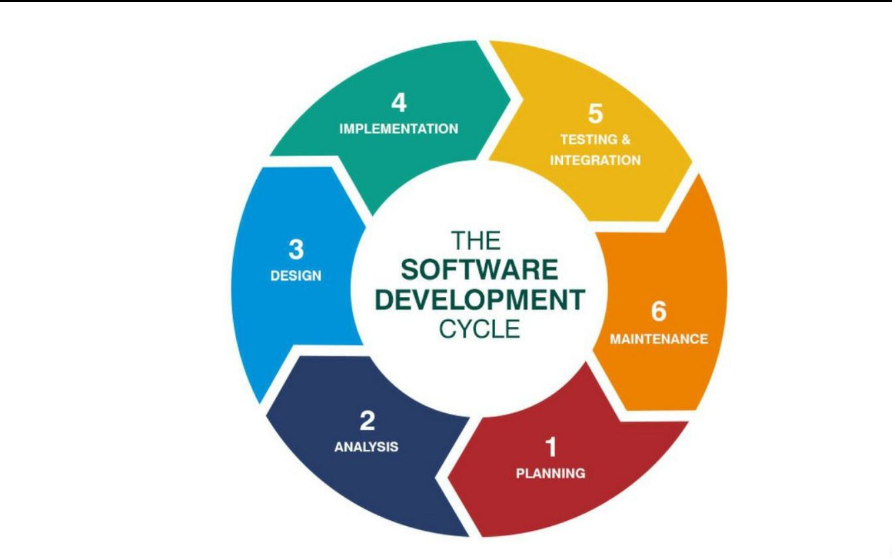
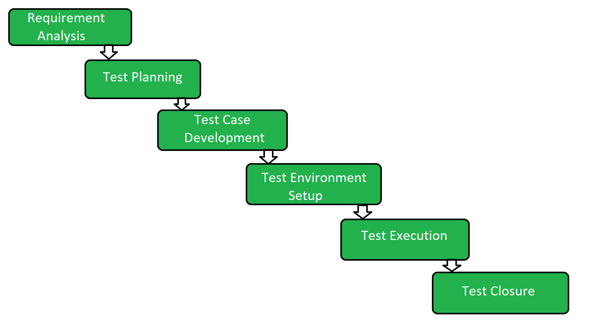

Software Development Life Cycle (SDLC) and Software Testing Life Cycle (STLC) are two distinct but interconnected processes in the software development and testing industry. Here are notes about both SDLC and STLC:

### Software Development Life Cycle (SDLC)
- **Purpose:** SDLC is a systematic process for planning, designing, developing, testing, and delivering software applications. It provides a structured approach to building software products, ensuring quality and meeting project objectives.
- **Scope:** SDLC encompasses the entire software development process, from initial requirements gathering and design to coding, testing, deployment, and maintenance.
- **Phases:** Common SDLC phases include Requirements Gathering, Planning, Design, Implementation (Coding), Testing, Deployment, and Maintenance.
- **Methodologies:** Various methodologies, such as Waterfall, Agile (e.g., Scrum), and DevOps, define the approach and order of these phases, emphasizing different aspects like sequential planning (Waterfall) or iterative development (Agile).
- **Key Documents:** SDLC produces various documents, including requirement specifications, design documents, codebase, and deployment plans.

### Software Testing Life Cycle (STLC)
- **Purpose:** STLC is the process of planning, designing, executing, and evaluating testing activities throughout the software development life cycle. It ensures that software is thoroughly tested to meet quality and performance requirements.
- **Scope:** STLC specifically focuses on the testing phase of SDLC, covering various levels (unit, integration, system, acceptance) and types of testing (functional, non-functional).
- **Phases:** STLC typically consists of phases such as Test Planning, Test Design, Test Execution, Defect Reporting, and Test Closure.
- **Methodologies:** STLC operates within the framework of SDLC methodologies. For instance, in Agile SDLC, testing activities are incorporated into each sprint or iteration.
- **Key Documents:** STLC generates test documentation, including test plans, test cases, test data, defect reports, and test summary reports.

### Key Differences
- SDLC encompasses the entire software development process, while STLC is specifically concerned with testing activities within SDLC.
- SDLC focuses on planning, design, coding, and overall software development, whereas STLC emphasizes testing strategy, test case creation, and test execution.
- SDLC can use various development methodologies (Waterfall, Agile), while STLC adapts to the chosen development methodology, ensuring testing aligns with the development process.
- In SDLC, the end goal is to deliver a working software product, while in STLC, the goal is to verify and validate the quality of the software through comprehensive testing.

### Integration
- STLC is an integral part of SDLC. Testing activities are carried out in parallel with development activities, ensuring that testing is a continuous and concurrent process.
- STLC helps verify that software meets the quality standards set during the development phases of SDLC.

In summary, SDLC represents the entire software development process, while STLC specifically focuses on the testing phase within SDLC. Both are crucial for delivering high-quality software products that meet user requirements and perform reliably.
