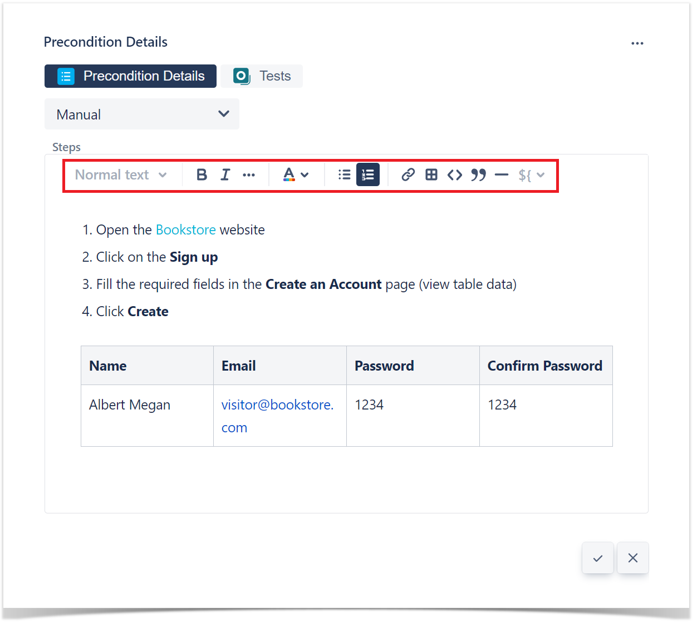
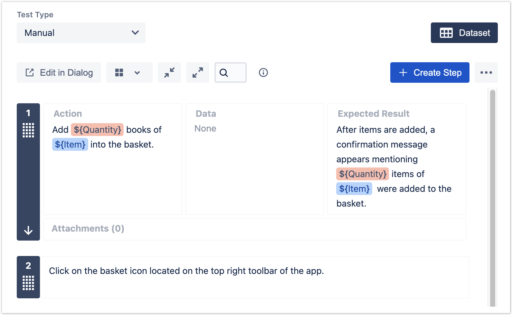

### TestCase 

### Test Types
- **Cucumber**: of the Gherkin Kind;
- **Generic**: of the Unstructured Kind;
- **Manual**: of the Steps Kind.

### Preconditions 
- A Precondition is like defining the step "0" for your tests.

### Precondition Types
    - Manual Type
    - Generic Type
    - Cucumber Type

### Cucumber 

### Manual and Generic

### Import Steps

- Test
- CSV
- JSON
- Clipboard

### Export Steps

- To CSV
### Cucumber Tests

### Export to Cucumber 

1. Feature file can be exported from xray itself. 

**Export to Cucumber**

### Parameterized Test

### Datasets

The parameters, along with their values, are defined within a **dataset**. A dataset is a collection of data represented with a tabular view where every column of the table represents a particular variable (or **parameter**), and each row corresponds to a given record (or **iteration**) of the dataset.

The number of rows in the dataset determines the number of iterations to execute. If the dataset contains a single row, there will be a single execution parameterized with the values defined on the dataset row.

Datasets can be defined in different [entities and scopes](https://docs.getxray.app/display/XRAYCLOUD/Parameterized+Tests#ParameterizedTests-Datasetscopes). A dataset can be defined, edited, or simply viewed using the "**Dataset**" button located in each Xray [entity or scope](https://docs.getxray.app/display/XRAYCLOUD/Parameterized+Tests#ParameterizedTests-Datasetscopes).
  

### Test Case Versioning 
