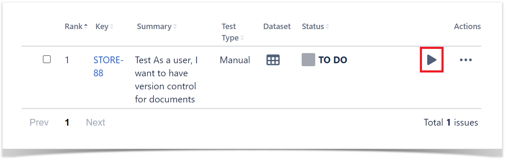
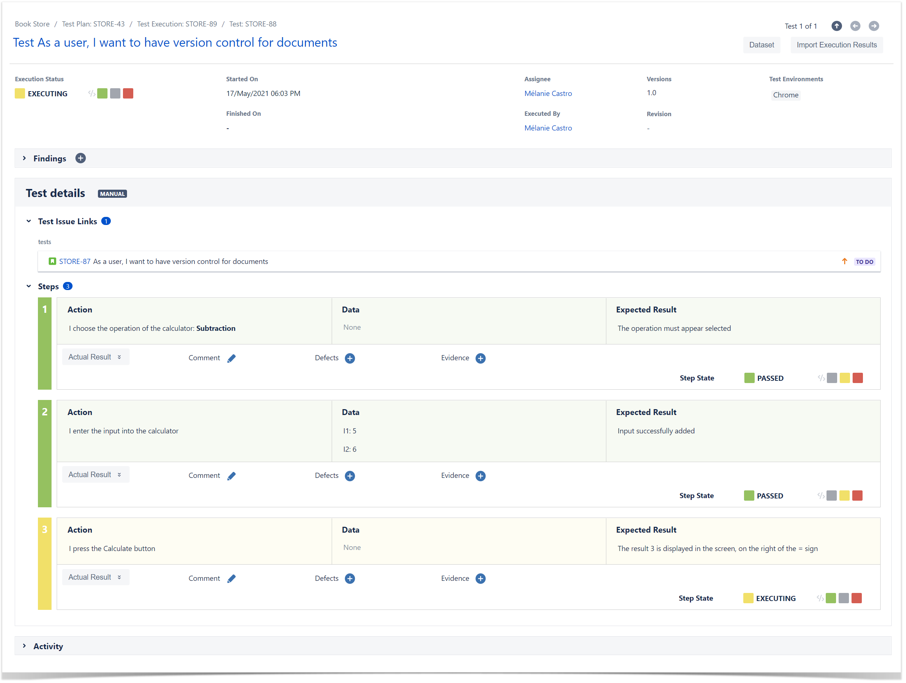
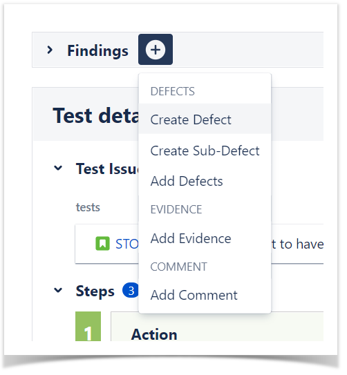

### Execute Tests
 
The easiest way to execute your tests is directly from the Test Plan, but you can also perform ad-hoc Test Executions directly from a Test, or even create a new Test Execution issue. 

1. Inside the **Test Plan**, click on **Create Test Execution**.  

2. Go to **Test Execution**, and click on **Execute** (play button).  

3. You are now at the Test Execution Screen, and from here you can follow the test steps and set the execution status: **TODO**, **EXECUTING**, **FAIL** and **PASS.  

4. Did you find a defect and want to report it? Create Defects from the Test Execution Screen, click on + button in the **Findings** section and select **Create Defect** (or expand the **Findings** section and in the **Defects** panel select **Create Defect)  

        
### Sub Test Execution

A Sub-Test Execution is similar to a Test Execution, but created as a sub-task of a requirement.
Normally, you will create Test Executions from Test Plans, or create ad hoc Test Executions (directly from a Test).

### Test Repository  

A project page which enables the hierarchical organisation of Tests at the project level by allowing you to organise Tests in folders and sub-folders. You can also perform several actions from this page including, creating new Tests, creating new Test Plans, Test Sets, Test Executions for a group of Tests, etc. This is the recommended approach whenever you have a large number of Tests and want to manage them more effectively.

### Test Set

An issue type for organising tests, and it is a flat list of Tests and is a simple way to create different groups of Tests. You can easily use them to add several Tests at once into Tests Plans or Test Executions.