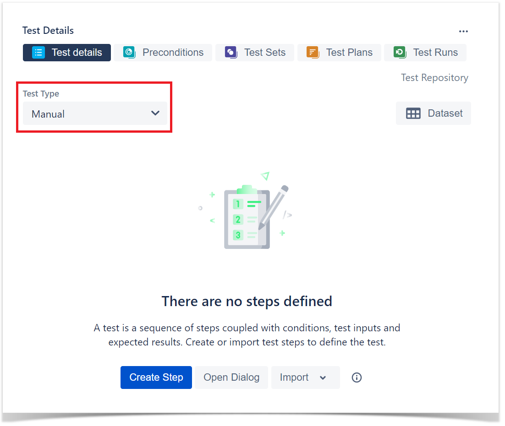
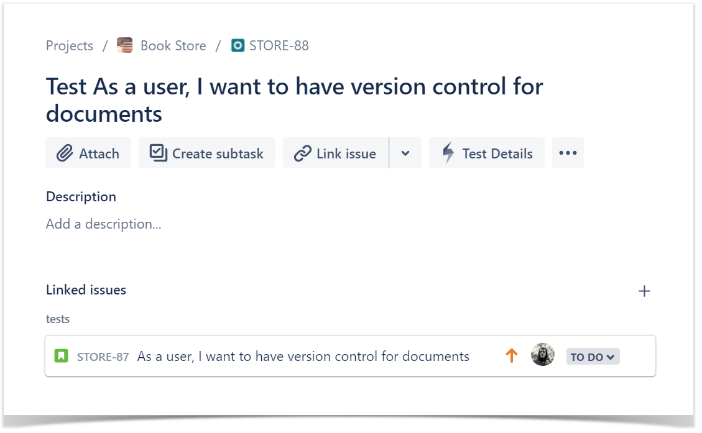

1. With Test Plans you will decide which Tests you want to perform, who will execute them and when they will be executed.  
2. Also, you may want to prioritize some of the Tests and focus on specific requirements.  
3. Test Plans are used to define the scope of your testing, track and consolidate the related results, no matter how many times you've run the tests.
### TestCase 

