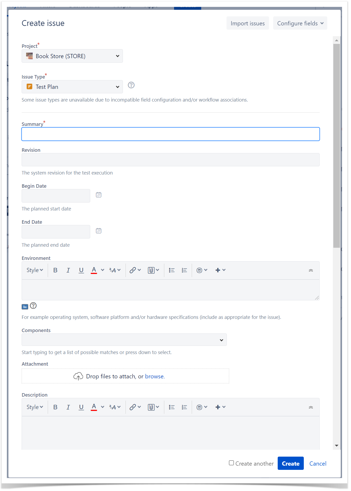

###  Basic Details

1. With Test Plans you will decide which Tests you want to perform, who will execute them and when they will be executed.  
2. Also, you may want to prioritise some of the Tests and focus on specific requirements.  
3. Test Plans are used to define the scope of your testing, track and consolidate the related results, no matter how many times you've run the tests.

### Planning 
Planning is the activity where you decide your **testing strategy,** e.g.,  which covered issues you want to validate, how would you validate them, will it be manual or automated, how will the resources be allocated, when and who will execute the tests. Depending on several factors, you may want to prioritize some of the tests, or focus on specific requirements. 

Although you may plan tests in [different ways](https://docs.getxray.app/display/XRAYCLOUD/Test+Process), we recommend that you use the [Test Plan](https://docs.getxray.app/display/XRAYCLOUD/Test+Plan) issue specifically for this purpose.

In your Test Plan, you can put the Tests you want to track for a given version and the Test Plan will show you the consolidated results for those Tests. In other words, it will present the latest status of each Test, independent of the number of testing iterations (i.e., Test Execution) you make with them

### Test Plan Steps

1. Click **Create** button and select **Test Plan** issue.
2. Besides **Summary**, you may want to fill out the **Fix Version** to indicate that you're tracking the results of the Tests for a specific version. This only makes sense if you have multiple versions.  

3. After creating the **Test Plan**, you can add **Tests**.  

    

5. Choose the Tests you want, by using the **Select** or **Search** tabs and then selecting some or all of them. Click **Add Selected** or **Add All**.  

