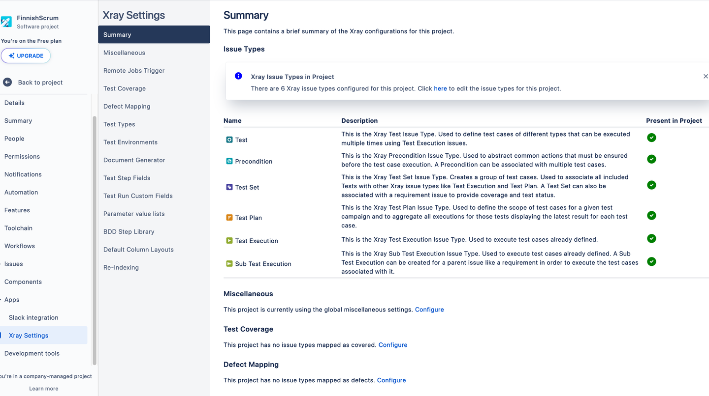

### Xray Types


### Xray Functionality


### Issue Types


### Issue Types added


### Supported Frameworks


### CI Support 


### Testing Board


### TestCase


### Sprint Board


### Reference  
```
https://docs.getxray.app/site/xray
```
