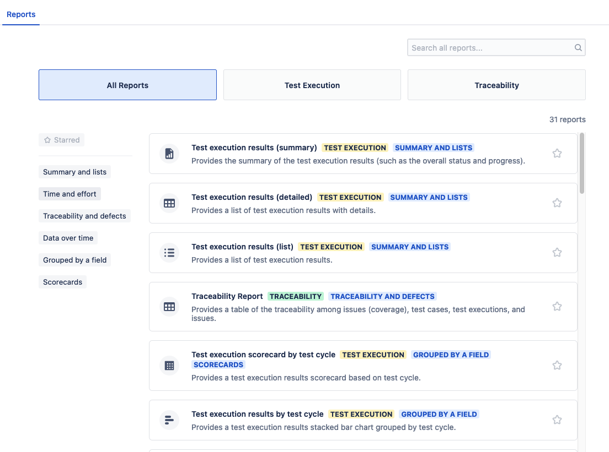

### Test-Execution Reports

Test-execution reports provide information about the status of the testing effort, including overall software quality and test execution progress.

|Report Title|Description|
|---|---|
|_Test execution results (summary)_|Provides the summary of the test execution results (such as the overall status and progress)|
|_Test execution results (list)_|Provides a list of test execution results|
|_Test execution results (detailed)_|Provides a list of test execution results with details|
|_Test execution burn up_|Provides a test execution burn-up chart.|
|_Test execution burn down_|Provides a test execution burn-down chart.|
|_Test execution completion over time by status_|Provides a test execution results line and bar chart.|
|_Test execution completion over time_|Provides a test execution results line and bar chart (completed).|
|_Test execution completion over time by status (accumulated)_|Provides a test execution results line and bar chart (accumulated).|
|_Test execution effort over time_|Provides a test execution effort line and bar chart|
|_Test execution effort (overall)_|Provides a test execution effort bar chart (estimated x actual).|
|_Test execution effort by tester_|Provides a test execution effort by tester (estimated x actual).|
|_Test execution results (overall)_|Provides a test execution results gauge chart (overall).|
|_Test execution results (progress)_|Provides a test execution results donut chart.|
|_Test execution results by project_|Provides a test execution results stacked bar chart grouped by project.|
|_Test execution results by coverage_|Provides a test execution results stacked bar chart grouped by coverage|
|_Test execution results by test plan_|Provides a test execution results stacked bar chart grouped by test plan|
|_Test execution results by test cycle_|Provides a test execution results stacked bar chart grouped by test cycle|
|_Test execution results by tester_|Provides a test execution results stacked bar chart grouped by tester.|
|Test execution results by component|Provides a test execution results stacked bar chart grouped by component.|
|_Test execution results by environment_|Provides a test execution results stacked bar chart grouped by environment|
|_Test execution results by label_|Provides a test execution results stacked bar chart grouped by label|
|_Test execution results by iteration_|Provides a test execution results stacked bar chart grouped by iteration.|
|_Test execution results by version_|Provides a test execution results stacked bar chart grouped by version.|
|_Test execution results by priority_|Provides a test execution results stacked bar chart grouped by priority.|
|_Test execution results by type_|Provides a test execution results stacked bar chart grouped by test execution type (manual x automated)|
|_Test execution scorecard by test cycle_|Provides a test execution results scorecard broken down by test cycle|
|_Test execution scorecard by tester_|Provides a test execution results scorecard broken down by tester|

### Traceability Reports

Traceability reports give you the ability to see coverage details from a range of helpful perspectives.

|Report Title|Description|
|---|---|
|_Coverage Report_|Displays the coverage relationship between issues (coverage) and test cases|
|_Traceability Report_|Provides a table of the traceability between issues (coverage), test cases, and test executions|
|_Traceability Matrix_|Displays the traceability matrix between test cases and issues (coverage)|
|_Traceability Tree_|Offers you dynamic, broad-ranging traceability and coverage statistics for all Jira issue types|

