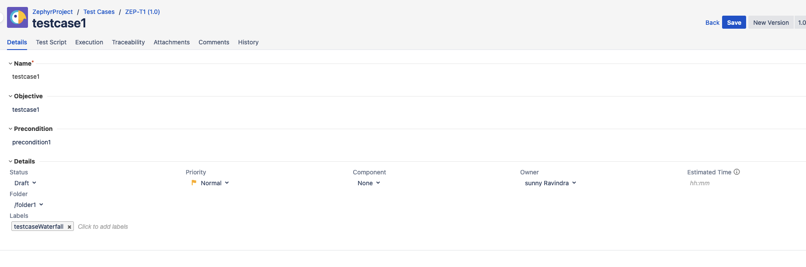
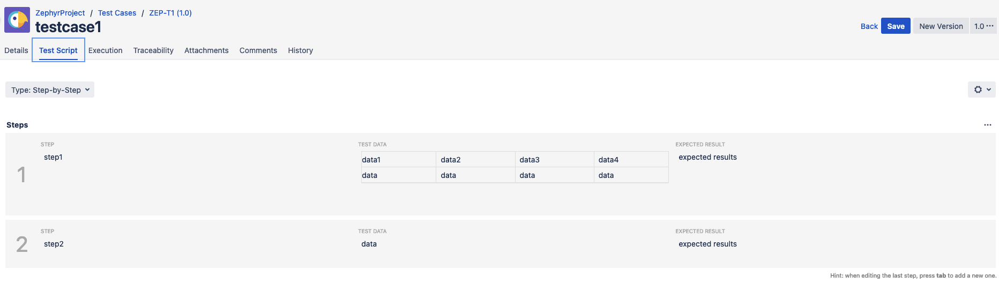
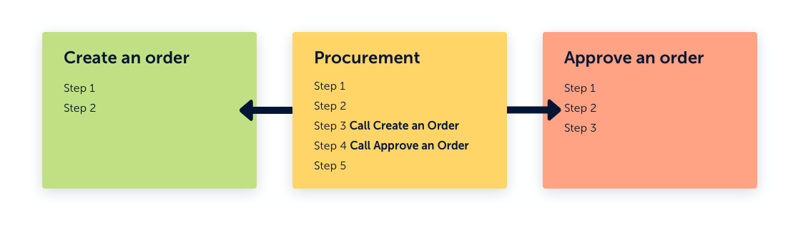
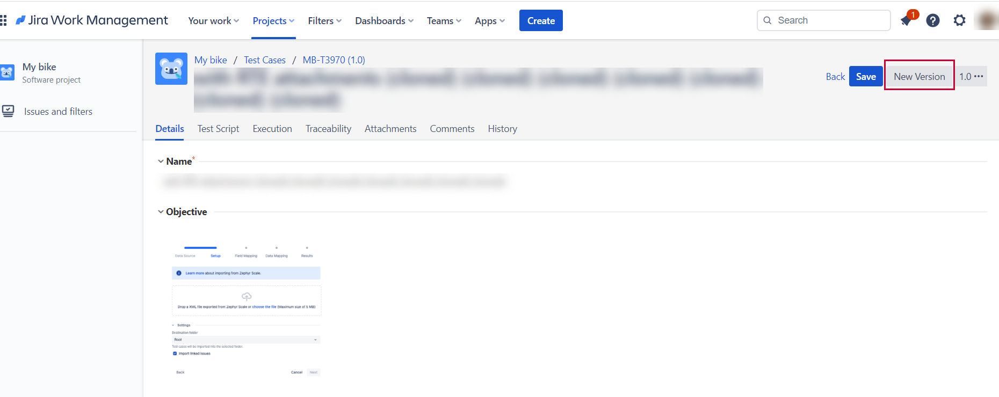
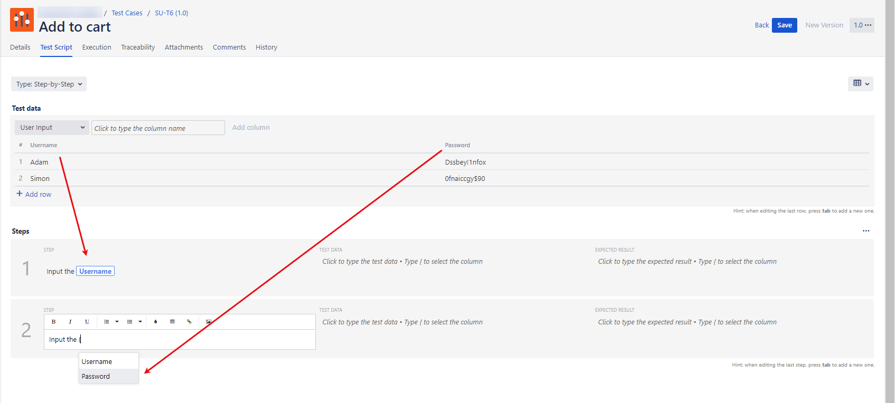
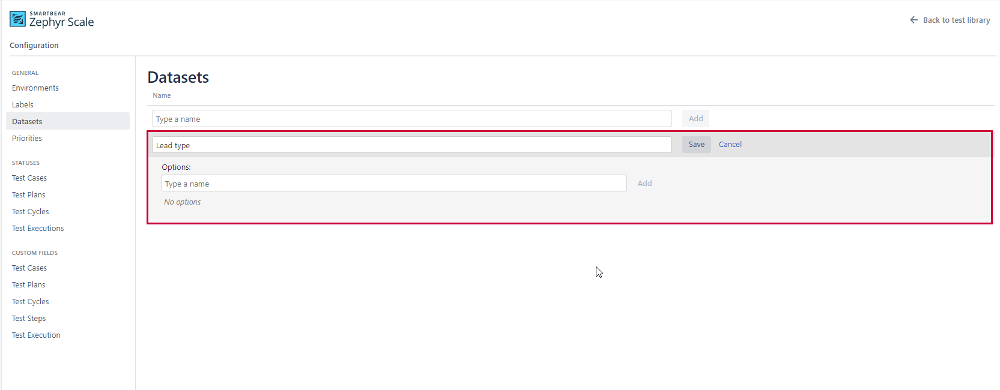

### TestCase

### Test Step/ Script

### Test Data

### Parameters

### Modular Test Case

### Test Case Versions

### BDD Tests

Select Export Feature Files (BDD - Gherkin) from **More** to download the feature file for your new test case (or the selected test cases).

### Data Driven Test
Testdata:

DataSet:

### Test Cycle 

A test cycle is a set of test cases that are grouped to achieve specific testing goals. Test cycles can be assigned to specific testers and test environments, and they offer a comprehensive overview of coordinated testing efforts.

### Creating Test Cases in Bulk

### Jira Integration 

### Test Execution

