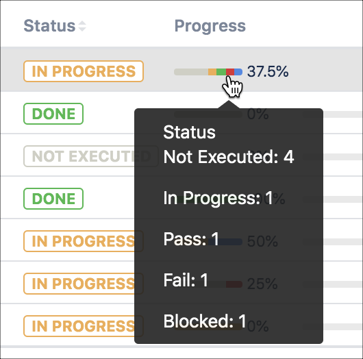
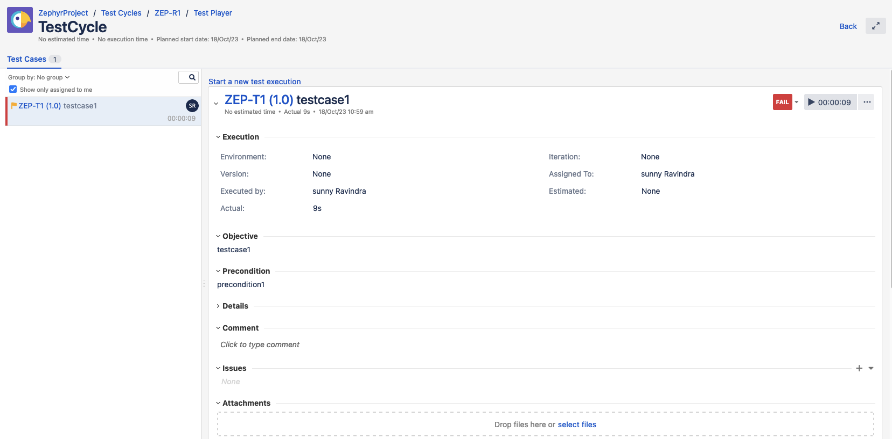
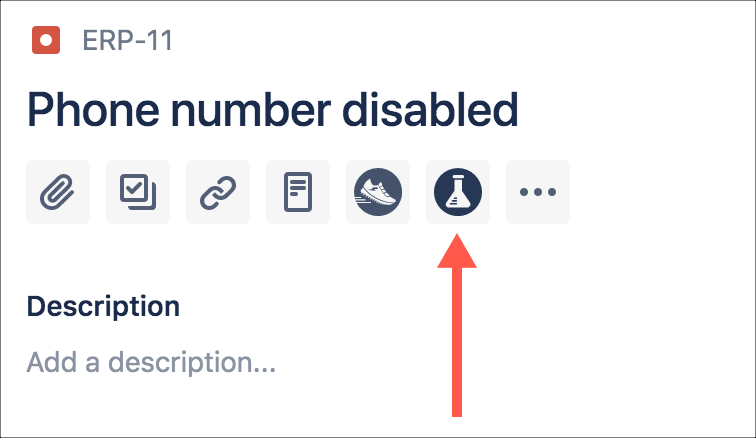
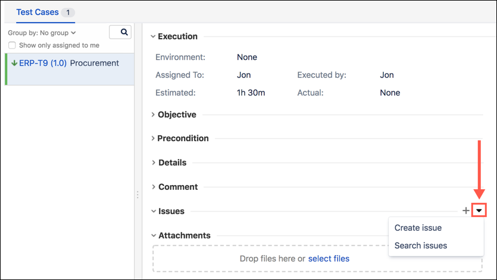

### TestCycle

The test case stores useful information, like the tester responsible for the execution, the execution date, the defects raised, the environment used, and the status of the execution (e.g., passed, failed, etc).

### Executing Tests from Cycle

### Jira Zephyr Integration

### Link to Defect 

