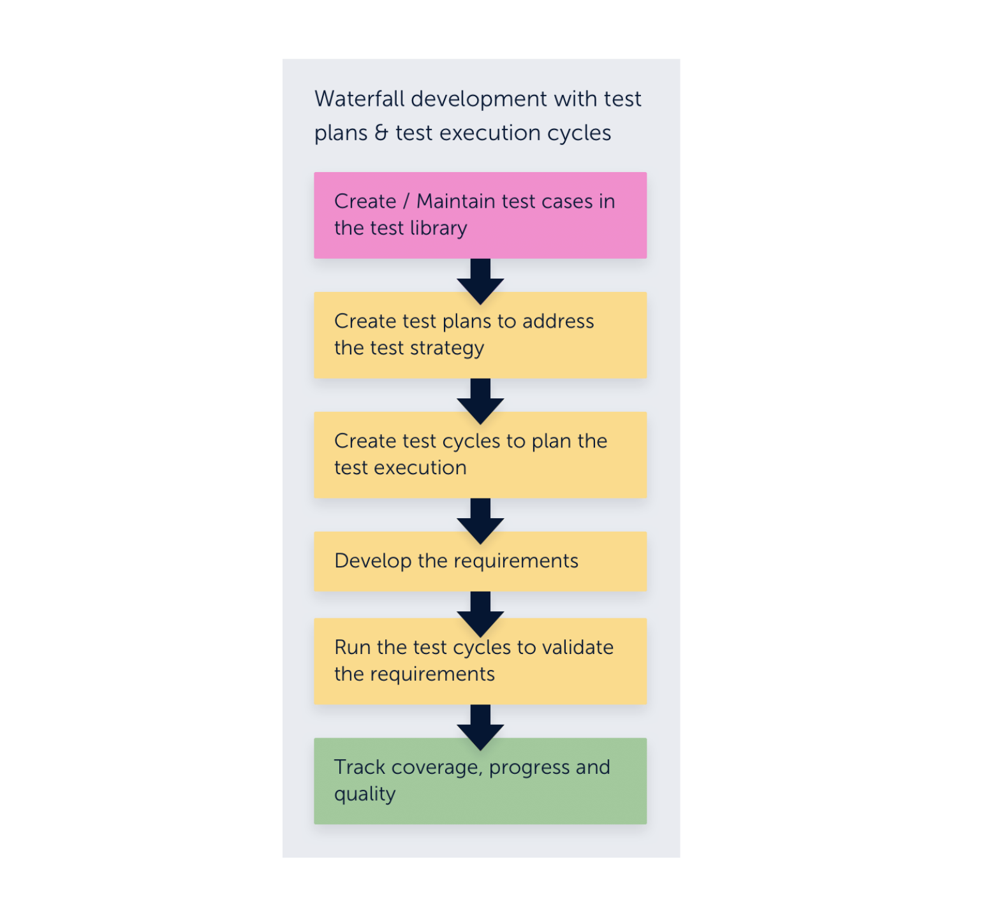
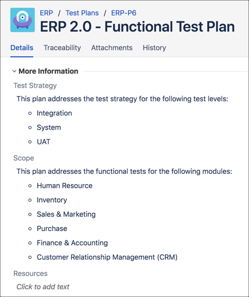
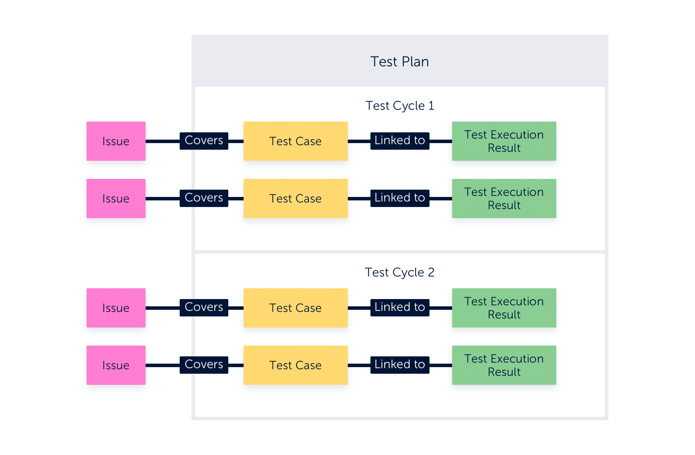
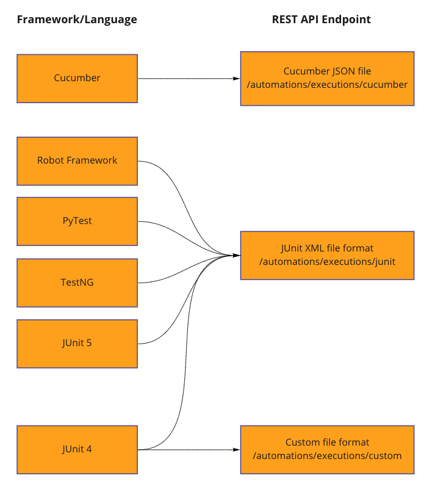

### TestPlan

Test plans help you manage high-level test planning and oversee an entire testing effort. 

Test plans are groups of test cycles. When you generate reports and statistics filtered by test plans, the information aggregates and displays the test-execution results, metrics, and coverage of the test cases associated with the test cycles.

### Test Automation

