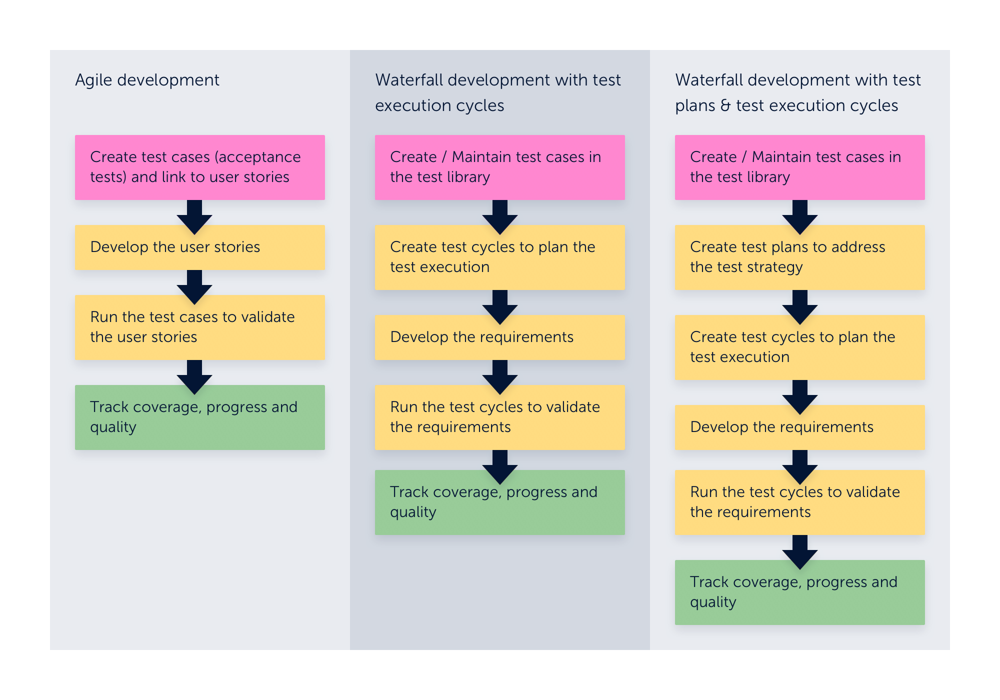

### Basics

### Test Case 
A test artefact developed for a particular test condition, such as to exercise a particular program path or to verify compliance with a specific requirement.

### Test Library 
The location where test cases are created and stored. This is also known as a test repository. Any Jira project can be a test library. Test cases are created and managed under a test library; however, you can share and reuse test cases across Jira projects when necessary to prevent duplication and increase reusability. Within a test Library, you can organize test cases by using a folder structure and categorize by using labels or custom fields.

### Test Script 
A specified sequence of steps and expected results for the execution of a test case. This is also known as manual test script or test procedure specification. Zephyr Scale allows the use of traditional step-by-step as well as BDD (Gherkin syntax) and plain text scripts.

### Test Cycle 
An ordered list of test cases assigned to testers and test environments created to achieve specific testing goals (usually a longer test run, such as regression tests, build verification tests, end-to-end tests, etc.).

### Test Plan 
An artefact used to track testing progress throughout an entire release or version. You can associate several test cycles to a test plan to can get real-time progress reports. Test plan fields are customizable, which allows you to track scope, risks, strategy, entry and exit criteria, test environment, test bed, and more.

### Test Execution Result 
A set of information that generates and is stored when a test case is executed. Data includes the tester responsible for the execution, the execution date, the defects raised, the environment and the status of the execution (e.g., passed or failed), and more.

### Test Environment 
A test environment is an attribute of a test execution result used to determine the environments to be tested for each test case. Planning your test environment includes defining your platform coverage, such as operational systems, browsers, databases, etc.

### Settings

### Navigation
 https://support.smartbear.com/zephyr-scale-cloud/docs/get-started/navigation-basics.html

### Working With Folders
https://support.smartbear.com/zephy-scale-cloud/docs/get-started/working-with-folders.html

### Workflow Strategies
