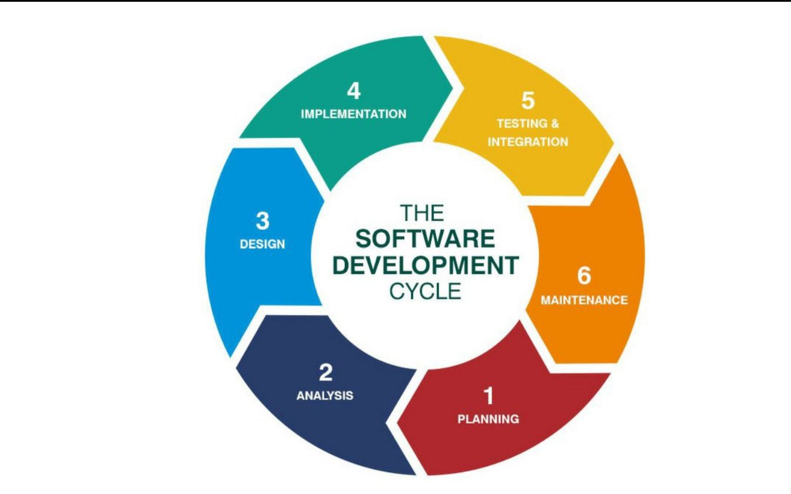
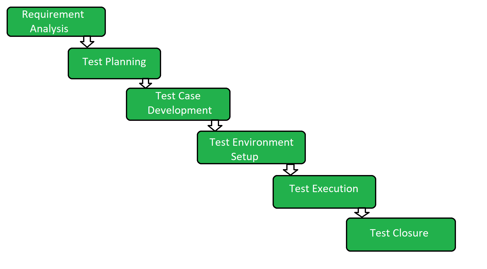
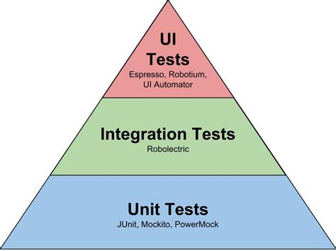

### Ad-hoc Testing
- **Purpose:** Ad-hoc testing is an informal, unscripted approach to testing where testers explore the application without any predefined test cases or plans. The primary goal is to find defects and understand the system's behavior quickly.
- **Scope:** Ad-hoc testing is not structured and does not follow a specific test script or test case. Testers rely on their experience and intuition to uncover issues in the software.
- **Execution Time:** Ad-hoc testing can be performed at any stage of the testing process. It is often used for quick, unplanned checks to identify issues that might have been missed during structured testing.

### Exploratory Testing
- **Purpose:** Exploratory testing is a testing approach where testers simultaneously design and execute test cases based on their real-time understanding of the application. It is a dynamic and flexible way of exploring the software.
- **Scope:** In exploratory testing, testers create test cases on the fly, using their domain knowledge and experience to investigate the application thoroughly. The focus is on uncovering defects, understanding the system's behavior, and identifying risks.
- **Execution Time:** Exploratory testing can be performed throughout the testing process. Testers adapt their testing approach based on what they discover as they explore the application.

In summary, both ad-hoc testing and exploratory testing are unscripted, informal testing approaches that rely on the tester's intuition and experience. Ad-hoc testing is often unplanned and used to quickly identify issues, while exploratory testing is a more structured approach where testers design and execute test cases in real-time to gain a deeper understanding of the software's behavior and uncover defects.


### Black Box Testing
- **Purpose:** Black Box Testing is a testing approach that focuses on evaluating the functionality of a software application without examining its internal code, structure, or logic. Testers treat the software as a "black box" and assess it based on its inputs, outputs, and behavior.
- **Scope:** Black Box Testing is concerned with testing the software from the user or end-user perspective. It assesses whether the software functions as expected and delivers the desired results without understanding the internal workings.
- **Test Cases:** Test cases in black box testing are designed based on requirements, specifications, or user stories. Testers validate that the software performs the correct functions and produces the expected outputs.
- **Types:** Common types of black box testing include Functional Testing, Non-Functional Testing (e.g., usability, performance, security), and Acceptance Testing.

### White Box Testing
- **Purpose:** White Box Testing, also known as Glass Box Testing or Structural Testing, examines the internal structure, code, and logic of the software application. Testers assess how well the code is written and whether it meets coding standards and design specifications.
- **Scope:** White Box Testing focuses on the internal workings of the software, including code paths, statements, and data flows. Testers assess the logical aspects of the software to identify coding errors, vulnerabilities, and areas that need improvement.
- **Test Cases:** Test cases in white box testing are designed based on knowledge of the internal code structure. Testers assess code coverage, branch conditions, and logical paths to ensure thorough testing of the software's logic.
- **Types:** White Box Testing includes techniques like Statement Coverage, Branch Coverage, Path Coverage, and Code Review.

### Key Differences
- Black Box Testing assesses the software's functionality from a user's perspective, while White Box Testing examines the internal code and structure of the software.
- Black Box Testers do not need knowledge of the internal code, whereas White Box Testers require in-depth knowledge of the code to design test cases.
- Test cases in Black Box Testing are based on requirements and specifications, while test cases in White Box Testing focus on code coverage and logical paths.
- Both types of testing are essential, with Black Box Testing ensuring that the software meets user requirements and White Box Testing verifying the quality of the code and logic.

In summary, Black Box Testing evaluates the functionality of the software without considering its internal code, while White Box Testing examines the internal structure, logic, and code of the software to ensure it is well-structured and adheres to coding standards. Both types of testing are integral to ensuring software quality and reliability.


### Component vs Integration Testing

Integration Testing and Component Testing are two essential levels of testing in the software development process, each with a specific focus and purpose. Here are notes on both integration testing and component testing:

**Component Testing:**
- **Purpose:** Component Testing, also known as Unit Testing, focuses on testing individual software components or units in isolation to verify their correctness and functionality.
- **Scope:** Component Testing is concerned with testing a specific module, class, or function without considering its interactions with other parts of the system.
- **Test Cases:** Test cases in component testing are designed to test the smallest units of code, ensuring that they produce the expected results when provided with specific inputs.
- **Environment:** Component testing typically takes place in a controlled and isolated development or testing environment.
- **Testing Tools:** Automated testing tools are often used to run unit tests to validate the behavior of code components.
- **Benefits:** Component testing helps identify and fix bugs at an early stage, ensuring that individual code units work correctly. It is essential for maintaining code quality.

**Integration Testing:**
- **Purpose:** Integration Testing is focused on verifying that multiple software components or modules work correctly when combined or integrated. It ensures that the interactions between components do not introduce defects.
- **Scope:** Integration Testing examines the interaction between various modules, subsystems, or components to verify that they function as a cohesive whole.
- **Test Cases:** Test cases in integration testing are designed to assess the interfaces and interactions between components, testing how data and control flow between them.
- **Environment:** Integration testing often requires a more comprehensive testing environment that simulates the entire system or at least a substantial portion of it.
- **Types:** Common types of integration testing include Top-Down Integration, Bottom-Up Integration, and Big Bang Integration, each focusing on a different approach to integrating components.
- **Benefits:** Integration testing helps identify issues related to component interactions, such as data flow, interface mismatches, and communication problems. It ensures that the integrated system behaves as expected.

**Key Differences:**
- Component testing evaluates individual code components in isolation, while integration testing assesses the interactions and interfaces between these components.
- Component testing is typically conducted by developers during the coding phase, while integration testing is performed as part of the broader testing process.
- Component testing helps ensure that the building blocks of the software are sound, while integration testing ensures that these building blocks work together harmoniously.

In summary, component testing focuses on individual code units, ensuring their correctness and functionality, while integration testing verifies that multiple components interact correctly when integrated into a larger system. Both types of testing are critical for ensuring that a software system operates as intended.


### Defect LifeCycle

The Defect Lifecycle, also known as the Bug Lifecycle or Issue Lifecycle, outlines the stages a defect or issue goes through from its discovery to its resolution. Understanding this lifecycle is crucial for efficient defect management. Here are notes on the typical stages of the Defect Lifecycle:

**1. Defect Identification:**
- **Discovery:** A defect is discovered during testing, user feedback, or any phase of software development.
- **Logging:** The defect is logged in a defect tracking system, often referred to as a bug tracking tool or issue tracking tool. It includes details like the defect's description, steps to reproduce, and its severity.

**2. Defect Triage:**
- **Assessment:** The defect is assessed to determine its validity and severity. It may be assigned a priority based on its impact on the software.
- **Assignment:** The defect is assigned to the responsible individual or team (usually a developer or tester) who will investigate and address it.

**3. Defect Resolution:**
- **Investigation:** The assigned person investigates the defect to understand its root cause. This may involve reviewing code, system logs, and relevant documents.
- **Fixing:** Once the cause is identified, the developer fixes the defect by modifying the code, configuration, or other relevant aspects.
- **Verification:** The tester verifies the fix by retesting the software to ensure that the defect is resolved.
- **Validation:** The defect is validated to ensure that the fix does not introduce new issues or negatively impact other parts of the software.

**4. Defect Closure:**
- **Documentation:** If the defect is fixed and verified successfully, it is marked as "closed" in the defect tracking system. This includes documenting details of the fix and verification.
- **Closure Report:** A closure report may be generated, summarizing the defect's history and resolution, to help in knowledge sharing and future reference.

**5. Defect Reopening (if necessary):**
- **Rejection:** If the defect reappears or is not fixed correctly, it may be reopened with detailed information about the regression.
- **Repeat Process:** The defect is reassigned for investigation, fixing, and retesting. The lifecycle stages may be repeated until the defect is finally resolved and verified.

**6. Defect Reporting:**
- **Communication:** The status of defects and their resolutions are communicated to relevant stakeholders, including project managers, developers, testers, and other team members.

**Key Points:**
- Defects may vary in severity, priority, and complexity, which impacts the time they spend in each lifecycle stage.
- A well-organized defect tracking system and effective communication are essential for managing defects throughout their lifecycle.
- Documentation is crucial at each stage to maintain a record of the defect's history and resolution.

In summary, the Defect Lifecycle ensures a systematic approach to managing defects, from their identification to their resolution and closure. This process helps maintain software quality and provides transparency in defect management.


### Functional vs Non Functional

Functional Testing and Non-Functional Testing are two essential categories of software testing, each serving a distinct purpose. Here are notes about both types of testing:

### Functional Testing
- **Purpose:** Functional Testing is focused on verifying that the software's functions work as intended and conform to the specified requirements. It aims to ensure that the system performs its intended operations correctly.
- **Scope:** Functional Testing tests the application's features, such as user interfaces, data processing, business logic, and functionality. It is concerned with "what" the software should do.
- **Test Cases:** Test cases in functional testing are designed based on the functional specifications and use cases, checking whether the software meets the expected behavior and produces correct outputs.
- **Types:** Common types of functional testing include Unit Testing, Integration Testing, System Testing, and Acceptance Testing. Each type of functional testing covers different levels of the application, from individual units to the entire system.

### Non-Functional Testing
- **Purpose:** Non-Functional Testing focuses on evaluating the non-functional aspects of software, such as performance, usability, security, and reliability. It assesses how well the system performs its operations under different conditions.
- **Scope:** Non-Functional Testing addresses "how" the software operates, considering attributes like speed, efficiency, user experience, security, and scalability.
- **Test Cases:** Test cases in non-functional testing are designed to measure and assess the qualities mentioned above. These test cases do not typically involve functionality but rather focus on metrics and characteristics of the software.
- **Types:** Non-Functional Testing includes various types, such as Performance Testing (including load, stress, and scalability testing), Usability Testing, Security Testing, Reliability Testing, and Compatibility Testing. Each type assesses specific non-functional attributes of the software.

### Key Differences
- Functional testing ensures that the software performs its intended functions correctly, while non-functional testing assesses how well the software operates under various conditions.
- Functional testing focuses on specific features and functionality, while non-functional testing evaluates characteristics like performance, security, and user experience.
- Test cases in functional testing check what the software should do, while test cases in non-functional testing assess how well it does it.
- Both types of testing are essential for comprehensive quality assurance, as they ensure that the software not only functions correctly but also meets the necessary performance, security, and user experience standards.

In summary, functional testing concentrates on the features and functionality of the software, whereas non-functional testing evaluates non-functional attributes like performance, usability, and security. Both types of testing are vital to ensuring that the software meets user expectations and quality standards.


### Load vs Stress Testing

### Load Testing:
- **Purpose:** Load Testing is a type of performance testing that assesses how a system or application performs under normal or expected load conditions.
- **Scope:** It involves testing the system with a specific load level that simulates typical user activity and usage patterns.
- **Objectives:** The primary goal of load testing is to ensure that the system can handle its expected load without performance degradation.
- **Test Conditions:** Load tests may include concurrent user actions, data input, or transaction processing typical of regular system usage.
- **Performance Metrics:** Load testing measures performance indicators such as response times, throughput, and resource utilization.
- **Benefits:** Load testing helps identify performance bottlenecks and capacity limitations, allowing for optimization before deployment.

### Stress Testing:
- **Purpose:** Stress Testing is a type of performance testing that evaluates how a system behaves under extreme conditions, beyond its normal operational limits.
- **Scope:** It involves testing the system with higher-than-expected load levels or by deliberately overloading it.
- **Objectives:** The primary goal of stress testing is to identify the system's breaking point or to observe how it behaves under exceptional conditions.
- **Test Conditions:** Stress tests may include sudden spikes in user activity, excessive data loads, or resource exhaustion scenarios.
- **Performance Metrics:** Stress testing may focus on assessing the system's behavior during and after a stress event, looking for issues like crashes or data corruption.
- **Benefits:** Stress testing helps identify vulnerabilities and weaknesses in the system, enabling proactive mitigation and disaster recovery planning.

### Key Differences:
- Load testing assesses how a system performs under expected or typical load conditions, while stress testing evaluates its behavior under extreme and abnormal conditions.
- Load testing is primarily concerned with ensuring performance under normal user activity, while stress testing seeks to find the system's limits and how it behaves when those limits are exceeded.
- Load testing helps optimize the system for expected traffic, while stress testing helps identify vulnerabilities and weaknesses in the face of unexpected events or extreme usage.

In summary, load testing ensures that a system can handle typical loads, while stress testing explores how the system behaves under extreme conditions or unexpected events. Both types of testing are essential for assessing a system's robustness and performance under different scenarios.


### Priority vs Severity


### Bug
- **Priority (Bug):** Priority for a bug determines the order in which the bug should be fixed, based on its importance and impact. For example, "High" priority bugs need to be addressed immediately, "Medium" priority bugs can be addressed after high-priority ones, and "Low" priority bugs can be deferred.
- **Severity (Bug):** Severity characterizes the seriousness of the bug, taking into account its potential impact on the system or users. For instance, "Critical" severity bugs are show-stoppers that render the system unusable, "Major" severity bugs significantly affect functionality, and "Minor" severity bugs have minimal impact.

### Test Case
- **Priority (Test Case):** Priority for a test case determines the order in which the test case should be executed during testing. "High" priority test cases are executed early to verify critical functionalities, "Medium" priority test cases are important but not critical, and "Low" priority test cases are executed later for less critical features.
- **Severity (Test Case):** Severity for a test case characterizes the criticality of the scenario it covers. "Critical" severity test cases are essential for the system to function properly, "Major" severity test cases are important but not show-stoppers, and "Minor" severity test cases cover non-critical or cosmetic aspects.

### User Story (Agile Development):
- **Priority (User Story):** Priority for a user story in an Agile context determines its importance and order in the product backlog. It guides the development team on which stories to work on next. For example, "High" priority user stories are essential for the next sprint, "Medium" priority stories are important but not urgent, and "Low" priority stories can be addressed later.
- **Severity (User Story):** In the context of user stories, severity might not be a commonly used term. Instead, user stories often focus on the value they bring to the user or the business, which can be labeled as "High Value," "Medium Value," or "Low Value."

In Agile development, user stories are typically prioritized based on business value, customer needs, and other factors, and the concept of severity is not as relevant as in the context of testing. However, user stories can still be assigned a priority to determine their order of implementation in an Agile backlog.

### Retesting vs Regression Testing


### Retesting
- **Purpose:** Retesting is a type of testing that focuses on verifying that a specific defect, which was found and fixed in a previous testing phase, has been successfully rectified. The primary goal is to ensure that the reported issue no longer exists.
- **Scope:** Retesting is narrow in scope and typically involves executing the same test cases that initially revealed the defect. It doesn't explore new areas of the application, focusing solely on the fixed issue.
- **Execution Time:** Retesting is performed after the defect has been fixed, and it aims to validate the resolution quickly. It is a targeted and focused activity.

### Regression Testing
- **Purpose:** Regression testing is a testing approach that aims to ensure that recent changes or new features introduced into the software do not adversely affect existing, stable functionalities. It verifies that the application still works as expected after modifications.
- **Scope:** Regression testing is broader in scope and involves re-running a subset of existing test cases (both related to the changes and critical core functionalities) to detect unintended side effects or regressions.
- **Execution Time:** Regression testing is performed whenever there are code changes, new feature additions, or updates to the application. It's an ongoing process throughout the software development lifecycle.

In summary, retesting and regression testing serve different purposes and have distinct scopes. Retesting is specific to validating the resolution of a known defect, while regression testing is a broader, ongoing effort to ensure that new changes do not introduce unintended issues in the existing, stable areas of the application.

### SDLC vs STLC

Software Development Life Cycle (SDLC) and Software Testing Life Cycle (STLC) are two distinct but interconnected processes in the software development and testing industry. Here are notes about both SDLC and STLC:

### Software Development Life Cycle (SDLC)
- **Purpose:** SDLC is a systematic process for planning, designing, developing, testing, and delivering software applications. It provides a structured approach to building software products, ensuring quality and meeting project objectives.
- **Scope:** SDLC encompasses the entire software development process, from initial requirements gathering and design to coding, testing, deployment, and maintenance.
- **Phases:** Common SDLC phases include Requirements Gathering, Planning, Design, Implementation (Coding), Testing, Deployment, and Maintenance.
- **Methodologies:** Various methodologies, such as Waterfall, Agile (e.g., Scrum), and DevOps, define the approach and order of these phases, emphasizing different aspects like sequential planning (Waterfall) or iterative development (Agile).
- **Key Documents:** SDLC produces various documents, including requirement specifications, design documents, codebase, and deployment plans.



### Software Testing Life Cycle (STLC)
- **Purpose:** STLC is the process of planning, designing, executing, and evaluating testing activities throughout the software development life cycle. It ensures that software is thoroughly tested to meet quality and performance requirements.
- **Scope:** STLC specifically focuses on the testing phase of SDLC, covering various levels (unit, integration, system, acceptance) and types of testing (functional, non-functional).
- **Phases:** STLC typically consists of phases such as Test Planning, Test Design, Test Execution, Defect Reporting, and Test Closure.
- **Methodologies:** STLC operates within the framework of SDLC methodologies. For instance, in Agile SDLC, testing activities are incorporated into each sprint or iteration.
- **Key Documents:** STLC generates test documentation, including test plans, test cases, test data, defect reports, and test summary reports.



### Key Differences
- SDLC encompasses the entire software development process, while STLC is specifically concerned with testing activities within SDLC.
- SDLC focuses on planning, design, coding, and overall software development, whereas STLC emphasizes testing strategy, test case creation, and test execution.
- SDLC can use various development methodologies (Waterfall, Agile), while STLC adapts to the chosen development methodology, ensuring testing aligns with the development process.
- In SDLC, the end goal is to deliver a working software product, while in STLC, the goal is to verify and validate the quality of the software through comprehensive testing.

### Integration
- STLC is an integral part of SDLC. Testing activities are carried out in parallel with development activities, ensuring that testing is a continuous and concurrent process.
- STLC helps verify that software meets the quality standards set during the development phases of SDLC.

In summary, SDLC represents the entire software development process, while STLC specifically focuses on the testing phase within SDLC. Both are crucial for delivering high-quality software products that meet user requirements and perform reliably.


### Smoke vs Sanity

### Smoke Testing
- **Purpose:** Smoke testing, also known as build verification testing, is a preliminary test that checks whether the software build is stable enough for more comprehensive testing. It helps ensure that the critical functionalities of the application work without major issues.
- **Scope:** Smoke tests cover a basic set of test cases that exercise core features and critical paths of the software. These tests do not aim to explore all functionalities but focus on essential functionality.
- **Execution Time:** Smoke tests are quick to execute and are typically run after a new build is deployed. If a build fails the smoke test, it indicates that there are severe defects that need immediate attention.

### Sanity Testing
- **Purpose:** Sanity testing is a subset of regression testing that focuses on verifying that specific code changes or new features have not adversely affected the existing, stable functionalities of the application. It ensures that the recent modifications have not introduced unexpected issues.
- **Scope:** Sanity tests are narrower in scope than comprehensive regression tests. They concentrate on the areas of the application affected by recent changes or enhancements.
- **Execution Time:** Sanity tests are relatively quick and are typically performed during the later stages of the testing cycle, after more extensive testing has taken place.

In summary, both smoke testing and sanity testing are important types of software testing, but they serve different purposes and are conducted at different stages of the testing process. Smoke testing determines whether a newly built application is fit for further testing, while sanity testing verifies that specific changes or new features have not broken the existing, stable parts of the application. Both testing types are designed to catch critical issues early in the development cycle.

### Test Case vs Scenario vs Step


### Test Scenario
   - Definition: A test scenario is a high-level description of a specific function or feature to be tested.
   - Purpose: Test scenarios provide a broad overview of what needs to be tested without going into detailed steps. They help in understanding the scope of testing for a particular feature.
   - Example: A test scenario for a login feature might be "Verify that users can successfully log in using valid credentials."

### Test Case
   - Definition: A test case is a detailed set of conditions, inputs, and expected results that specify how to test a particular aspect of a software application.
   - Purpose: Test cases are specific and actionable instructions for executing tests. They provide step-by-step guidance to testers to verify whether the software functions correctly.
   - Example: A test case for the login feature mentioned earlier might include steps like "Enter valid username and password" and the expected result of "Successfully logged in."

### Test Step
   - Definition: A test step is a single action or instruction within a test case, defining what the tester needs to do and what is expected to happen.
   - Purpose: Test steps break down a test case into individual, discrete actions. They provide a clear, sequential path for the tester to follow.
   - Example: In the test case for the login feature, each step is a test step. For example, "Enter username" and "Enter password" would be individual test steps within the test case.

### Differences
- Test Scenario is high-level and provides an overview, whereas Test Case is detailed and provides specific steps.
- Test Scenario doesn't include specific instructions or expected outcomes, while Test Case provides precise instructions and expected results.
- Test Case consists of multiple Test Steps, which are individual actions to be performed during testing.
- Test Scenarios are typically used for test planning and requirement analysis, while Test Cases are used for actual testing execution.
- Test Scenarios help in creating an initial test plan, while Test Cases ensure systematic and comprehensive testing of specific functionalities.

In summary, test scenarios help you understand what needs to be tested at a high level, test cases provide the detailed steps and expected results for testing, and test steps break down those test cases into individual actions. All three are essential for effective and structured software testing.


### Test Pyramid
The Test Pyramid strategy is designed to guide software development teams on how to structure their automated testing efforts efficiently by categorizing tests into three layers, forming a pyramid-like shape. The goal is to achieve a balanced approach to testing while ensuring thorough coverage and faster feedback.

The three layers of the Test Pyramid are:

1. Unit Tests (Base of the Pyramid):
   - Unit tests are the foundation of the pyramid and should form the majority of your automated tests.
   - These tests focus on verifying the smallest units of code, such as individual functions or methods.
   - Unit tests are fast to execute, easy to maintain, and provide immediate feedback to developers.
   - They help catch and fix bugs early in the development process, ensuring code correctness at the lowest level.

2. Integration Tests (Middle of the Pyramid):
   - Integration tests validate the interactions and integration between various components or modules of the software.
   - These tests check how different units work together and whether they communicate correctly.
   - Integration tests are broader in scope than unit tests but more focused than end-to-end tests.
   - They help uncover issues related to data flow, communication, and system integration.

3. End-to-End Tests (Top of the Pyramid):
   - End-to-end tests, also known as UI tests or acceptance tests, validate the functionality of the entire application from the user's perspective.
   - These tests simulate real user interactions with the application, including user interface interactions and workflows.
   - End-to-end tests are the slowest and most brittle of the three layers, making them the most expensive to maintain and execute.
   - They are essential for ensuring that the entire application functions correctly and that all components work together seamlessly.

The key principles of the Test Pyramid strategy are as follows:
- Prioritize writing a large number of fast and reliable unit tests to cover the majority of your codebase.
- Use integration tests to validate that components and modules interact correctly.
- Limit the number of end-to-end tests to focus on critical user scenarios and workflows.

The Test Pyramid strategy helps strike a balance between test coverage, execution speed, and maintenance efforts. By emphasizing unit tests at the base of the pyramid, teams can catch and fix defects early in the development process, resulting in more robust and maintainable software. Integration and end-to-end tests serve as safety nets to ensure that the application functions correctly as a whole, without sacrificing the efficiency of the testing process.




### TestCase Example

[TestCase Example](./static/TestCaseTemplate.xls)

### Test Case Identifier
  - A unique identifier or name for the test case, often using a numbering or naming convention for easy reference.

### Test Case Title
  - A brief and descriptive title that summarizes the purpose of the test case.

### Objective
  - A clear statement of the specific objective or goal of the test case.

### Prerequisites
  - Any preconditions or setup requirements that must be met before the test case can be executed.

### Test Data
  - Details about the data, inputs, or conditions to be used in the test case.

### Test Steps
  - A step-by-step list of actions to be performed during the test, including specific instructions, input data, and expected outcomes for each step.
  
### Expected Results
  - The expected outcomes or behavior at the end of each test step. This helps in determining whether the test case passed or failed.

### Test Environment
  - Information about the test environment, including hardware, software, configurations, and tools required to execute the test case.

### Test Execution
  - Guidance on how the test case should be executed, including the order of test steps and any specific conditions for execution.

### Test Pass/Fail Criteria
  - Clear criteria that define when the test case is considered a pass or a fail, based on the actual results compared to the expected results.

### Test Data Setup/Cleanup
  - Details on how test data should be prepared before the test and how any cleanup activities should be performed after the test.

### Test Dependencies
  - Any dependencies on other test cases, test scenarios, or external systems that the test case relies on.

### Defect References
  - Links or references to any related defects or issues in the defect tracking system, if applicable.

### Test Case Author
  - The name or identification of the person responsible for creating and maintaining the test case.

### Test Case Reviewer
  - The name of the person who reviewed and verified the accuracy of the test case.

### Test Case Status
  - The current status of the test case, which can indicate whether it is in draft, approved, executed, or completed.

### Test Case Priority
  - The priority of the test case, which can help in test execution scheduling.

### Attachments
  - Any additional documentation, screenshots, diagrams, or files that are relevant to the test case.

A well-structured test case document provides a clear and detailed description of how a particular functionality or aspect of the software should be tested. It helps testers understand what to test, how to test it, and what to expect as results, ensuring consistent and thorough testing throughout the project.


### TestPlan Example

[TestPlan Example](./static/TestPlan.doc)


### Introduction
   - Overview of the document.
   - Purpose and scope of the test plan.
   - Identification of the project or system being tested.

### Test Objectives
   - Clear and concise statement of what the testing aims to achieve.
   - Specific goals and desired outcomes.

### Test Strategy
   - Description of the overall approach to testing, including the testing methods and techniques that will be used.
   - Information on testing levels (e.g., unit testing, integration testing, system testing) and the order in which they will be conducted.

### Test Scope
   - Detailed information on what aspects of the system will be tested and what will not be tested.
   - Inclusion and exclusion criteria for the scope of testing.

### Test Deliverables
   - List of documents and artifacts that will be produced during the testing process, such as test cases, test scripts, test data, and test reports.

### Test Schedule
   - Timelines and milestones for the testing activities.
   - Sequence and dependencies of testing phases.

### Resource Requirements
   - Identification of the people, tools, hardware, and software needed for testing.
   - Allocation of roles and responsibilities for the testing team.

### Risks and Assumptions
   - Identification of potential risks and challenges that could impact the testing process.
   - Assumptions made during the test planning.

### Test Environment
   - Description of the test environment, including hardware, software, network configurations, and any other specific setups required for testing.

### Test Data
   - Details on the test data needed for the test cases.
   - How the test data will be created, obtained, or generated.

### Test Execution
   - Procedures for executing test cases, including the order and frequency of test runs.
   - Entry and exit criteria for each test phase.

### Test Reporting
   - Explanation of how test results will be recorded, tracked, and reported.
   - Templates for test summary reports or defect reports.

### Defect Management
   - Procedures for logging, tracking, and managing defects.
   - Severity and priority definitions for defects.

### Change Control
   - How changes to the test plan or the scope of testing will be managed and documented.

### Approval and Sign-Off
   - Identification of stakeholders who need to review and approve the test plan.
   - Sign-off process to ensure that all parties are in agreement.

### Appendices
   - Any supplementary information, such as glossaries, references, or additional details.

A well-structured and thorough test plan provides a clear roadmap for the testing process, ensuring that all stakeholders understand the objectives, scope, and logistics of the testing effort. It helps maintain consistency and quality in testing activities and serves as a reference throughout the testing project.


### Levels of Testing

Unit Testing, Integration Testing, System Testing, and Acceptance Testing are different levels of software testing that serve distinct purposes in the software development and quality assurance process. Here are similar notes on each type of testing:

### Unit Testing
- **Purpose:** Focuses on testing individual components or functions of the software in isolation.
- **Scope:** Tests the smallest units of code, such as functions, methods, or classes.
- **Isolation:** Tests are independent and isolated from the rest of the system.
- **Test Data:** Typically uses mock objects or stubs to simulate dependencies.
- **Speed:** Fast execution, suitable for continuous integration.
- **Developers are primarily responsible for writing unit tests.**
- Aims to catch and fix bugs early in the development process.

### Integration Testing
- **Purpose:** Validates the interactions and interfaces between different software components or modules.
- **Scope:** Tests the connections and integration points between units.
- **May involve testing API endpoints, data exchanges, or communication between modules.
- **Focuses on ensuring that integrated components work together correctly.**
- Helps detect issues related to data flow, interface compatibility, and component communication.
- Performed by developers and testing teams.

### System Testing
- **Purpose:** Evaluates the entire software system as a whole, including all integrated components.
- **Scope:** Tests the software in its complete and functional state.
- **Ensures that the system meets its specified requirements and functions correctly.
- **Covers functional and non-functional testing aspects, such as performance, security, and usability.**
- Typically conducted by dedicated testing teams.
- Helps identify system-level issues, such as incorrect behavior or performance bottlenecks.

### Acceptance Testing
- **Purpose:** Validates that the software meets the specified business requirements and user expectations.
- **Scope:** Focuses on user scenarios, workflows, and user acceptance criteria.
- **Typically involves end-to-end testing and often includes user interface (UI) testing.**
- Performed by stakeholders, including product owners, business analysts, or end-users.
- Ensures that the software is ready for production release and fulfills its intended purpose.
- Helps to gain confidence in the software's readiness for deployment.

In summary, these testing levels gradually progress from testing individual code units to validating the entire software system against specified requirements. Each level serves a unique purpose in ensuring the quality and reliability of the software. Unit testing focuses on small code units, integration testing ensures component interactions, system testing assesses the complete system, and acceptance testing verifies that the software aligns with user expectations and business needs.


### Traceability Matrix Example
[Traceability Matrix Example](./static/RTM_Template.xlsx)

A Requirement Traceability Matrix (RTM) is a critical document used in software development and testing to ensure that all requirements are covered and that testing efforts are aligned with those requirements. Here are notes about the Requirement Traceability Matrix:

### Requirement Traceability Matrix (RTM)
- **Purpose:** An RTM is a tool used to track and manage the relationship between requirements, test cases, and other project artifacts. It ensures that each requirement is associated with corresponding test cases, helping to maintain transparency and coverage in the testing process.
- **Scope:** RTM focuses on the mapping of requirements to various test levels and types, including unit testing, integration testing, system testing, and user acceptance testing.
- **Elements:** An RTM typically contains rows representing requirements and columns representing test cases. The cells of the matrix indicate the mapping or coverage of specific requirements by the corresponding test cases.
- **Usage:** RTMs are used to verify that all requirements are tested and to trace test cases back to their corresponding requirements. They also assist in identifying gaps, redundancies, or inconsistencies in requirements and testing efforts.
- **Key Documents:** In addition to requirements and test cases, RTMs may include other documents such as change requests, defects, and design documents to track relationships.

### Key Aspects
- **Bidi­rectional Tracing:** RTMs enable both forward tracing (from requirements to test cases) and backward tracing (from test cases to requirements).
- **Coverage Analysis:** RTMs help in assessing the extent of requirement coverage by test cases, highlighting untested or partially tested requirements.
- **Change Impact Analysis:** When requirements change, RTMs aid in identifying the impact on test cases, facilitating efficient updates to test scripts.
- **Verification:** RTMs help ensure that the project complies with defined requirements and standards.

### Benefits
- Improved Requirement Management: RTMs enhance requirement visibility and help in managing changes and updates.
- Enhanced Testing Efficiency: Testers can easily verify that all requirements are tested without omissions.
- Change Management: When requirements change, RTMs facilitate tracking and managing changes and their effects on testing.
- Gap Identification: RTMs can expose gaps or inconsistencies in requirements or test coverage.

### Challenges
- Maintaining Consistency: Keeping the RTM up-to-date with changing requirements or test cases can be challenging.
- Time-Consuming: Creating and maintaining a detailed RTM can be time-intensive, especially for large projects.

In summary, an RTM is a valuable document that ensures requirements are adequately covered by test cases, enhancing the quality and effectiveness of testing efforts. It serves as a bridge between requirements and testing, making it easier to manage changes, verify compliance, and maintain consistency throughout the software development and testing process.

### Priority vs Severity

### Bug
- **Priority (Bug):** Priority for a bug determines the order in which the bug should be fixed, based on its importance and impact. For example, "High" priority bugs need to be addressed immediately, "Medium" priority bugs can be addressed after high-priority ones, and "Low" priority bugs can be deferred.
- **Severity (Bug):** Severity characterizes the seriousness of the bug, taking into account its potential impact on the system or users. For instance, "Critical" severity bugs are show-stoppers that render the system unusable, "Major" severity bugs significantly affect functionality, and "Minor" severity bugs have minimal impact.

### Test Case
- **Priority (Test Case):** Priority for a test case determines the order in which the test case should be executed during testing. "High" priority test cases are executed early to verify critical functionalities, "Medium" priority test cases are important but not critical, and "Low" priority test cases are executed later for less critical features.
- **Severity (Test Case):** Severity for a test case characterizes the criticality of the scenario it covers. "Critical" severity test cases are essential for the system to function properly, "Major" severity test cases are important but not show-stoppers, and "Minor" severity test cases cover non-critical or cosmetic aspects.

### User Story (Agile Development):
- **Priority (User Story):** Priority for a user story in an Agile context determines its importance and order in the product backlog. It guides the development team on which stories to work on next. For example, "High" priority user stories are essential for the next sprint, "Medium" priority stories are important but not urgent, and "Low" priority stories can be addressed later.
- **Severity (User Story):** In the context of user stories, severity might not be a commonly used term. Instead, user stories often focus on the value they bring to the user or the business, which can be labeled as "High Value," "Medium Value," or "Low Value."

In Agile development, user stories are typically prioritized based on business value, customer needs, and other factors, and the concept of severity is not as relevant as in the context of testing. However, user stories can still be assigned a priority to determine their order of implementation in an Agile backlog.

### Security Testing 

### Browser Cookies

Cookies are the small encripted text files in the browser directory.

### Cookies vs Session Cookies
1. Session cookies tracks the information about the logged in session, hence the appliaction dont have to authenticate over and over again.
2. Cookies stores customers web applications settings and preferences for further use.

### Cookies Security
1. Secure Atrribute should be enabled to make sure the authentication cookies are not passed to HTTP connection calls.
2. HTTP Only flag makes sure that the cookies are retried only when HTTP call is made, if there is any cross site scripting code 
trying to access the cookie (like document.getCookies) then those calls will not contain the Cookies linked to them.
3. Make sure that the accessed domian name in commplete so that attacker cant acess subdomains, example .accenture.com can access all the subdomans like employee.accenture.com, info.accenture.com 
hence the naming for full domain will make sure that the only that domain cookies are accessed and not anything else.
4. Also make sure that the path attribute is also restricted as domain/ is less secure that domain/path/path , in second case cookies are only accessed via the path specified.
5. Confidential cookies should be expired frequently. And others expiry time should be set as per the requirements.(online banking cookies expiry should be set to session)

### SQL Basics


# DBMS (Database Management system) 

### MY SQL Docker server
```bash
docker run --name some-mysql -e MYSQL_ROOT_PASSWORD=my-secret-pw -d mysql:tag
```

### SQL login 
```bash
mysql -u<username> -hlocalhost/ServerIp -p
mysql -u<username> -hlocalhost/ServerIp -pPassword 
```

### Import/Export Table
```bash
# This exports data from a table to a .sql file
mysqldump -uroot -hlocalhost/serverIP -pPassword tableName > ~/export.sql

# This Imports data from .sql file to a table
# Note that the table name you specifi should have been already created in the SQL databse
mysql -uroot -hlocalhost/serverIP -pPassword tableName < ~/export.sql
```
### Create Db and Tables
```bash
# Create Database
create databse DatabaseName;

# Create Tables with primarykey, foreign key and constraints
create table tableName (
PrimaryKeyID int primary key auto_increment  not null,
column1 varcar(20), 
column2 text unique, 
column3 int default 0,
);
foreign key (column3) references ReferenceTableName (columnName to reference) ON DELETE CASCADE
```

### List Database and Tables
```bash
# List Database
show database;

# List Tables
show Tables;

# List Tables with views
show full Tables;

# Select Database
use Database;

# List Tables
describe tableName;
disc tableName;
```

### Delete Database and Tables 
```bash
# Delete Entire Database
drop database databaseName

# This removed the entire table from the database
drop table tablename 

# This deletes a spechific row from a table with id =3
delete from tableName where id = 3;
```


### SQL Data Manupulation

### Add data into table
```bash
insert into tablename (columnName1,columnName2) values("Test Value","Test Value2")
```

### Accessing Database
```bash
# Show all values from the table
select * from tableName;

# Show a specific row
select * from tableName where id =1;

# Show count of rows
select count(*) from tableName;

# showing non NUll values
select * from tableName where name is NOT NULL

# Show data where age not equal to 40;
select * from tableName where age != 40;

# Show unique rows
select distinct * from tableName 

# In operator
select * from tableName where  id in(1,2,3);

# Between operator
select * from tableName where id between 1 and 10;

# Get todays date year time day and week
select time(now()), day(now()), year(now()), week(now());
```

### Reguler expression usage
```bash
# Show rows with name starting with s + any letter + u
select * from tableName where (name like "%s_u" && age > 40) || (name like "%su" && age < 40) ;

# Show rows with name containing letter  o
select * from tableName where name like "%o%";

# Show rows with name not starting with su
select * from tableName where name not like "su%";
```

### Updating Database
```bash
# Adding new column to an existing table 
alter table tableName add columnName varchar(20); 

# Removing a column from an existing table
alter table tableName drop columnName

# Added Foreign key to existing table (this act like Enums in db world)
alter table tableName add constrain fk_addForeignkey foreign key (columnName) reference tablename (columnName)

# Update values in existing table
update tableName set columnName1 = "Value" where id = 1;

# Add index to and existing table(this adds index to the columns rows which helps in fetching the data quickly)
alter table tableName add index idx_index(columnName);
```

### Group By, Order by, Limits, Union, UnionAll, Sub Queries, Views, Intersect, Exists, Case
```bash
# Accending Order
select * from tableName order by columnName1 asc, columnName2 desc;

# Decending Order
select * from tableName order by columnName1 desc, columnName2 desc;

# Group By
select columnName2 from tableName where condition group by columnName2 having condition order by columnName2 asc/desc;

#Limits
select * from TableName Limit 1, 10;

# note - Both the tables needs to be similer for this to work
# Union Rmoves duplicates while unionall doesnt 
select * from TableName condition
union/union all
select * from TableName condition

# Intersect
# Returns values which are in both the tables 
# both the columns should be same in both the tables
# Functionality only available in Oracle DB
select * from TableName condition
intersect
select * from TableName condition
# in mysql find solutions for intersect is as per below
select * from table1 where id in (select id from table2);

# Exists
# this runs the second query first and if that is true only then the first query is run 
select * from table1 exists(select * from table1 where id =1);

# case
select columns, case id 
when 1 then columns * 2 
when 2 then columns * 4 
else columns
end
'new_column_name', column3
from table


# Sub Queries
select * from TableName where column in (select * from table);

# View
create view viewName as (your SQL query);
# View is a virtual table whose access can be provided to restricted users(developer decides which columns to be visible in the views)
# View creates something which looks like table but in the background it just runs the query and creates a table/view.
# Hene views can be slow to access.
# note - data can be inserted into the view but it will endup inserting in the main table (might not be visible in view)
```

### Joins 
```bash
# Inner Join 
select a.columnName1 , b.columnName2 from table1 as a join table2 as b on a.columnName1 = b.columnName2;

# Left Join 
select a.columnName1 , b.columnName2 from table1 as a left join table2 as b on a.columnName1 = b.columnName2;

# Right Join 
select a.columnName1 , b.columnName2 from table1 as a right join table2 as b on a.columnName1 = b.columnName2;
```

### Variables and Functions 
```bash
# Varibale
set @varName = "Value";

# Function

# Join Strings
select concat(columnName,string2,string3,and so on ...) from tableName;

# Uppercase String
select ucase(string);

# Lower case String
select lcase(string)
```

### Stored Proc
```bash 
# running multiple qureies at ones from another application
# Create Procedure
create procedure ProcedureName(in id1 int, id2 int, title text )
begin
select id, title into @id, @title from tableName where columnName1 < id1 and columnName2 > id2 and columnName3 = title;
end;
# note - you should be using a databse for prcedures to work

# Drop Procedure
drop prcedure ProcedureName;

# invoking a procedure
call ProcedureName(1,2);

# Create Function 
# just returns one single value
create function functionName(id int, name text) returns numberic(10,2) 
begin
  declare results numberic(10,2);
  select id into @results from tablename where id= 1;

  return results
end; 

# calling Function 
select functionName(1,2,"text"); 
# functions will return one value 

```


### SQL DataTypes

### Numeric Types
```bash
INT or INTEGER: A whole number.

TINYINT: A very small integer.

SMALLINT: A small integer.

MEDIUMINT: A medium-sized integer.

BIGINT: A large integer.

FLOAT: A single-precision floating-point number.

DOUBLE or REAL: A double-precision floating-point number.

DECIMAL or NUMERIC: A fixed-point decimal number.
```

### Date and Time Types
```bash
DATE: Date in 'YYYY-MM-DD' format.

TIME: Time in 'HH:MM:SS' format.

DATETIME: Date and time in 'YYYY-MM-DD HH:MM:SS' format.

TIMESTAMP: A timestamp representing a datetime value.

YEAR: A year in 2-digit or 4-digit format.
```

### String Types
 ```bash
CHAR: Fixed-length character string.

VARCHAR: Variable-length character string.

BINARY: Fixed-length binary string.

VARBINARY: Variable-length binary string.

TINYBLOB, TINYTEXT: Tiny binary or text data.

BLOB, TEXT: Binary or text data of various sizes.

MEDIUMBLOB, MEDIUMTEXT: Medium-sized binary or text data.

LONGBLOB, LONGTEXT: Large binary or text data.

ENUM: Enumeration of possible values.

SET: Set of values, where each value can be selected.
```

### JSON Types
```bash
JSON: JSON data type for storing JSON-encoded data.
```

### Spatial Types
```bash
GEOMETRY: For geometric shapes.

POINT: For a point in space.

LINESTRING: For a series of points.

POLYGON: For a closed shape.
```

### Other types
```bash
BIT: A bit field type.

BOOLEAN or BOOL: A synonym for TINYINT(1).

SERIAL: An alias for BIGINT UNSIGNED AUTO_INCREMENT.
```

### Custom User-Defined Types
```bash
MySQL allows you to create your own custom data types using the CREATE TYPE statement.
```

### Temporal Types (Introduced in MySQL 8.0)
```bash
YEAR,
YEAR_MONTH,
YEAR_DAY,
MONTH_DAY,
DAY_TIME,
HOUR_MINUTE,
MINUTE_SECOND,
SECOND_MICROSECOND,
TIME_ZONE,
and more. These types are used for working with temporal values.
```


### SQL Injection

SQL injection is a type of cyberattack that occurs when an attacker inserts malicious SQL (Structured Query Language) code into a vulnerable SQL query. SQL is a language used for managing and manipulating relational databases, and SQL injection attacks take advantage of poorly sanitized or unprotected inputs in web applications or software that interact with databases.

Here's how SQL injection works:

1. **Vulnerable Input**: In a web application, user inputs such as text fields, search boxes, or URL parameters are often used in SQL queries without proper validation or sanitization.

2. **Malicious Input**: An attacker submits carefully crafted input that includes SQL code in these vulnerable input fields. For example, they might input something like `' OR 1=1; --`.

3. **Manipulating Queries**: The attacker's input is then concatenated with the original SQL query executed by the application. If the application doesn't properly validate or sanitize the input, the resulting query becomes a combination of the original query and the malicious SQL code.

4. **Execution**: The modified query is sent to the database server, which executes it as if it were a legitimate query. In the example above, `' OR 1=1; --`, the attacker's goal is typically to make the query always return true (1=1), allowing them to bypass authentication or access unauthorized data.

5. **Data Theft or Manipulation**: Depending on the attacker's intentions, they can use SQL injection to steal, manipulate, or delete data from the database, gain unauthorized access, or even take control of the entire application.

SQL injection attacks are a significant security concern and can have severe consequences if not properly mitigated. To prevent SQL injection, developers should use techniques such as parameterized queries or prepared statements, input validation, and output encoding to ensure that user inputs are not treated as executable SQL code. Additionally, regular security testing and code reviews can help identify and address potential vulnerabilities.

1. Check from the list if website can be exploited using SQL injection.
2. try enterting the orderby's with column 8 randomy to know the size of table.
3. try entering incorrect query to understand which sql tool is being used.
4. getting all the userid's
```bash
select * from user where username = tom or 1+1;
https://?tom or 1+1;
```


### SQL Operators


### Comparision
```bash
> 	Greater than operator

>= 	Greater than or equal operator

< 	Less than operator

<>, != 	Not equal operator

<= 	Less than or equal operator

<=> 	NULL-safe equal to operator

= 	Equal operator

BETWEEN ... AND ... 	Whether a value is within a range of values

COALESCE() 	Return the first non-NULL argument

GREATEST() 	Return the largest argument

IN() 	Whether a value is within a set of values

INTERVAL() 	Return the index of the argument that is less than the first argument

IS 	Test a value against a boolean

IS NOT 	Test a value against a boolean

IS NOT NULL 	NOT NULL value test

IS NULL 	NULL value test

ISNULL() 	Test whether the argument is NULL

LEAST() 	Return the smallest argument

LIKE 	Simple pattern matching

NOT BETWEEN ... AND ... 	Whether a value is not within a range of values

NOT IN() 	Whether a value is not within a set of values

NOT LIKE 	Negation of simple pattern matching

STRCMP() 	Compare two strings 
```

### Logical
```bash

AND, && 	Logical AND

NOT, ! 	Negates value

OR, || 	Logical OR

XOR 	Logical XOR 
```


### XSS Attack

Xross site scripting also know as XSS , as one of the most common we application vulneribility that 
allows attackers to run his own client side script(specially javascript) in the web page viewed by the user.

### Vulnerable cases
- Url post string 
- Input Elements eg - sending html tags in the input elements.
- From submission
- Any html tags passed in the input should convert to encoded format for the website to be secure.

### Reflective XSS
1. This is when the passed input is only valied for the active browser session.
2. Also when malessios code is entered in the input, Website should not give any indication on what are allowed 
characters and patterns hence the attacker is not fully aware of the exploits.

### Persistence XSS
1. In Persistence XSS attack the injected script gets altered or injected on the server.
2. Hence anyone can then exploit the application from any device after this attack.
3. Who ever visits the website the mellisous script will get downloaded to the clients machine.

### Session Hijacking and CSRF(Cross site request forgrery)
1. malicious links can be used to access saved auth cookies to access sensitive applications from your own system , so never click on a suspicious linkes.

### Cryptography tokens
1. On login two tokens gets generated
2. Lets say for submitting a form attacker might be able to replicate with endpoints with params but if the form submission is using cryptographi token which was generate at the time of login will be needed to move forward.
hence the attacker will not be able to attack the website.
3. Confidential data should not go as a part of get request, it should alwasys go in post request.
4. Request should not be successfull on manually changing the token value.
5. Try hitting the token ID from another system and with other user, this should not work.
6. Check if the both the Cryptography token are required not just one.
7. Make sure Cryptography tokens are used for sensitive data on the website.

### Bruteforce attach handler mechanisim
1. make sure that automation scripts to do not try cmbinations and understand the password, lock account after 3 or 5 attempts.


### References

https://www.1keydata.com/sql/sql.html
