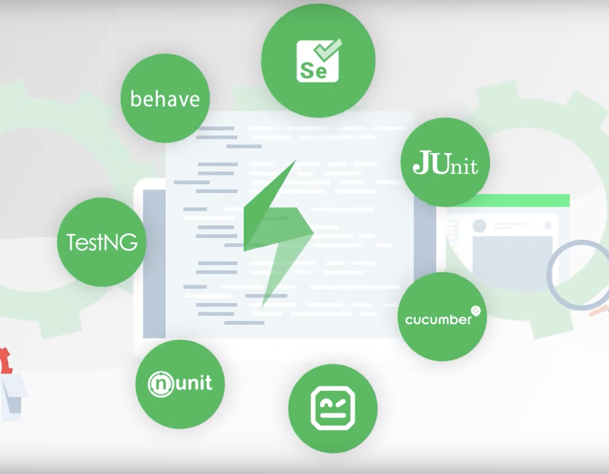
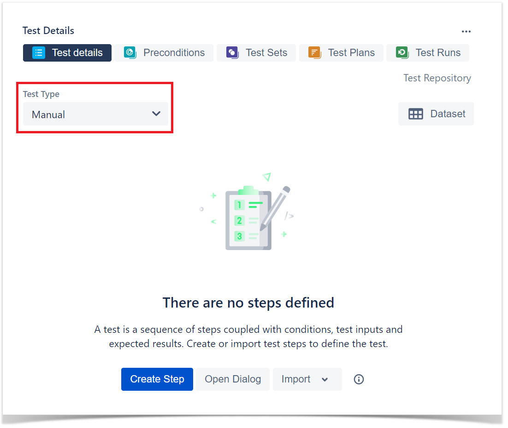
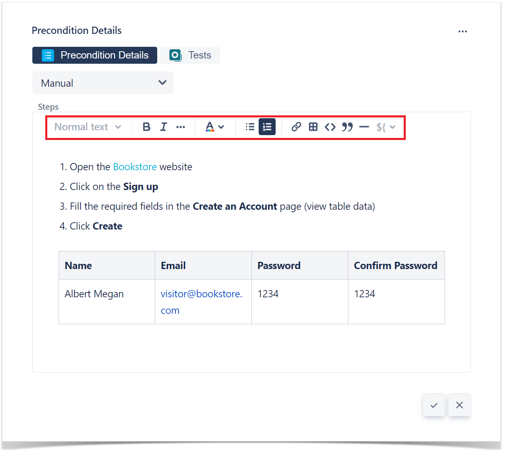
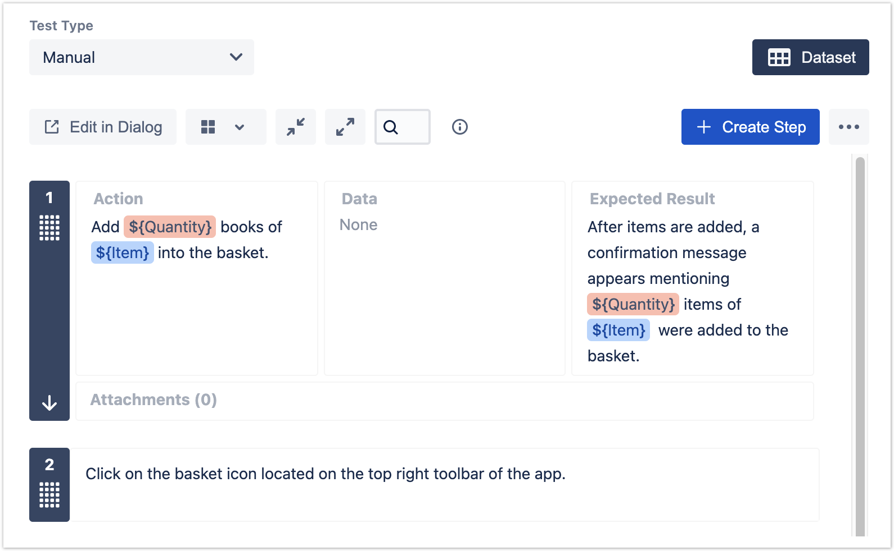
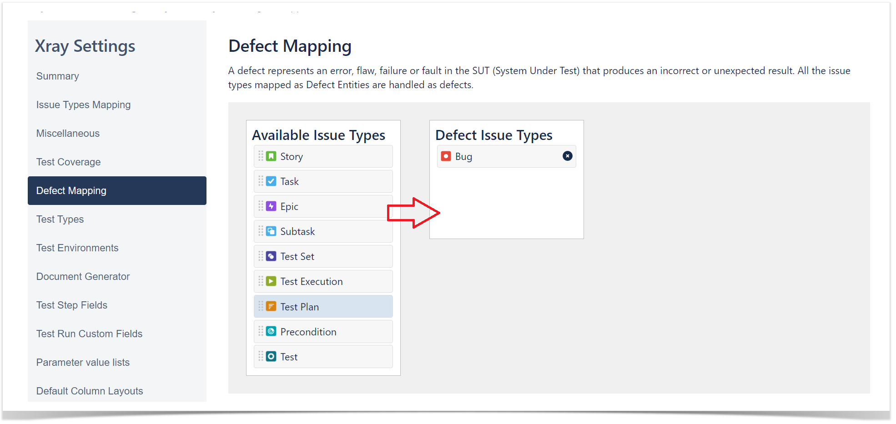
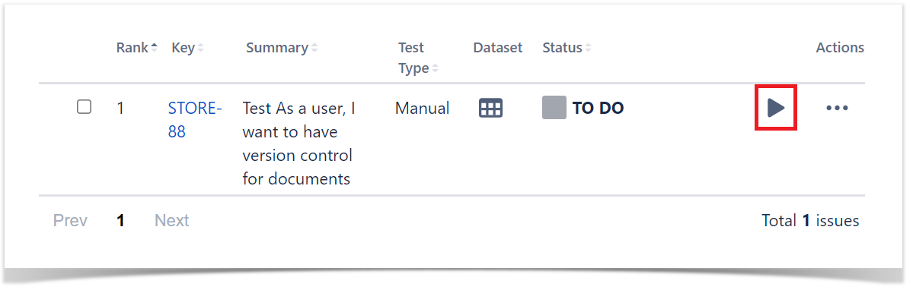
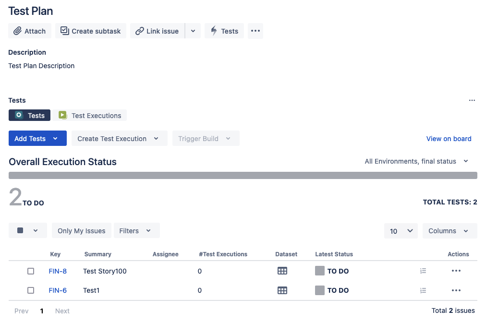

### Xray Types


### Xray Functionality


### Issue Types


### Issue Types added


### Supported Frameworks


### CI Support 


### Testing Board


### TestCase


### Sprint Board


### Reference  
```
https://docs.getxray.app/site/xray
```

### Terminology

|Xray|ISTQB|Description|   |
|---|---|---|---|
|**Test**|Test|A test case. It may either be manual or automated, composed of multiple steps, actions and expected results.|test case, test scenario, test template|
|**Precondition**|Pre-Condition|Initial conditions that must be assured before the execution of the Test's own steps. A Pre-Condition may be used by multiple Tests.||
|**Test Set**|Test Set|A group of tests, organized in some logical way. A test may belong to multiple Test Sets.|test group, test suite|
|**Test Plan**|Test Plan|A "formal" plan of the tests intended to be executed for a given version.||
|**Test Execution**|Test Execution|An assignable, "schedulable" task to execute one or more tests for a given version/revision along with its results.|test cycle|
|**Sub-Test Execution**|Sub-Test Execution|A Sub-Test Execution has the same functionalities as the [Test Execution](http://confluence.xpand-addons.com/display/XRAY/Test+Execution) issue type. The difference between them is that the Sub-Test Execution is a sub-task and can be created in a requirement's context. Creating a Test Execution as a sub-task from within the requirement issue screen will provide the user the ability to track executions on the Agile board.||
|**Test Run**|-|A specific run of a test. An instance of the test containing the execution status and a snapshot of the test specification. Whenever a user adds a Test to a Test Execution, a test run is created internally within the Test Execution context. A test may have multiple test runs.||
|**Coverable Issue**|Story, requirement, Bug, ....|All issues whose Issue Type is configured as being a Coverable Issue Type in [Project Settings: Test Coverage](https://docs.getxray.app/display/XRAYCLOUD/Project+Settings%3A+Test+Coverage).||
|**Test Status**|-|The calculated test coverage status of a Test, for some scope (e.g., version/test plan). In the context of a Test Execution, the recorded status of a Test Run.|..|
|**Requirement**|Story, Requirement, ....|Something that you expect from the system; a feature. A good requirement explains how the system should behave and its purpose.||
|**Test Repository**|-|The full list of tests within a project. In Xray, the test repository is simply composed of all Test issues.||
|**Test Strategy**|-|The requirements you want to validate, how to validate them, use of either manual or automated tests, the resource allocation, etc.||
|**Testing Lifecycle**|-|After requirement specification and revision, the testing lifecyce involves test **planning**, test **designing**, test **execution** and test **reporting.**||

### TestCase 



### Test Types
- **Cucumber**: of the Gherkin Kind;
- **Generic**: of the Unstructured Kind;
- **Manual**: of the Steps Kind.

### Preconditions 
- A Precondition is like defining the step "0" for your tests.

### Precondition Types
    - Manual Type
    - Generic Type
    - Cucumber Type

### Cucumber 


### Manual and Generic


### Import Steps

- Test
- CSV
- JSON
- Clipboard

### Export Steps

- To CSV
### Cucumber Tests


### Export to Cucumber 

1. Feature file can be exported from xray itself. 


**Export to Cucumber**

### Parameterized Test


### Datasets

The parameters, along with their values, are defined within a **dataset**. A dataset is a collection of data represented with a tabular view where every column of the table represents a particular variable (or **parameter**), and each row corresponds to a given record (or **iteration**) of the dataset.

The number of rows in the dataset determines the number of iterations to execute. If the dataset contains a single row, there will be a single execution parameterized with the values defined on the dataset row.

Datasets can be defined in different [entities and scopes](https://docs.getxray.app/display/XRAYCLOUD/Parameterized+Tests#ParameterizedTests-Datasetscopes). A dataset can be defined, edited, or simply viewed using the "**Dataset**" button located in each Xray [entity or scope](https://docs.getxray.app/display/XRAYCLOUD/Parameterized+Tests#ParameterizedTests-Datasetscopes).
  


### Test Case Versioning 


### Test Coverage add Coverage


### Test Coverage add Defect


### Test Coverage Story


### Execute Tests
 
The easiest way to execute your tests is directly from the Test Plan, but you can also perform ad-hoc Test Executions directly from a Test, or even create a new Test Execution issue. 

1. Inside the **Test Plan**, click on **Create Test Execution**.  


2. Go to **Test Execution**, and click on **Execute** (play button).  



3. You are now at the Test Execution Screen, and from here you can follow the test steps and set the execution status: **TODO**, **EXECUTING**, **FAIL** and **PASS.  


4. Did you find a defect and want to report it? Create Defects from the Test Execution Screen, click on + button in the **Findings** section and select **Create Defect** (or expand the **Findings** section and in the **Defects** panel select **Create Defect)  


        
### Sub Test Execution

A Sub-Test Execution is similar to a Test Execution, but created as a sub-task of a requirement.
Normally, you will create Test Executions from Test Plans, or create ad hoc Test Executions (directly from a Test).

### Test Repository  

A project page which enables the hierarchical organisation of Tests at the project level by allowing you to organise Tests in folders and sub-folders. You can also perform several actions from this page including, creating new Tests, creating new Test Plans, Test Sets, Test Executions for a group of Tests, etc. This is the recommended approach whenever you have a large number of Tests and want to manage them more effectively.

### Test Set

An issue type for organising tests, and it is a flat list of Tests and is a simple way to create different groups of Tests. You can easily use them to add several Tests at once into Tests Plans or Test Executions.

###  Test Plan

1. With Test Plans you will decide which Tests you want to perform, who will execute them and when they will be executed.  
2. Also, you may want to prioritise some of the Tests and focus on specific requirements.  
3. Test Plans are used to define the scope of your testing, track and consolidate the related results, no matter how many times you've run the tests.

### Planning 
Planning is the activity where you decide your **testing strategy,** e.g.,  which covered issues you want to validate, how would you validate them, will it be manual or automated, how will the resources be allocated, when and who will execute the tests. Depending on several factors, you may want to prioritize some of the tests, or focus on specific requirements. 

Although you may plan tests in [different ways](https://docs.getxray.app/display/XRAYCLOUD/Test+Process), we recommend that you use the [Test Plan](https://docs.getxray.app/display/XRAYCLOUD/Test+Plan) issue specifically for this purpose.

In your Test Plan, you can put the Tests you want to track for a given version and the Test Plan will show you the consolidated results for those Tests. In other words, it will present the latest status of each Test, independent of the number of testing iterations (i.e., Test Execution) you make with them

### Test Plan Steps

1. Click **Create** button and select **Test Plan** issue.
2. Besides **Summary**, you may want to fill out the **Fix Version** to indicate that you're tracking the results of the Tests for a specific version. This only makes sense if you have multiple versions.  


3. After creating the **Test Plan**, you can add **Tests**.  

    

5. Choose the Tests you want, by using the **Select** or **Search** tabs and then selecting some or all of them. Click **Add Selected** or **Add All**.  



###  Reports

Xray provides several ways to make it easier for the entire team to have a clear view of the overall readiness of the project.

As part of your daily tasks, use the dedicated reports and gadgets available in your customized dashboard to evaluate your testing progress.

The most popular reports are: 


