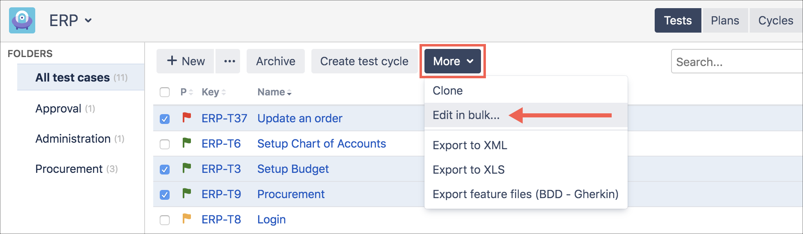
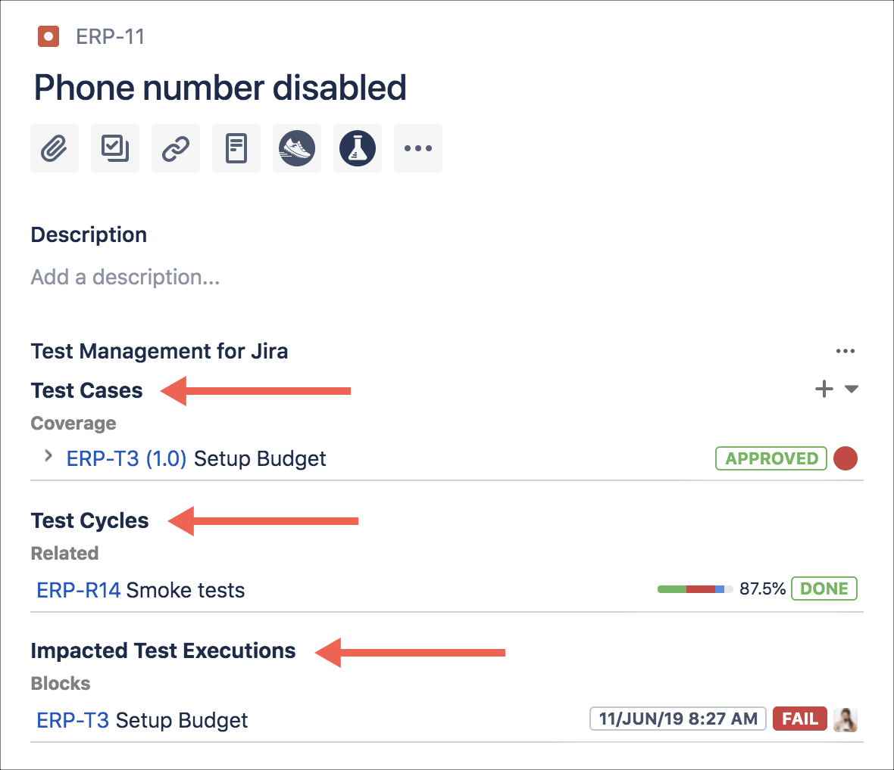

### Test Case 
A test artefact developed for a particular test condition, such as to exercise a particular program path or to verify compliance with a specific requirement.

### Test Library 
The location where test cases are created and stored. This is also known as a test repository. Any Jira project can be a test library. Test cases are created and managed under a test library; however, you can share and reuse test cases across Jira projects when necessary to prevent duplication and increase reusability. Within a test Library, you can organize test cases by using a folder structure and categorize by using labels or custom fields.

### Test Script 
A specified sequence of steps and expected results for the execution of a test case. This is also known as manual test script or test procedure specification. Zephyr Scale allows the use of traditional step-by-step as well as BDD (Gherkin syntax) and plain text scripts.

### Test Cycle 
An ordered list of test cases assigned to testers and test environments created to achieve specific testing goals (usually a longer test run, such as regression tests, build verification tests, end-to-end tests, etc.).

### Test Plan 
An artefact used to track testing progress throughout an entire release or version. You can associate several test cycles to a test plan to can get real-time progress reports. Test plan fields are customizable, which allows you to track scope, risks, strategy, entry and exit criteria, test environment, test bed, and more.

### Test Execution Result 
A set of information that generates and is stored when a test case is executed. Data includes the tester responsible for the execution, the execution date, the defects raised, the environment and the status of the execution (e.g., passed or failed), and more.

### Test Environment 
A test environment is an attribute of a test execution result used to determine the environments to be tested for each test case. Planning your test environment includes defining your platform coverage, such as operational systems, browsers, databases, etc.

### Settings

### Navigation
 https://support.smartbear.com/zephyr-scale-cloud/docs/get-started/navigation-basics.html

### Working With Folders
https://support.smartbear.com/zephy-scale-cloud/docs/get-started/working-with-folders.html

### Workflow Strategies

### TestPlan

Test plans (groups of test cycles) are used to track testing progress throughout an entire release or version. You can link several test cycles to a test plan and get real-time progress reports when you need them. Test plan fields are customizable, which allows you to track scope, risk, strategy, entry and exit criteria, test environment, test bed, and more.

### TestCycle

The test case stores useful information, like the tester responsible for the execution, the execution date, the defects raised, the environment used, and the status of the execution (e.g., passed, failed, etc).

### Executing Tests from Cycle

### Jira Zephyr Integration

### Link to Defect 

### TestCase

### Test Step/ Script

### Test Data

### Parameters

### Modular Test Case

### Test Case Versions

### BDD Tests

Select Export Feature Files (BDD - Gherkin) from **More** to download the feature file for your new test case (or the selected test cases).

### Data Driven Test
Testdata:

DataSet:

### Test Cycle 

A test cycle is a set of test cases that are grouped to achieve specific testing goals. Test cycles can be assigned to specific testers and test environments, and they offer a comprehensive overview of coordinated testing efforts.

### Creating Test Cases in Bulk

### Jira Integration 

### Test Execution

### Test-Execution Reports

Test-execution reports provide information about the status of the testing effort, including overall software quality and test execution progress.

|Report Title|Description|
|---|---|
|_Test execution results (summary)_|Provides the summary of the test execution results (such as the overall status and progress)|
|_Test execution results (list)_|Provides a list of test execution results|
|_Test execution results (detailed)_|Provides a list of test execution results with details|
|_Test execution burn up_|Provides a test execution burn-up chart.|
|_Test execution burn down_|Provides a test execution burn-down chart.|
|_Test execution completion over time by status_|Provides a test execution results line and bar chart.|
|_Test execution completion over time_|Provides a test execution results line and bar chart (completed).|
|_Test execution completion over time by status (accumulated)_|Provides a test execution results line and bar chart (accumulated).|
|_Test execution effort over time_|Provides a test execution effort line and bar chart|
|_Test execution effort (overall)_|Provides a test execution effort bar chart (estimated x actual).|
|_Test execution effort by tester_|Provides a test execution effort by tester (estimated x actual).|
|_Test execution results (overall)_|Provides a test execution results gauge chart (overall).|
|_Test execution results (progress)_|Provides a test execution results donut chart.|
|_Test execution results by project_|Provides a test execution results stacked bar chart grouped by project.|
|_Test execution results by coverage_|Provides a test execution results stacked bar chart grouped by coverage|
|_Test execution results by test plan_|Provides a test execution results stacked bar chart grouped by test plan|
|_Test execution results by test cycle_|Provides a test execution results stacked bar chart grouped by test cycle|
|_Test execution results by tester_|Provides a test execution results stacked bar chart grouped by tester.|
|Test execution results by component|Provides a test execution results stacked bar chart grouped by component.|
|_Test execution results by environment_|Provides a test execution results stacked bar chart grouped by environment|
|_Test execution results by label_|Provides a test execution results stacked bar chart grouped by label|
|_Test execution results by iteration_|Provides a test execution results stacked bar chart grouped by iteration.|
|_Test execution results by version_|Provides a test execution results stacked bar chart grouped by version.|
|_Test execution results by priority_|Provides a test execution results stacked bar chart grouped by priority.|
|_Test execution results by type_|Provides a test execution results stacked bar chart grouped by test execution type (manual x automated)|
|_Test execution scorecard by test cycle_|Provides a test execution results scorecard broken down by test cycle|
|_Test execution scorecard by tester_|Provides a test execution results scorecard broken down by tester|

### Traceability Reports

Traceability reports give you the ability to see coverage details from a range of helpful perspectives.

|Report Title|Description|
|---|---|
|_Coverage Report_|Displays the coverage relationship between issues (coverage) and test cases|
|_Traceability Report_|Provides a table of the traceability between issues (coverage), test cases, and test executions|
|_Traceability Matrix_|Displays the traceability matrix between test cases and issues (coverage)|
|_Traceability Tree_|Offers you dynamic, broad-ranging traceability and coverage statistics for all Jira issue types|

