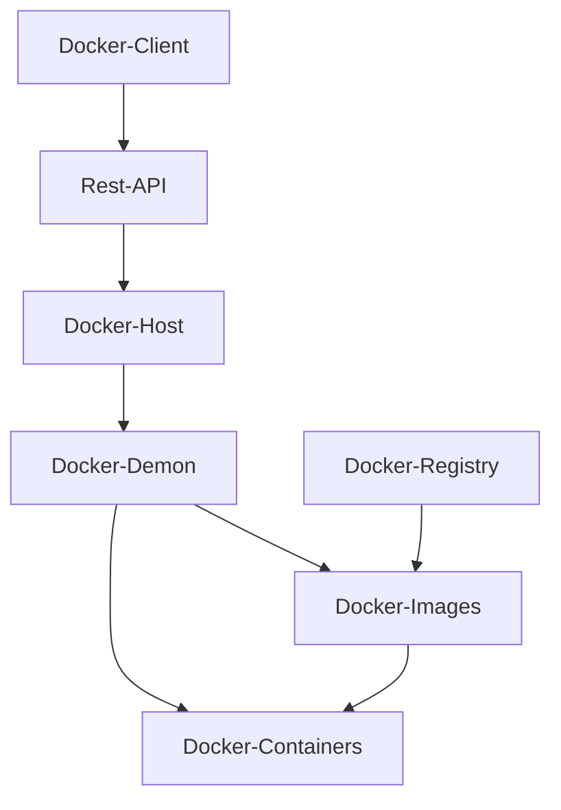

### Docker Client Server Architecture 

### My Docker Approach

- [[My Docker Approach]]

- [[My Used Docker Commands]]

### Related Topics

- [[Chroot]]

- [[Linux Namespaces]]

- [[Docker DevEnv Setup]]

- [[Docker Nextjs Application]]

- [[DockerHub ]]

- [[Docker Volumes]]

- [[Docker Bind Mounts]]

- [[Docker Networking]]

- [[Docker MySQL Application]]

- [[Docker Nicolaka Netshoot]]

- [[Docker Secrets]]

- [[Docker Compose]]

- [[Docker Layer Caching]]

- [[Docker Multi Stage Build]]

### References

- [Docker Overview](https://docs.docker.com/get-started/overview/)

- [Docker Quick Start Guide](https://docs.docker.com/get-started/overview/)

- [kernel namespaces and cgroups](https://medium.com/@saschagrunert/demystifying-containers-part-i-kernel-space-2c53d6979504)

