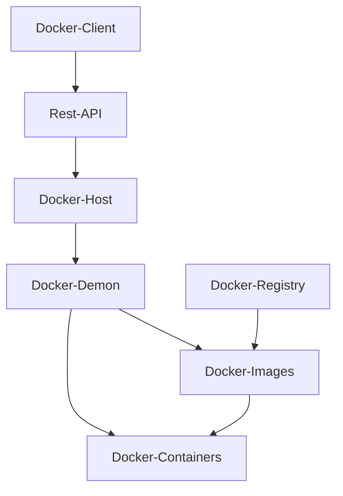

### Docker Client Server Architecture 

### References

- [Docker Overview](https://docs.docker.com/get-started/overview/)

- [Docker Quick Start Guide](https://docs.docker.com/get-started/overview/)

[[My Docker Approach]]
