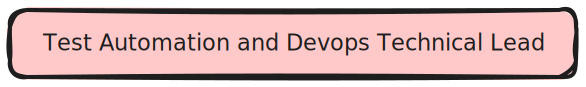
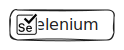
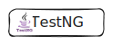
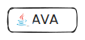
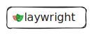

I'm Sunny, Test Automation and **Devops** Technical Lead, currently living in **Pune** , India.

I am a seasoned IT professional with extensive experience in Test Automation and DevOps transformation, and team leadership. I have managed teams and ensured the smooth functioning of multiple Selenium Frameworks and AWS Devops pipelines while providing automation support to several daily tasks as well as test Automation.

#### `Test Automation`

         

- [Data Driven Framework](https://github.com/sunnyRavindra/DataDrivenFramework) 
- Page Object Model (POM)
- Extent Reports
- Annotations 
- Data Provider
- Parametrization
- Core Java
- Gherkins

#### `Devops`
      

- CDK IAC (Infrastructure as code)
- Code Commit
- Code Build
- Test Dockerization

***

      
