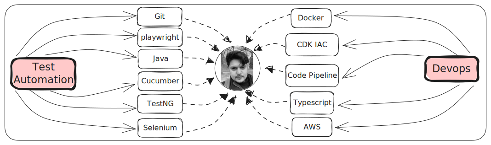

## Test Automation Lead Engineer

##### Helsinki,Finland

I'm Sunny, Test Automation and **Devops** Technical Lead, currently living in **Helsinki** , Finland.

Experienced (9years) Lead Test Automation Engineer with expertise in Test
Architecture, Framework Development, Test Automation and (AWS) Cloud DevOps
transformations.

### Skills 
- [Selenium](https://botcat.org/SDET/Selenium/Introduction)
- Java
- Robot Framework
- SQL
- CDK IAC (Infrastructure as code)
- AWS
- Docker
- Grid
- Git 
- Jira
- Xray
- Zpheyr

### Contact Me 
#### [LinkedIn](https://www.linkedin.com/in/sunnybharne)
#### [Github](https://github.com/sunnyRavindra)
#### [Email](mailto:sunny.bharne.automation@gmail.com?subject=Test_Automation_Expert)

### Resume
#### [Download Resume](../../static/resume/SunnyRavindra_Resume.pdf)

